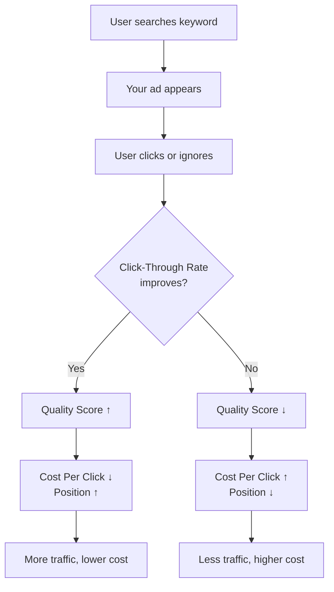
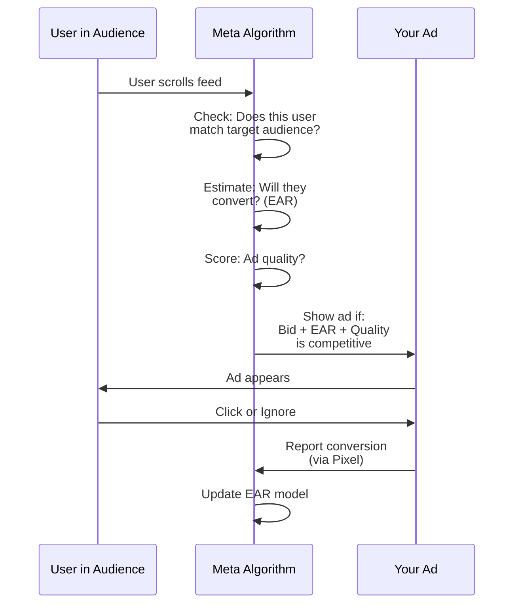

# LECTURE NOTES: META ADS & GOOGLE ADS
## High-Density, Low-Fluff Guide for Beginners

---

## What You'll Learn

In this lesson, you'll learn to:
- Understand how Google Ads and Meta Ads rank your ads and charge you money (the **Ad Rank** and **Auction** systems).
- Build a campaign structure that doesn't cannibalize itself (hierarchies, match types, audiences).
- Implement pixel tracking and conversion events so the algorithm can actually optimize for you.
- Avoid the 10 most common pitfalls that drain budgets without results.

---

## Detailed Explanation

### The Auction Universe: Your Ad is a Bidder at Two Different Auctions

Think of Google Ads and Meta Ads as **two different auction houses**. You walk in with a bid (your budget), but the gavel doesn't just go to the highest bidder. Both houses have secret judges.

**Google's Judge:** Quality Score (1–10). It measures how relevant your ad is to the search query. High relevance = lower cost per click.

**Meta's Judge:** Estimated Action Rate (EAR) + Ad Quality. It measures how likely someone in that audience will convert. Higher likelihood = lower cost per impression.

The core insight: **You don't pay for the best position; you pay for the best judge's approval.**

---

### Why It Matters

Imagine you're selling sneakers. On Google, someone searches "best running shoes under $100." That's **high intent**—they're ready to buy. On Meta, you're showing an ad to someone who *liked* a fitness influencer's post. That's **interest-based**, not intent-based.

These are fundamentally different auctions. You need different strategies for each.

---

### Google Ads: The Intent Auction

**Campaign Structure:**
```
Campaign (Budget, Settings)
  └─ Ad Group (Keywords, Ads)
       └─ Keywords (Exact, Phrase, Broad, BMM)
       └─ Ads (Headline, Description, Landing Page)
```

**Match Types = Your Net:**
- `[Exact]` – Catches only "running shoes under 100" (tight net, low volume, high intent).
- `"Phrase"` – Catches "best running shoes under 100" and "running shoes under 100 near me" (medium net).
- `Broad` – Catches "shoes," "running," "under 100," "sneakers" (wide net, low intent, high waste).
- `+Broad +Match` – Catches "running shoes" and "shoes running" but not "running" alone (controlled broad).

**The Quality Score Feedback Loop:**



**The Ad Rank Formula (This is Critical):**
```
Ad Rank = Bid × Quality Score
```

If you bid $2 with a Quality Score of 8, your Ad Rank is 16. Your competitor bids $3 with a Quality Score of 4—their Ad Rank is 12. You win.

**What You Actually Pay (Cost-Per-Click):**
```
CPC = (Competitor's Ad Rank / Your Quality Score) + $0.01
```

This means **improving Quality Score directly lowers your cost**. It's the most underutilized lever in Google Ads.

**Conversion Tracking (The Missing Piece):**
Install the **Global Site Tag (gtag.js)** on your website. When someone buys, the pixel fires a conversion event. Google then connects that purchase back to the keyword that triggered the click.

```javascript
// Example: Track a purchase
gtag('event', 'purchase', {
  'value': 99.99,
  'currency': 'USD'
});
```

Without this, Google can't optimize. You're flying blind.

---

### Meta Ads: The Audience Auction

**Campaign Structure (Inverted!):**
```
Campaign (Objective: Traffic, Conversions, etc.)
  └─ Ad Set (Budget, Audience, Placement)
       └─ Ad (Creative: Image, Video, Copy)
```

Notice the budget lives at the **Ad Set level**, not the Campaign. This matters.

**Audiences = Your Target:**
- **Saved Audience:** Demographics, interests, behaviors (e.g., "Women 25-34, interested in fitness").
- **Custom Audience:** People who visited your website or engaged with your content (requires **Meta Pixel**).
- **Lookalike Audience (LAL):** "Find people similar to my best customers" (1%-10% similarity to seed audience).

**The Meta Pixel: Non-Negotiable**

The Meta Pixel is a tracking code installed on your website. It does two things:

1. **Fires events:** When someone lands on your page (`PageView`), views a product (`ViewContent`), adds to cart (`AddToCart`), or buys (`Purchase`).
2. **Builds audiences:** Meta learns from these events to find similar people.

```html
<!-- Meta Pixel Code -->
<script>
  !function(f,b,e,v,n,t,s)
  {if(f.fbq)return;n=f.fbq=function(){n.callQueue.push(arguments)};
   n.push=n;n.loaded=!0;n.version='2.0';
   // ... (standard Meta Pixel code)
  }(window, document, 'script', 'https://connect.facebook.net/en_US/fbevents.js');
  fbq('init', 'YOUR_PIXEL_ID');
  fbq('track', 'PageView');
</script>
```

**Without the pixel firing 50+ conversions per week, Meta's algorithm can't learn. You're stuck in "Learning Phase" forever.**

**The Auction Logic:**



**Bidding Strategies:**
- **CPC (Cost-Per-Click):** You pay when clicked (like Google).
- **oCPM (Optimized CPM):** Meta optimizes for conversions while you pay per 1,000 impressions. Sounds weird, but it works—Meta shows your ad to people most likely to convert, so CPM goes down.
- **Conversions:** You set a **Bid Cap** (max you'll pay per conversion). Meta tries to stay under it.

---

### The Learning Phase Trap (Critical)

When you launch a Meta campaign, the algorithm needs **~100 conversions** to "learn" your audience. During this time:
- Don't cut budget (Meta restarts learning).
- Don't change audience (Meta restarts learning).
- Don't pause and restart (Meta restarts learning).

Violate this rule, and you'll waste 3–5 days relearning. That's real money.

---

### Common Pitfalls & How to Avoid Them

| Pitfall | Why It Kills You | Fix |
|---------|------------------|-----|
| **Pixel not firing** | < 50 conversions/week = no optimization | Test pixel with Meta's Pixel Helper browser extension |
| **Match type stacking** | Same keyword in Exact + Phrase + Broad = cannibalization | Use one match type per keyword; use negatives to separate |
| **Quality Score misread** | You check account-level score (irrelevant) | Check keyword-level Quality Score in Google Ads Editor |
| **iOS14 attribution mismatch** | You expect 28-day window; Meta credits 7-day click | Plan for shorter attribution window in reporting |
| **Lookalike from weak seed** | Seed audience has 0% converters = bad model | Seed LAL with your best 1,000 customers, not all website visitors |
| **Landing page misalignment** | Ad says "50% Off"; page says "Free Shipping" | Match ad copy to headline and CTA on landing page |
| **Budget cuts mid-campaign** | Meta Learning Phase resets | Lock budget for 5 days minimum |

---

## Key Takeaways

- **Google Ads = Intent Auction.** Someone searches; you bid on keywords. Quality Score is your leverage—improve it, and costs drop.
- **Meta Ads = Audience Auction.** You target people; Meta estimates who'll convert. The Meta Pixel is your feedback loop. Without it, the algorithm can't learn.
- **Campaign structure matters.** Google is hierarchical (Campaign > Ad Group > Keywords). Meta is inverted (Campaign > Ad Set > Ad). Don't mix them up.
- **The Learning Phase is sacred.** On Meta, don't touch budget, audience, or creative for 5 days after launch. Let the algorithm learn.
- **Conversion tracking is not optional.** Google needs gtag.js. Meta needs the Pixel firing 50+ conversions per week. Without it, you're paying for impressions, not results.

---

**You're now ready to build your first campaign.** Start with Google Ads if you have a clear product (high intent). Start with Meta if you're building brand awareness (interest-based). Or run both—they're different tools for different jobs.