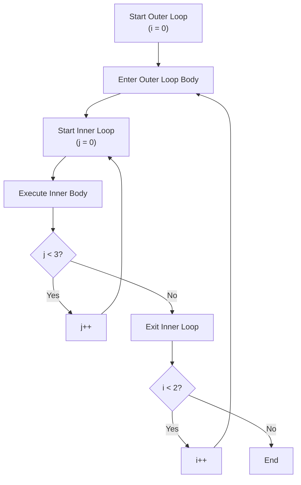

# LECTURE NOTES: NESTED LOOPS

## What You'll Learn

In this lesson, you'll learn to:
- Understand how nested loops create multi-dimensional iteration patterns and execute in a predictable order.
- Write nested loops that correctly iterate over 2D data structures (like matrices and tables).
- Identify and avoid common pitfalls like variable shadowing, scope confusion, and incorrect break behavior.
- Recognize when nested loops are the right tool and estimate their performance impact using Big-O notation.

---

## Detailed Explanation

### The Analogy: A Restaurant Kitchen

Imagine you're running a restaurant kitchen. The **outer loop** is your head chef calling out orders: "Order 1, Order 2, Order 3." For *each* order, the **inner loop** is the line cook executing every single step: "Chop vegetables, heat pan, cook protein, plate dish, clean station." Only *after* the line cook finishes all steps does the head chef move to the next order.

This is exactly how nested loops work. The outer loop says "do this N times." For *each* of those times, the inner loop says "do this M times." The total work? **N × M** tasks.

### Why It Matters

You'll need nested loops when you work with **2D data**: spreadsheets, game boards, matrices, seating charts, pixel grids in images. Any time your data has rows *and* columns, nested loops are your go-to tool. Without them, you'd have to write separate loops for each row—tedious and error-prone.

### The Execution Order: Step by Step

Let's trace through a real example:

```javascript
for (let i = 0; i < 2; i++) {           // Outer loop: i = 0, 1
  for (let j = 0; j < 3; j++) {         // Inner loop: j = 0, 1, 2
    console.log(`i=${i}, j=${j}`);      // Print coordinates
  }
}
```

**Execution trace:**
1. i = 0 → Enter outer loop
2. j = 0, 1, 2 → Inner loop runs **3 times** (prints: i=0,j=0 | i=0,j=1 | i=0,j=2)
3. i = 1 → Increment outer loop
4. j = 0, 1, 2 → Inner loop runs **3 times again** (prints: i=1,j=0 | i=1,j=1 | i=1,j=2)
5. i = 2 → Outer loop condition fails; exit

**Total console.log calls: 2 × 3 = 6.** This is the **N × M rule**.

> **Pro Tip:** The inner loop completes *entirely* before the outer loop increments. This is the golden rule.

### Real Code Example: Printing a Grid

```javascript
// Print a 3×4 grid of asterisks
for (let row = 0; row < 3; row++) {
  let line = "";
  for (let col = 0; col < 4; col++) {
    line += "* ";
  }
  console.log(line);
}
// Output:
// * * * *
// * * * *
// * * * *
```

Notice: We declare `line` *outside* the inner loop. If we declared it *inside*, it would reset every iteration, and we'd lose our progress. **Accumulator placement matters.**

### Visual: The Nested Loop Flow



This flowchart shows the **nesting relationship**: the inner loop (j) must complete before the outer loop (i) advances.

### Variable Scope: The Kitchen Hierarchy

In our kitchen analogy, the **head chef** (outer loop) can see and talk to the **line cook** (inner loop). But the line cook's private notes (inner loop variable `j`) don't exist after they clock out.

```javascript
for (let i = 0; i < 2; i++) {
  for (let j = 0; j < 3; j++) {
    // Both i and j are accessible here
  }
  // i is accessible here, but j is NOT—it's out of scope
}
console.log(i); // ERROR: i is also out of scope (block-scoped)
```

**Key rule:** Use distinct variable names (`i`, `j`, `k`) to avoid **variable shadowing**—accidentally reusing the same name and losing track of which loop you're in.

### Dependent Bounds: Triangular Iteration

Here's a trick: the inner loop's bound can depend on the outer loop's counter.

```javascript
// Print a triangle pattern
for (let i = 0; i < 4; i++) {
  let stars = "";
  for (let j = 0; j <= i; j++) {  // Inner bound depends on i
    stars += "*";
  }
  console.log(stars);
}
// Output:
// *
// **
// ***
// ****
```

This creates **triangular iteration**: 1 + 2 + 3 + 4 = 10 total inner executions, not 4 × 4 = 16. The math changes when bounds are dependent.

### The Break & Continue Trap

Here's where beginners get burned:

```javascript
for (let i = 0; i < 3; i++) {
  for (let j = 0; j < 3; j++) {
    if (j === 1) break;  // Exits INNER loop only
    console.log(`i=${i}, j=${j}`);
  }
}
// Prints: i=0,j=0 | i=1,j=0 | i=2,j=0
// The outer loop still runs 3 times!
```

If you need to escape *both* loops, use a **labeled break**:

```javascript
outerLoop: for (let i = 0; i < 3; i++) {
  for (let j = 0; j < 3; j++) {
    if (j === 1) break outerLoop;  // Exits BOTH loops
    console.log(`i=${i}, j=${j}`);
  }
}
// Prints: i=0,j=0
// Then stops completely
```

> **Warning:** Labeled breaks are powerful but can make code harder to follow. Use them sparingly.

### Performance: Big-O Complexity

Two nested loops? That's **O(n²)** complexity—quadratic time. Three nested loops? **O(n³)**—cubic.

```javascript
// O(n²): Bubble sort
for (let i = 0; i < array.length; i++) {
  for (let j = 0; j < array.length - 1; j++) {
    // Compare and swap
  }
}
```

This matters. If your array has 1,000 items, you're doing ~1,000,000 comparisons. With 10,000 items? 100,000,000. Nested loops scale *fast*. Always ask: "Can I solve this with a single loop instead?"

---

## Key Takeaways

- **Execution Order:** The inner loop runs *completely* before the outer loop advances one step. Total iterations = outer bound × inner bound.

- **Scope Rules:** Inner loop variables are block-scoped. Use distinct names (`i`, `j`, `k`) to avoid shadowing. Declare accumulators *outside* both loops.

- **Break Behavior:** `break` exits only the immediate enclosing loop. Use labeled breaks to escape multiple levels.

- **Dependent Bounds:** The inner loop's bound can reference the outer loop's counter, creating triangular or other patterns. Adjust your complexity analysis accordingly.

- **Performance Impact:** Nested loops = O(n²) or worse. Avoid triple nesting when possible. Always consider: "Is there a single-loop solution?"

---

**You're now ready to handle multi-dimensional data.** Start with simple 2D arrays, practice the execution trace, and you'll develop the intuition to write nested loops confidently.