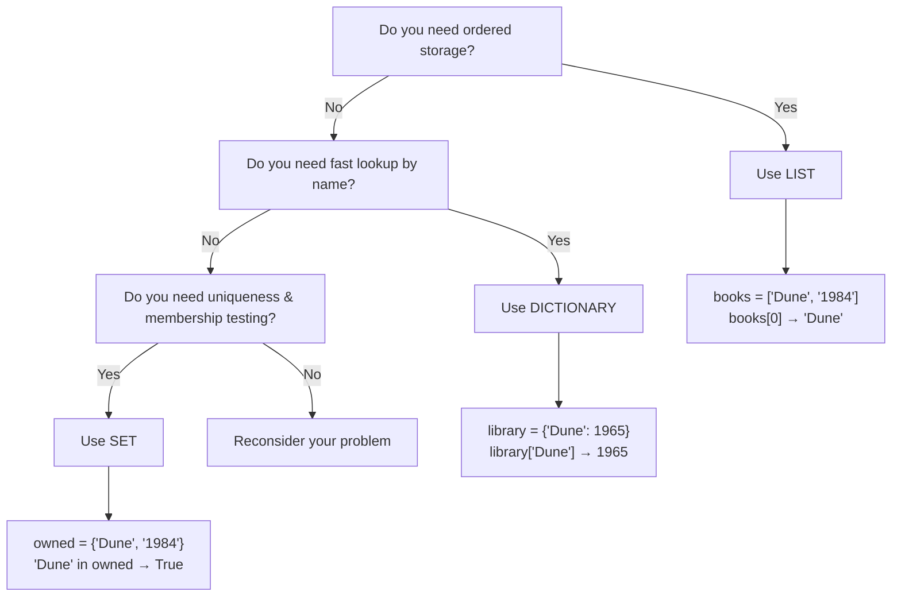

# Python Data Structures: Lists, Dictionaries, and Sets

## What You'll Learn

In this lesson, you'll learn to:

- Create and manipulate **Lists** using indexing, slicing, and built-in methods.
- Use **Dictionaries** to organize data as key-value pairs and retrieve values efficiently.
- Build **Sets** for membership testing and mathematical operations like union and intersection.
- Understand when to use each data structure and avoid common pitfalls that trip up beginners.

---

## Detailed Explanation

### The Analogy Universe: The Library

Imagine you're building a personal library to store and organize your book collection. Each data structure is a different organizational system:

- **Lists** are like shelves where books sit in a specific order. You can find a book by its position ("the 3rd book on the shelf").
- **Dictionaries** are like a card catalog where each book has a unique call number (the **key**) that tells you exactly where it is, without counting shelves.
- **Sets** are like a checklist: "Do I own this book?" You don't care about order or position—only whether it's there.

---

### Lists: Ordered Storage with Position

**Why It Matters:** Lists are your go-to when order matters—a to-do list, a sequence of sensor readings, or a leaderboard. You'll use them constantly.

**What Lists Are:**
A **List** is an ordered, mutable collection. Think of it as a shelf where each book has a numbered position (starting from 0). You can add, remove, or rearrange books anytime.

```python
# Creating a list
books = ["Dune", "1984", "Sapiens"]
print(books[0])        # "Dune" (position 0)
print(books[-1])       # "Sapiens" (last position)
print(books[1:3])      # ["1984", "Sapiens"] (slice: positions 1 and 2)
```

**Key Insight:** Negative indexing wraps around. `books[-1]` is the last book, `books[-2]` is second-to-last. This mirrors how you'd think about it: "the last book on the shelf."

**Common List Methods:**

```python
books = ["Dune", "1984"]

books.append("Sapiens")           # Add to end
books.insert(1, "Neuromancer")    # Insert at position 1
books.remove("1984")              # Remove by value
last = books.pop()                # Remove and return last item
books.sort()                      # Sort alphabetically (mutates in-place)
count = books.count("Dune")       # How many copies of "Dune"?
```

> **Pro Tip:** `.append()` is O(1) amortized—Python allocates extra space when your shelf gets full, so adding one book is nearly instant.

**Slicing Creates Shallow Copies:**
```python
original = [[1, 2], [3, 4]]
copy = original[0:1]    # Creates new list, but inner lists are shared
copy[0][0] = 99         # This ALSO changes original[0][0]!
```

This trips up beginners. Slicing copies the outer container, not the nested objects inside.

---

### Dictionaries: Key-Value Lookup Without Position

**Why It Matters:** When you need to find something by its name (not position), dictionaries are unbeatable. Think: user profiles, configuration settings, or translating words.

**What Dictionaries Are:**
A **Dictionary** is an unordered (insertion-ordered in Python 3.7+) mapping of **keys** to **values**. Instead of "the 3rd book," you ask for "the book titled 'Dune'"—instant lookup.

```python
# Creating a dictionary
library = {
    "Dune": 1965,
    "1984": 1949,
    "Sapiens": 2011
}

print(library["Dune"])           # 1965 (O(1) lookup)
print(library.get("Missing", 0)) # 0 (safe; no error)
```

**Keys Must Be Hashable:**
Only immutable types (strings, numbers, tuples) can be keys. Lists cannot.

```python
# ✓ Valid
config = {
    "host": "localhost",
    ("x", "y"): [1, 2, 3]
}

# ✗ Invalid
bad = {
    ["list"]: "value"  # TypeError: unhashable type: 'list'
}
```

**Common Dictionary Methods:**

```python
library = {"Dune": 1965, "1984": 1949}

library["Sapiens"] = 2011           # Add/update
library.setdefault("Neuromancer", 1984)  # Add only if missing

for title in library:               # Iterate keys only
    print(title)

for title, year in library.items(): # Iterate key-value pairs
    print(f"{title}: {year}")

library.pop("1984")                 # Remove and return value
library.clear()                     # Empty the dictionary
```

> **Gotcha:** Iterating a dict yields **keys only**. Use `.items()` to get both.

**Dictionary vs. List—When to Choose:**

```python
# Use Dictionary if you have a "name"
student = {"name": "Alice", "gpa": 3.9, "major": "CS"}
print(student["name"])  # Clear intent: "get the name"

# Use List if you have positions
grades = [95, 87, 92]
print(grades[0])        # Less clear: "get the first grade" (of whom?)
```

---

### Sets: Uniqueness and Fast Membership Testing

**Why It Matters:** Sets answer the question "Do I have this?" instantly. They're perfect for deduplication, checking membership, or mathematical operations.

**What Sets Are:**
A **Set** is an unordered collection of unique, hashable elements. Think of it as a checklist: "Do I own 'Dune'? Yes or no."

```python
# Creating a set
owned = {"Dune", "1984", "Sapiens"}
print("Dune" in owned)    # True (O(1) check)

# Remove duplicates from a list
titles = ["Dune", "1984", "Dune", "Sapiens"]
unique = set(titles)      # {"Dune", "1984", "Sapiens"}
```

**Set Operations—Mathematical Set Theory:**

```python
alice_books = {"Dune", "1984", "Sapiens"}
bob_books = {"Dune", "Neuromancer", "Snow Crash"}

shared = alice_books & bob_books      # Intersection: {"Dune"}
all_books = alice_books | bob_books   # Union: all unique books
alice_only = alice_books - bob_books  # Difference: what Alice has but Bob doesn't
different = alice_books ^ bob_books   # Symmetric difference: books only one person owns
```

**Common Set Methods:**

```python
owned = {"Dune", "1984"}

owned.add("Sapiens")              # Add one element
owned.update(["Neuromancer"])     # Add multiple
owned.remove("1984")              # Remove (error if missing)
owned.discard("Missing")          # Remove (no error if missing)
```

> **Warning:** `{}` creates an empty **dictionary**, not a set. Use `set()` for an empty set.

---

### Visual: Choosing the Right Structure



---

## Key Takeaways

- **Lists** store items in order; use indexing (`lst[0]`) and slicing (`lst[1:3]`) to access them. Methods like `.append()` and `.sort()` mutate in-place.

- **Dictionaries** map keys to values for instant lookup. Keys must be hashable (immutable). Always use `.items()` to iterate both key and value together.

- **Sets** enforce uniqueness and enable fast membership testing (`"item" in set`). Use them for deduplication and mathematical operations (union, intersection, difference).

- **Shallow copy pitfall:** Slicing a list or copying a dict creates a new container, but nested objects are still shared. Be aware when working with complex structures.

- **Choose wisely:** List for order, Dictionary for named lookup, Set for uniqueness. Mixing them up wastes performance and clarity.

---

**You're ready to use these three structures as your foundation for organizing data in Python. Next, you'll learn how to combine them into more complex programs.**