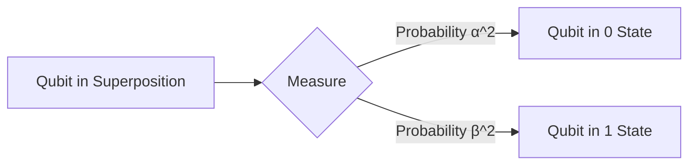

# Quantum Computing: Superposition

## What You'll Learn

In this lesson, you'll learn to:

- Understand the concept of **superposition** and how it applies to quantum bits (qubits)
- Explain the role of superposition in quantum computing and how it enables quantum parallelism
- Describe the process of measurement and how it affects the state of a qubit
- Recognize the key challenges and limitations associated with maintaining superposition in quantum systems

## Detailed Explanation

### The Quantum Kitchen: Superposition and Qubits

Imagine you're the head chef in a quantum kitchen, and your task is to prepare a special dish called a "qubit." In the classical cooking world, you'd have ingredients that are either 0 or 1 (like a binary switch). But in the quantum kitchen, your ingredients can exist in a **superposition** of both 0 and 1 at the same time!

A **qubit**, the fundamental unit of information in a quantum computer, is like a special ingredient that can be in multiple states simultaneously. Just like a chef can combine multiple ingredients to create a unique dish, a qubit can exist in a superposition of 0 and 1 states, represented by the quantum state vector `|ψ⟩ = α|0⟩ + β|1⟩`. The coefficients `α` and `β` are complex numbers that determine the probability of the qubit being in the 0 or 1 state when measured.

### Why Superposition Matters

Superposition is the key to the power of quantum computing. By allowing qubits to exist in a superposition of states, quantum computers can explore multiple possibilities simultaneously, rather than the one-at-a-time approach of classical computers.

> Imagine you're a busy restaurant owner, and you need to serve 100 customers as quickly as possible. In the classical world, you'd have to take each order one by one. But in the quantum kitchen, your qubits can take all the orders at once, dramatically speeding up the process!

This quantum parallelism is what enables quantum computers to tackle certain problems, like factoring large numbers or simulating complex chemical reactions, exponentially faster than classical computers.

### The Quantum Measurement Dance

Now, let's talk about the delicate dance of **measurement** in the quantum kitchen. When you observe the state of a qubit, it's like peeking into the oven to check on your dish. The act of measurement forces the qubit to "collapse" into a definite 0 or 1 state, as determined by the probabilities encoded in `α` and `β`.

This measurement disturbance is a fundamental property of quantum mechanics, known as the "No-cloning Theorem." It means you can't perfectly copy the state of a qubit, as the act of measurement will always change it.

### Challenges in the Quantum Kitchen

Maintaining superposition in the quantum kitchen is no easy feat. The primary challenge is **decoherence**, which is when the qubit interacts with the environment and loses its delicate quantum state. This is like when your soufflé collapses because you opened the oven door too many times.

Another challenge is **scalability**. As you try to scale up the number of qubits in your quantum computer, it becomes increasingly difficult to keep them all in a stable superposition. This is like trying to coordinate a symphony of a hundred chefs, each with their own quirks and sensitivities.

## Key Takeaways

- **Superposition** is the ability of a qubit to exist in a combination of 0 and 1 states simultaneously, before measurement.
- Superposition enables quantum computers to explore multiple possibilities in parallel, leading to exponential speedups for certain problems.
- Measurement of a qubit forces it to collapse into a definite 0 or 1 state, a phenomenon known as the "No-cloning Theorem."
- Maintaining superposition is challenging due to decoherence and scalability issues, which are active areas of research in quantum computing.
- Quantum computing leverages the unique properties of superposition and entanglement to perform certain computations more efficiently than classical computers.