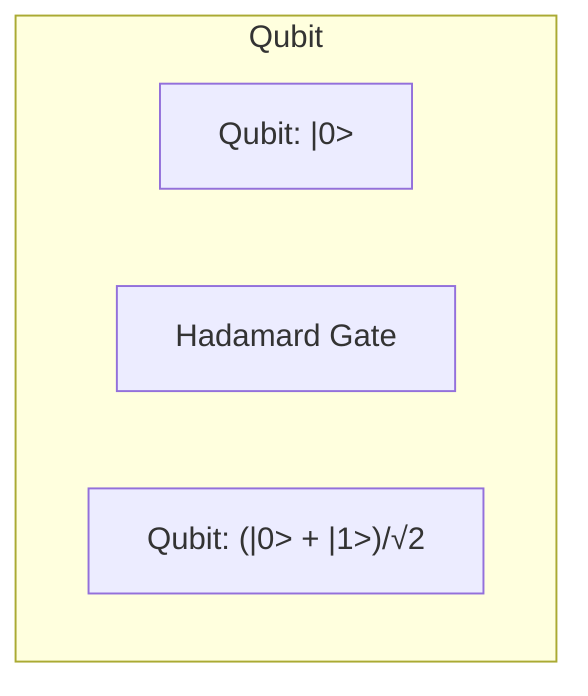

# Quantum Computing: Superposition

## What You'll Learn

In this lesson, you'll learn to:

- Understand the concept of **superposition** in quantum computing
- Explain how **quantum bits (qubits)** can exist in a superposition of 0 and 1 states
- Describe the role of **measurement** in collapsing a qubit's superposition
- Recognize the key properties and challenges of superposition in quantum systems

## Detailed Explanation

### The Quantum Kitchen

Imagine a quantum kitchen where the ingredients (qubits) can exist in multiple states simultaneously. In a classical kitchen, when you have a single egg, it's either whole or cracked. But in the quantum kitchen, the egg can be in a superposition - it's both whole and cracked at the same time, until you open the fridge (measure it).

**Superposition** is the ability of a quantum system to exist in multiple states at once. Just like the egg, a **quantum bit (qubit)** can be in a superposition of 0 and 1 states before it is measured. This is represented by the quantum state vector |ψ⟩ = α|0⟩ + β|1⟩, where α and β are complex numbers that satisfy |α|^2 + |β|^2 = 1.

> The principle of superposition states that a qubit can exist in a superposition of 0 and 1 states until it is measured.

### Why Superposition Matters

Superposition is a fundamental property of quantum systems and is the key to the power of quantum computing. By existing in a superposition of multiple states, a qubit can explore many possibilities simultaneously, leading to exponential speedups for certain computations compared to classical computers.

Imagine you're a chef trying to find the perfect recipe for a new dish. In a classical kitchen, you'd have to try each recipe one by one. But in a quantum kitchen, you could have the egg, flour, and other ingredients all in superposition - exploring multiple recipes at the same time! This is the power of quantum computing.

### Manipulating Superposition

To create and manipulate the superposition of a qubit, we use **quantum logic gates**. These are the quantum equivalent of the classical logic gates (AND, OR, NOT, etc.) that we use in classical computers.

For example, the **Hadamard gate** takes a qubit in the 0 state and puts it into an equal superposition of 0 and 1 states. The **NOT gate** flips the state of the qubit, turning 0 into 1 and vice versa.

> The Hadamard gate creates an equal superposition of 0 and 1 states, while the NOT gate flips the state of the qubit.

### The Challenge of Measurement

The key challenge with superposition is that it is fragile and easily disturbed. When you **measure** the state of a qubit, the wavefunction collapses, and the qubit is forced into either the 0 or 1 state, with probabilities determined by the values of α and β.

This measurement disturbance is a fundamental property of quantum mechanics, known as the "No-cloning Theorem." It means that you can't perfectly copy the state of a qubit, as that would require measuring it.

> Measuring a qubit disturbs its state, forcing it into either the 0 or 1 state. This is known as the "No-cloning Theorem."

Another challenge is **decoherence**, where unintended interactions with the environment can cause the qubit to lose its superposition, leading to errors.

## Key Takeaways

- **Superposition** is the ability of a quantum system to exist in multiple states simultaneously before measurement.
- **Qubits** can be in a superposition of 0 and 1 states, represented by the quantum state vector |ψ⟩ = α|0⟩ + β|1⟩.
- **Quantum logic gates** like the Hadamard and NOT gates are used to create and manipulate the superposition of qubits.
- **Measurement** of a qubit collapses its wavefunction, forcing it into either the 0 or 1 state, which is a fundamental limitation known as the "No-cloning Theorem."
- **Decoherence** is a challenge that can cause qubits to lose their superposition due to unintended interactions with the environment.