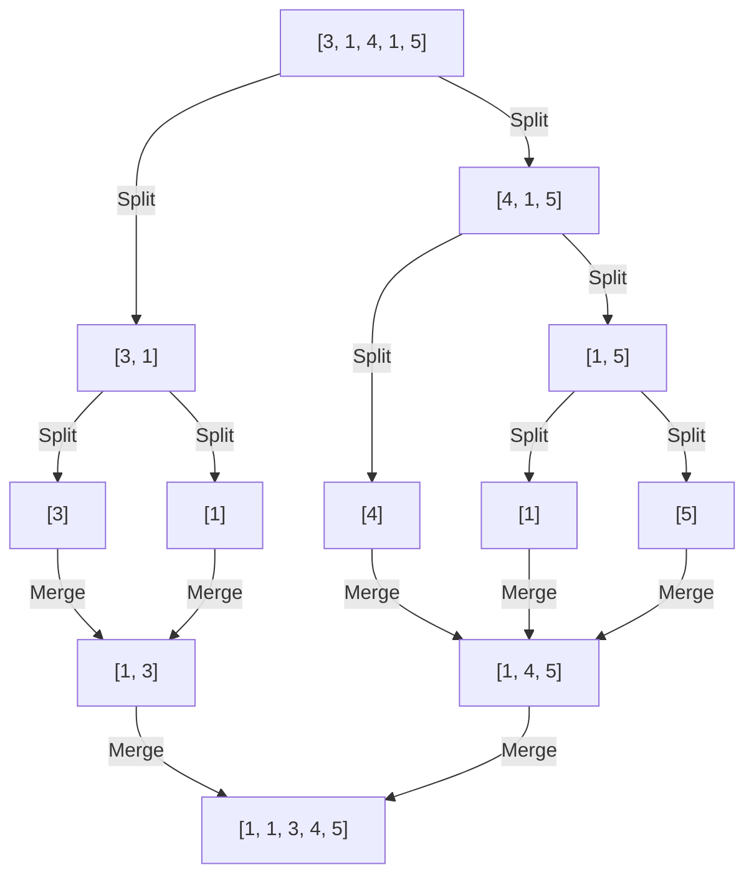

# Pre-Read Notes: Sorting Algorithms in Python

## 1. What You'll Learn

In this pre-read, you'll discover:
- **What sorting algorithms are** and why computers need them (they're not magic—just organized steps)
- **Three different approaches** to sorting: the patient way, the bubbly way, and the divide-and-conquer way
- **How to pick the right tool** for the job (some are slow, some are fast, some are just for learning)
- **Why speed matters** when you're sorting thousands or millions of items

---

## 2. Detailed Explanation

### A. Introduction: "What Is a Sorting Algorithm?"

Imagine you're organizing a messy pile of index cards by number. You could pick the smallest card each time and set it aside (patient but thorough). Or you could compare neighbors and swap them over and over until they're in order (tedious but simple). Or you could split the pile in half, sort each half, then carefully merge them back together (clever and fast).

**A sorting algorithm is a step-by-step recipe that arranges items in order.** It's like organizing anything in your life—but the computer does it automatically, and we need to choose the smartest method based on how much data we have.

### B. Importance: "Why Does This Matter?"

**1. Speed saves time:** When you search for a name in a phone book, it only works because names are sorted. Without sorting, finding anything takes forever.

**2. Memory matters:** Some sorting methods use extra space; others don't. On phones or small devices, that difference is huge.

**3. Real-world problems:** Ranking search results, organizing files, processing payments—all depend on sorting working correctly and fast.

### C. Building Understanding: "From Known to New"

Let's say you have a list: `[5, 2, 8, 1, 9]`

The **painful way** (without a smart algorithm): You'd manually compare and swap until your eyes crossed. No system. Slow. Error-prone.

The **smart way**: Use an algorithm—a predictable recipe that guarantees the job gets done. Three main recipes exist, each with trade-offs between simplicity and speed.

---

### D. Core Components: Meet the Three Algorithms

#### **1. Selection Sort: The Patient Picker**
Find the smallest item in the unsorted pile, move it to the sorted pile, repeat. It's methodical and predictable—always takes the same time, even if the list is already sorted.

#### **2. Bubble Sort: The Neighbor Comparer**
Compare two neighbors, swap if they're out of order, move to the next pair. Repeat until nothing changes. Simple to understand, but can waste time on already-sorted lists.

#### **3. Merge Sort: The Divide-and-Conquer Master**
Split the list in half recursively until you have single items, then carefully merge sorted pairs back together. Faster for large lists, but needs extra space to work.

---

### E. Step-by-Step Process: How Each Works

**Selection Sort:**
1. Look at the unsorted portion of your list
2. Find the smallest item
3. Swap it with the first unsorted position
4. Move the boundary one step right
5. Repeat until done

**Bubble Sort:**
1. Compare the first two items
2. Swap if left > right
3. Move to the next pair
4. When you reach the end, start over
5. Stop when no swaps happen in a full pass

**Merge Sort:**
1. Split the list in half (recursively, all the way to single items)
2. Merge the left half (now sorted) with the right half (now sorted)
3. Use a two-pointer technique: pick the smaller item from each half
4. Continue until both halves are combined
5. Return the fully sorted list

---

### F. Key Features

| Feature | Selection | Bubble | Merge |
|---------|-----------|--------|-------|
| **Speed** | Slow (O(n²)) | Slow (O(n²)) | Fast (O(n log n)) |
| **Extra Memory?** | No | No | Yes |
| **Good for Learning?** | Yes | Yes | Maybe later |
| **Best Use Case** | Tiny lists, memory-tight | Nearly sorted data | Large lists |

**Critical insight:** Selection and Bubble are quadratic (slow on big data). Merge is logarithmic (stays fast even with millions of items).

---

### G. Putting It All Together: A Real Example

Let's sort `[3, 1, 4, 1, 5]` using **Selection Sort**:

```
Start:     [3, 1, 4, 1, 5]
Pass 1:    Find min (1), swap with position 0 → [1, 3, 4, 1, 5]
Pass 2:    Find min in [3, 4, 1, 5] (1), swap with position 1 → [1, 1, 4, 3, 5]
Pass 3:    Find min in [4, 3, 5] (3), swap with position 2 → [1, 1, 3, 4, 5]
Pass 4:    Find min in [4, 5] (4), already in place → [1, 1, 3, 4, 5]
Done!
```

Here's what it looks like in Python:

```python
def selection_sort(arr):
    for i in range(len(arr) - 1):
        min_idx = i
        for j in range(i + 1, len(arr)):
            if arr[j] < arr[min_idx]:
                min_idx = j
        arr[i], arr[min_idx] = arr[min_idx], arr[i]
    return arr

print(selection_sort([3, 1, 4, 1, 5]))  # Output: [1, 1, 3, 4, 5]
```

---

### Visual: How Merge Sort Splits and Merges



---

## 3. Practice Exercises

**Exercise 1: Pattern Recognition**
Look at this list: `[2, 1, 3, 4, 5]`. If you used Bubble Sort, how many passes would it take? (Hint: One pass moves the largest unsorted item to the right.)

**Exercise 2: Concept Detective**
You're sorting 1 million numbers. Selection Sort takes 1 hour. Merge Sort takes 20 seconds. Why is the difference so dramatic? (Hint: Think about how many comparisons each makes.)

**Exercise 3: Real-Life Application**
Think of three situations where you'd use sorting in real life. For each, would you care more about speed or memory usage? Why?

**Exercise 4: Spot the Error**
A student wrote this for Selection Sort:
```python
for i in range(len(arr)):
    min_idx = i
    for j in range(i, len(arr)):  # ← Problem here?
```
What's wrong? How would you fix it?

**Exercise 5: Planning Ahead**
If you were sorting a list of student names alphabetically, which algorithm would you pick? Why? (Hint: Think about how many names you'd realistically have.)

---

**You're ready!** You now understand *what* these algorithms do and *why* they matter. Next, you'll code them yourself and see them in action. 🚀