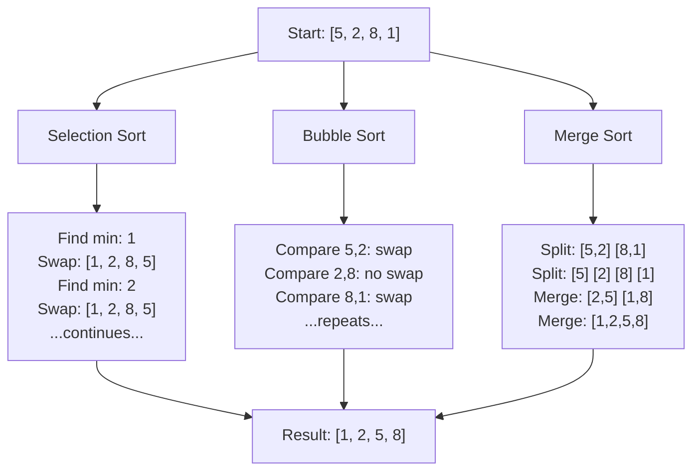

# Pre-Read Notes: Sorting Algorithms in Python

## 1. What You'll Learn

In this pre-read, you'll discover:
- **What sorting algorithms do** and why computers need them
- **Three different sorting strategies** that solve the same problem in different ways
- **How to pick the right tool** for the job (speed vs. simplicity)
- **Why some algorithms are faster** than others as your data grows

---

## 2. Detailed Explanation

### A. Introduction: "What Is a Sorting Algorithm?"

Imagine you're organizing a pile of unsorted books on a shelf. You could grab the shortest book, place it on the left, then find the next shortest, and keep going. Or you could compare neighboring books, swap them if they're out of order, and repeat. Or you could split the pile in half, organize each half separately, then carefully merge them back together.

**A sorting algorithm is a step-by-step recipe that arranges items in order** (usually smallest to largest).

All three approaches work. They just take different amounts of time and effort. That's what we're exploring today.

---

### B. Importance: "Why Does This Matter?"

1. **Speed matters when data grows.** Sorting 10 items takes seconds. Sorting 1 million items? Bad algorithms take hours; good ones take seconds. You'll learn why.

2. **Different problems need different solutions.** Sometimes you have barely any extra memory (use **Selection Sort**). Sometimes you need guaranteed speed no matter what (use **Merge Sort**). Knowing your options saves you.

3. **It's everywhere.** Your phone sorts contacts. Your email app sorts messages. Your bank sorts transactions. Understanding sorting is understanding how the digital world stays organized.

---

### C. Building Understanding: "From Known to New"

Let's say you have a list of numbers: `[5, 2, 8, 1, 9]`.

**The painful way:** Check every pair manually, swap if needed, repeat until done. You'd do this over and over, sometimes checking the same pairs unnecessarily.

**The smarter way:** Use an algorithm that *remembers* what it's already done and *avoids* repeating work.

This is where **Selection Sort**, **Bubble Sort**, and **Merge Sort** come in. Each one is a different strategy to reduce wasted effort.

---

### D. Core Components

All three algorithms share these basic ideas:

1. **Comparison:** Check if one item should come before another.
2. **Swapping (or merging):** Move items into the right position.
3. **Repetition:** Keep going until everything is sorted.

The difference? *How many times* you compare, *when* you swap, and *how* you organize your work.

---

### E. Step-by-Step: Meet the Three Algorithms

#### **Selection Sort: "Find the Smallest"**

Think of it like picking the shortest book from a pile, placing it aside, then picking the next shortest from what's left.

```
1. Look at the unsorted pile
2. Find the smallest number
3. Swap it with the first position
4. Move to the next position
5. Repeat until done
```

**Speed:** Slow for large lists (O(n²) — that means if you double the list size, it takes 4x longer).  
**Memory:** Very efficient (sorts in place, no extra space).

---

#### **Bubble Sort: "Compare Neighbors"**

Like a conversation where neighbors keep trading places if they're in the wrong order. The largest "bubbles" to the end each round.

```
1. Compare first two numbers
2. Swap if left > right
3. Move to the next pair
4. Repeat until no swaps happen
```

**Speed:** Also slow for large lists (O(n²)), but faster on nearly-sorted data.  
**Memory:** Very efficient (sorts in place).

---

#### **Merge Sort: "Divide and Conquer"**

Like splitting a pile of books in half, organizing each half separately, then carefully merging them back together in order.

```
1. Split the list in half
2. Split each half again (keep going until single items)
3. Merge pairs back together in sorted order
4. Keep merging until one sorted list remains
```

**Speed:** Fast even for large lists (O(n log n) — if you double the list, it only takes a little longer).  
**Memory:** Needs extra space to merge.

---

### F. Key Features: What Makes Them Different?

| Feature | Selection | Bubble | Merge |
|---------|-----------|--------|-------|
| **Speed (large lists)** | Slow | Slow | Fast ✓ |
| **Extra memory needed?** | No ✓ | No ✓ | Yes |
| **Best for** | Tiny lists, memory-tight systems | Learning, nearly-sorted data | Real-world apps |

---

### G. Putting It All Together: A Visual Guide

Here's how each algorithm tackles `[5, 2, 8, 1]`:



---

## 3. Practice Exercises

### Exercise 1: Pattern Recognition
Look at these two sorting steps on `[7, 3, 5]`:
- **Method A:** Find 3, swap with 7 → `[3, 7, 5]`. Find 5, swap with 7 → `[3, 5, 7]`.
- **Method B:** Compare 7 and 3, swap → `[3, 7, 5]`. Compare 7 and 5, swap → `[3, 5, 7]`.

Which method is Selection Sort? Which is Bubble Sort? Why?

---

### Exercise 2: Concept Detective
You're sorting 1,000,000 numbers. Your computer has very little extra memory available. Which algorithm would you pick: **Merge Sort** or **Selection Sort**? Why?

---

### Exercise 3: Spot the Problem
A student wrote this for Bubble Sort:
```python
for i in range(n):
    for j in range(n-1):  # ← Is this right?
        if arr[j] > arr[j+1]:
            swap(arr[j], arr[j+1])
```

What's the issue? (Hint: Think about how many comparisons you need each round.)

---

### Exercise 4: Real-Life Application
List 3 real-world situations where you'd use sorting:
1. ___________________________
2. ___________________________
3. ___________________________

For each, would you care more about **speed** or **memory**?

---

### Exercise 5: Planning Ahead
Imagine you're writing a phone app that sorts contact names. Your users might have 10 names or 10,000 names. Which algorithm would you pick and why? (There's no "wrong" answer—just explain your thinking!)

---

## Key Takeaway

You now know that **sorting isn't one-size-fits-all**. Selection Sort is simple. Bubble Sort is intuitive. Merge Sort is powerful. Your job as a programmer is to pick the right one for your problem. That's the real skill.

**Ready to dive deeper?** You're prepared to explore the code, test these algorithms, and see them in action. You've got this! 🚀