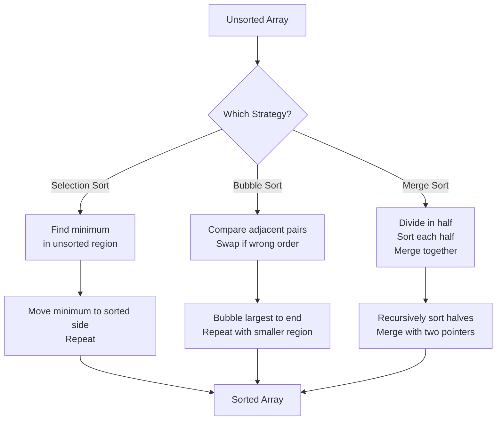

# Pre-Read: Sorting Algorithms in Python

## 1. The Hook (Analogy First)

Imagine you're organizing a massive pile of unsorted mail in a post office. You have hundreds of letters scattered everywhere, and your job is to arrange them by zip code so they can be delivered to the right neighborhoods.

Now, here's the thing: there are *different ways* to do this job, and some methods are way faster and smarter than others. You could pick through the pile one letter at a time, finding the smallest zip code and setting it aside (that's like **selection sort**). Or you could walk through the pile repeatedly, swapping any two letters that are out of order (that's **bubble sort**). Or—and this is the clever part—you could divide the pile in half, organize each half separately, then *merge* them together perfectly (that's **merge sort**).

These three approaches represent three fundamentally different *strategies* for sorting. Today, we're going to explore all three so you understand not just *how* they work, but *when* and *why* you'd use each one.

---

## 2. What You'll Learn

In this pre-read, you'll discover:

- **Understand** the three main sorting strategies and how they approach the problem differently
- **Identify** the key trade-offs between speed, memory usage, and simplicity
- **Compare** when each algorithm shines and when it struggles
- **Recognize** the patterns so you can spot them in real code and real problems

---

## 3. Why This Matters

**🎯 You'll Write Faster Code**
Knowing which sorting algorithm to use prevents you from accidentally choosing a slow method for large datasets. Imagine sorting 1 million items with the "wrong" algorithm—it could take hours instead of seconds.

**🧠 You'll Understand How Python Works**
Behind the scenes, Python's built-in `sort()` uses sophisticated algorithms. Learning these fundamentals helps you appreciate *why* Python is fast and what trade-offs exist.

**💡 You'll Solve Real Problems**
Sorting appears everywhere: search results, leaderboards, data pipelines, file systems. Understanding these algorithms makes you dangerous (in a good way).

---

## 4. From Known to New (The Bridge)

### The "Painful" Way

Let's say you're a post office worker with zero strategy. You grab letters randomly, compare them, swap them, compare again, and hope eventually everything lands in the right spot. You might get lucky and finish quickly, or you might repeat the same comparisons over and over. There's no *system*. You're inefficient, exhausted, and unsure if you're even making progress.

This is what happens when you don't understand sorting algorithms—you're just "hoping" your code is efficient.

### The "Better" Way

Now imagine you have a *strategy*. You know exactly which letters to compare, in what order, and when to stop. You might use a "divide and conquer" approach, or a "find the minimum" approach, or a "bubble up the largest" approach. Each strategy has a *predictable cost*—you know roughly how many comparisons you'll make, how much space you'll need, and how long it will take.

This is the power of algorithms: they turn chaos into predictability.

### Visual: The Three Strategies

---

## 5. Core Components

### **Component 1: Selection Sort — "Find the Smallest"**

**Analogy mapping:** Think of this as the "careful organizer" method. You walk through the unsorted pile, find the smallest zip code, pull it out, set it aside in a sorted pile. Then repeat. You're *selecting* the minimum each time.

**One-sentence definition:** Repeatedly find the smallest unsorted element and move it to its correct position at the front of the sorted region.

**Key trait:** You make the *fewest swaps possible* (only n-1 swaps), but you always scan the entire unsorted region, so it's slow for large datasets.

---

### **Component 2: Bubble Sort — "Compare and Swap Neighbors"**

**Analogy mapping:** Think of this as "the lazy approach." You walk through the pile, comparing each letter with its neighbor. If they're out of order, you swap them. The largest items naturally "bubble up" to the end with each pass. It's simple but repetitive.

**One-sentence definition:** Repeatedly step through the array, compare adjacent elements, and swap them if they're in the wrong order.

**Key trait:** It's stable (equal elements stay in their original order) and easy to code, but it's slow for large datasets. However, if the data is *already nearly sorted*, it can be surprisingly fast.

---

### **Component 3: Merge Sort — "Divide and Conquer"**

**Analogy mapping:** Think of this as the "smart strategy." Instead of scanning the whole pile repeatedly, you divide it into smaller piles, organize *each small pile* (which is fast because they're tiny), then *merge* them together intelligently. This divide-and-conquer approach is powerful.

**One-sentence definition:** Recursively split the array in half until you have single elements, then merge the sorted halves back together.

**Key trait:** It's *guaranteed* to be fast (O(n log n)) no matter what, but it requires extra memory to hold the temporary merged arrays. For large datasets, this trade-off is worth it.

---

## 6. Putting It All Together (Mini-Case Study)

Let's sort this small array: `[5, 2, 8, 1, 9]`

### Selection Sort in Action
1. Find minimum (1), swap with position 0 → `[1, 2, 8, 5, 9]`
2. Find minimum in [2, 8, 5, 9] (which is 2), it's already in place → `[1, 2, 8, 5, 9]`
3. Find minimum in [8, 5, 9] (which is 5), swap with position 2 → `[1, 2, 5, 8, 9]`
4. Find minimum in [8, 9] (which is 8), it's already in place → `[1, 2, 5, 8, 9]`
5. Done! Total: 2 swaps, many comparisons.

### Bubble Sort in Action
**Pass 1:** Compare and swap neighbors: `[2, 5, 8, 1, 9]` → `[2, 5, 1, 8, 9]` → `[2, 5, 1, 8, 9]` (9 bubbles to end)
**Pass 2:** `[2, 1, 5, 8, 9]` (8 is in place)
**Pass 3:** `[1, 2, 5, 8, 9]` (done)
Total: Many swaps, many comparisons.

### Merge Sort in Action
1. Divide: `[5, 2, 8, 1, 9]` → `[5, 2]` and `[8, 1, 9]`
2. Divide further: `[5]`, `[2]`, `[8]`, `[1]`, `[9]`
3. Merge: `[2, 5]`, `[1, 8, 9]`
4. Merge: `[1, 2, 5, 8, 9]`
Total: Fewer comparisons overall, but requires temporary arrays.

---

## 7. Practice Exercises (Mental Gym)

### **Exercise 1 — Pattern Recognition**

Which algorithm is being described?

- *"I walk through the list multiple times, comparing neighbors. The biggest items move to the end each pass."* → **Bubble Sort**
- *"I divide the list in half, sort each half, then merge them together."* → **Merge Sort**
- *"I find the smallest unsorted item and move it to the front. Then repeat."* → **Selection Sort**

### **Exercise 2 — The Analogy Check**

In our post office mail-sorting analogy:

- **Selection Sort** is like: Scanning the entire unsorted pile, pulling out the one letter with the smallest zip code, setting it aside. Repeating. What makes this slow?
- **Bubble Sort** is like: Walking through the pile, comparing each letter with the next one, swapping if they're out of order. Why does this feel repetitive?
- **Merge Sort** is like: Dividing the pile into smaller stacks, sorting each stack separately, then intelligently combining them. Why does this feel smarter?

### **Exercise 3 — Real World Spotting**

Think about these scenarios. Which algorithm's *strategy* would you use?

- **Organizing a small pile of 10 items:** Selection or Bubble Sort (simple, fast enough)
- **Sorting 1 million records in a database:** Merge Sort (guaranteed speed, worth the extra memory)
- **Checking if a nearly-sorted list needs any fixes:** Bubble Sort (it can detect this and stop early)

---

## Ready for the Deep Dive?

You now understand the *why* behind three major sorting strategies. In the upcoming lecture, we'll code them up, trace through them step-by-step, measure their performance, and learn when to reach for each one.

The mail will be sorted. The algorithm will be clear. Let's go! 📬✨