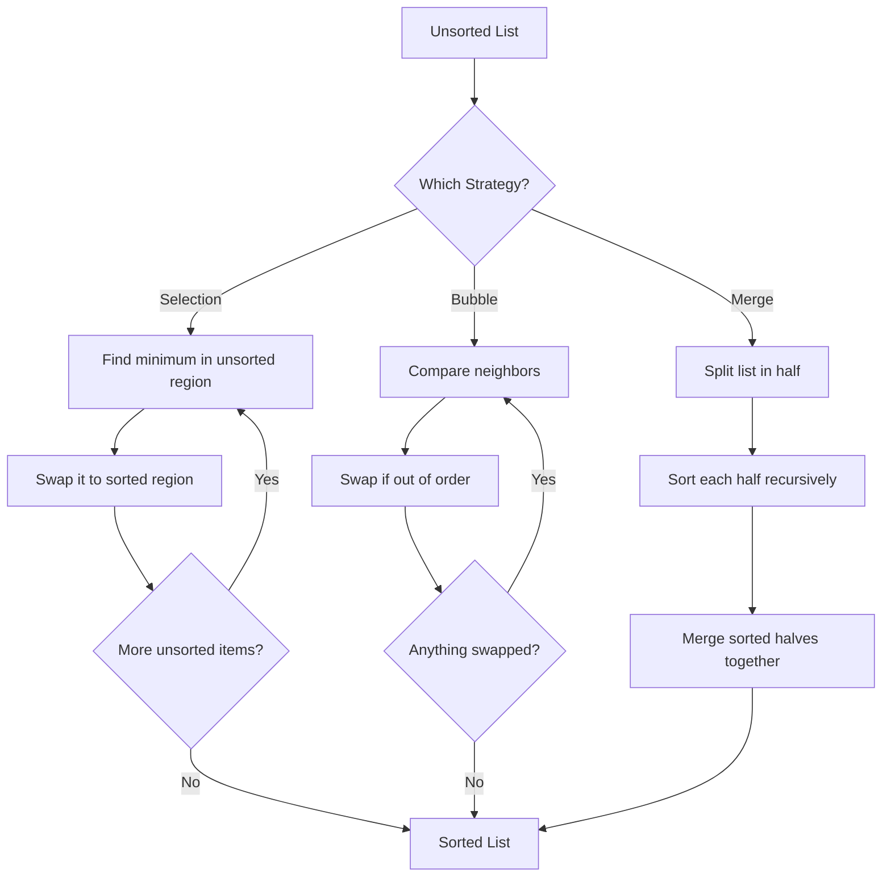

# Pre-Read: Sorting Algorithms in Python

## 1. The Hook (Analogy First)

Imagine you're organizing a messy kitchen pantry. You've got cans, boxes, and jars scattered everywhere, and you need to arrange them so you can find things quickly. You could organize them in different ways:

- **The Slow, Obvious Way:** Pick up each item one by one, find where it belongs, and place it in the right spot. This takes forever if you have 100 items.
- **The Slightly Smarter Way:** Walk through the shelves repeatedly, comparing neighbors and swapping the ones that are out of order. Each pass gets a little better.
- **The Clever Way:** Divide the pantry in half, organize each half separately, then carefully merge them back together in perfect order.

These three strategies are exactly how **sorting algorithms** work. They're recipes for taking a jumbled list of items (numbers, names, anything) and arranging them in order. Today, you're about to learn three classic recipes: **Selection Sort**, **Bubble Sort**, and **Merge Sort**. Each one trades speed, memory, and complexity in different ways.

---

## 2. What You'll Learn

In this pre-read, you'll discover:

- **Understand** how three fundamentally different sorting strategies work and why they matter
- **Compare** the trade-offs between speed, memory usage, and code complexity
- **Identify** which sorting algorithm is best for different real-world situations
- **Recognize** the core patterns that make some algorithms faster than others

---

## 3. Why This Matters

**🎯 You'll Write Better Code**
Understanding sorting algorithms helps you choose the right tool for the job. Picking the wrong algorithm can make your program slow on large datasets—sometimes the difference between finishing in 1 second versus 1 hour.

**🧠 You'll Understand How Computers Think**
Sorting is one of the most fundamental operations in computer science. Learning it teaches you how to break big problems into smaller steps, a skill that applies to almost every coding challenge you'll face.

**⚡ You'll Recognize Performance Patterns**
Some algorithms are "fast but use lots of memory." Others are "slow but use almost no memory." Learning to spot these trade-offs makes you a smarter problem-solver, whether you're writing code or debugging why something's slow.

---

## 4. From Known to New (The Bridge)

### The "Painful" Way

Let's say you have a list of 1,000 numbers and you want them sorted from smallest to largest. Without any algorithm knowledge, you might think: *"I'll just check every number against every other number and swap them if they're wrong."*

If you actually do this naively—checking all 1,000 numbers against all 1,000 numbers—you'd do about **1,000,000 comparisons**. Even worse, if the list is already sorted, you'd still do all those comparisons! Your program would be slow, and there'd be no way to make it faster without a smarter strategy.

### The "Better" Way

This is where sorting algorithms come in. They're **proven recipes** that reduce wasted work:

- Some algorithms (like **Selection Sort**) still do ~1,000,000 comparisons but organize them smartly so you never check the same pair twice.
- Some algorithms (like **Bubble Sort**) can detect when you're done early and stop, so a nearly-sorted list takes much less time.
- Some algorithms (like **Merge Sort**) use a "divide and conquer" trick that cuts the work down to just ~10,000 operations—a 100x speedup!

The magic is that these algorithms *guarantee* you won't waste time. They're blueprints that work, every time.

### Visual: The Three Strategies



---

## 5. Core Components

### **Selection Sort: The Methodical Organizer**

**Technical Name:** Selection Sort

**Pantry Analogy:** You stand at the left side of the shelf (the "sorted" side). Each time, you scan the entire right side (the "unsorted" side), find the smallest item, and bring it to the left. After many passes, everything on the left is in order.

**One-Sentence Definition:** Repeatedly find the smallest item in the unsorted portion and move it to the sorted portion.

**Key Trait:** Always takes the same amount of time, no matter what the input looks like. Even if your list is already sorted, it still does all the work.

---

### **Bubble Sort: The Neighbor Checker**

**Technical Name:** Bubble Sort

**Pantry Analogy:** You walk along the shelf from left to right, comparing each item with its neighbor. If they're out of order, you swap them. Then you do it again. Larger items "bubble" toward the right with each pass, like bubbles rising in water.

**One-Sentence Definition:** Repeatedly compare adjacent items and swap them if they're in the wrong order.

**Key Trait:** Smart versions of this algorithm can stop early if the list is already sorted. It's the only elementary sort that can adapt to easy inputs.

---

### **Merge Sort: The Divide-and-Conquer Master**

**Technical Name:** Merge Sort

**Pantry Analogy:** You divide the shelf in half. You organize the left half, organize the right half, then carefully walk through both halves at the same time, picking the smaller item from each side and placing it on a new shelf. The result is perfectly organized.

**One-Sentence Definition:** Recursively split the list in half, sort each half, then merge the sorted halves back together.

**Key Trait:** Much faster for large lists (O(n log n) vs. O(n²)), but requires extra space to hold the merged results temporarily.

---

## 6. Putting It All Together (Mini-Case Study)

Let's organize this simple list: **[5, 2, 8, 1]**

### Selection Sort Path:
```
Start:     [5, 2, 8, 1]  | Sorted: []
Pass 1:    [1, 2, 8, 5]  | Found min (1), moved it left
Pass 2:    [1, 2, 8, 5]  | Found min (2), already in place
Pass 3:    [1, 2, 5, 8]  | Found min (5), moved it left
Pass 4:    [1, 2, 5, 8]  | Only one left, done!
```

### Bubble Sort Path:
```
Start:     [5, 2, 8, 1]
Pass 1:    [2, 5, 1, 8]  | 5>2 (swap), 5>8 (no), 8>1 (swap)
Pass 2:    [2, 1, 5, 8]  | 2>1 (swap), 5>8 (no), 8 already in place
Pass 3:    [1, 2, 5, 8]  | 2>1 (swap), 5>8 (no), done!
```

### Merge Sort Path:
```
Start:     [5, 2, 8, 1]
Split:     [5, 2] and [8, 1]
Split:     [5], [2], [8], [1]  (all singles are "sorted")
Merge:     [2, 5] and [1, 8]
Merge:     [1, 2, 5, 8]  ✓
```

Notice how Merge Sort splits first, then does the smart merging. Selection and Bubble do the work gradually, one comparison at a time.

---

## 7. Practice Exercises (Mental Gym)

### **Exercise 1: Pattern Recognition**

You have a list of 10 numbers. Which statement is true?

A) Selection Sort will always finish faster than Bubble Sort  
B) Bubble Sort might finish faster if the list is already mostly sorted  
C) Merge Sort will always use less memory than Selection Sort  
D) All three algorithms produce the same result, just at different speeds

**Answer:** B and D are true. Bubble Sort can stop early (optimization). All three produce sorted lists, but Merge Sort uses extra memory for merging.

---

### **Exercise 2: The Analogy Check**

In our pantry analogy, which algorithm matches this action?

*"I split my shopping list in half, organize each half separately, then carefully combine them by always picking the next smallest item from either list."*

**Answer:** Merge Sort. The "split and merge" strategy is the hallmark of divide-and-conquer.

---

### **Exercise 3: Real World Spotting**

You're sorting a list of 1 million customer names. Which algorithm would you probably NOT want to use, and why?

**Answer:** Selection Sort or Bubble Sort. With 1 million items, O(n²) means ~1 trillion comparisons. Merge Sort's O(n log n) would do only ~20 million comparisons—thousands of times faster.

---

## You're Ready!

You now have a mental map of three sorting strategies and understand *why* they matter. In the deep-dive lecture, we'll code these up, trace through them step-by-step, and explore the math behind their speed differences.

Come ready to ask: *"Why does dividing the list make it faster?"* and *"When should I actually use each one?"* These are the questions that separate good programmers from great ones.

See you there! 🚀