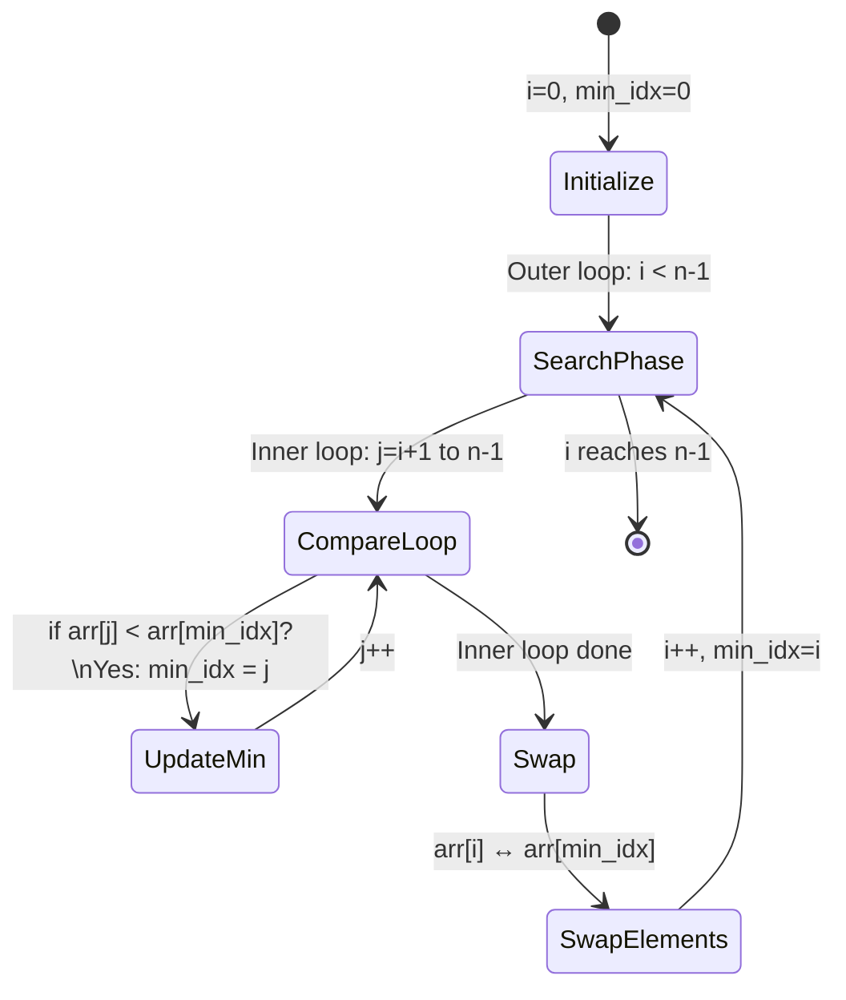
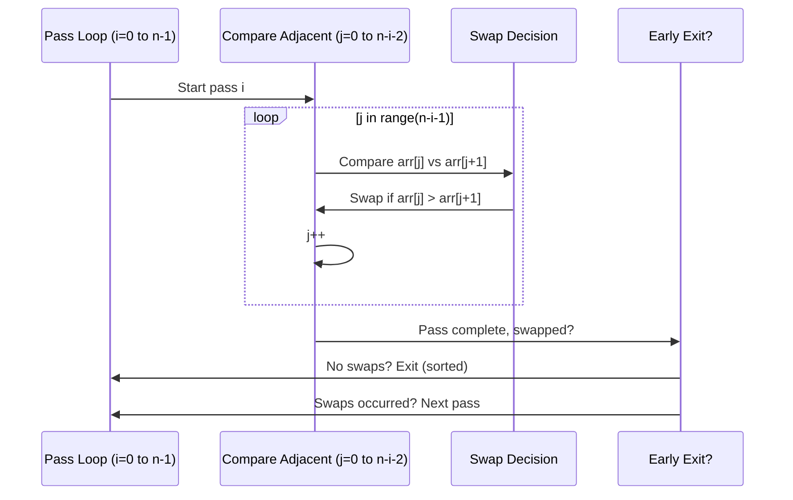
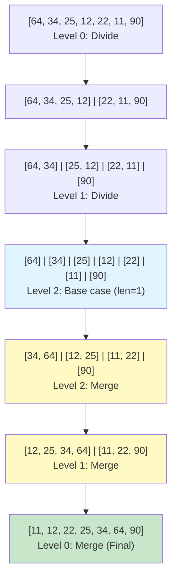

# Lecture Notes: Sorting Algorithms in Python

## 1. Learning Objectives

By the end of this deep dive, you will be able to:

- **Implement** selection sort, bubble sort, and merge sort from scratch with correct index management and no off-by-one errors.
- **Analyze** the time and space complexity of each algorithm and predict performance on datasets of varying sizes.
- **Debug** common pitfalls in each algorithm, including early termination failures, stability violations, and memory mismanagement.
- **Architect** sorting solutions for constrained environments (selection/bubble for O(1) space) versus performance-critical systems (merge sort for guaranteed O(n log n)).
- **Recognize** when each algorithm is appropriate and how they fit into production systems like Python's built-in Timsort.

---

## 2. The Theoretical Framework (The "Why" & "What")

### Analogy Re-Introduction: The Kitchen Line

Imagine a professional kitchen where a line of orders (dishes) must be organized by priority (time-to-serve). You have three strategies:

1. **Selection Sort:** Walk the entire line, find the highest-priority dish, move it to the front. Repeat. Slow but methodical.
2. **Bubble Sort:** Walk the line, swap adjacent dishes if the left one is lower priority. Keep walking until nothing moves. Repetitive but simple.
3. **Merge Sort:** Split the line into smaller groups, sort each group, then carefully interleave them back together. Complex setup but dramatically faster for long lines.

The kitchen doesn't care *how* you organize—it cares about **speed** and **space constraints**. A food truck (limited memory) uses selection or bubble. A Michelin kitchen (performance-critical) uses merge sort or better.

### Technical Definition

A **sorting algorithm** is a procedure that rearranges elements of a collection into a specified order (ascending/descending) based on a comparison function. The three algorithms we examine today represent a spectrum:

- **Selection Sort:** Greedy, in-place, quadratic, minimal swaps.
- **Bubble Sort:** Iterative, in-place, quadratic, adaptive (can optimize for nearly-sorted data).
- **Merge Sort:** Divide-and-conquer, not in-place, linearithmic, stable, guaranteed O(n log n).

### Why It Matters

In production systems, sorting is ubiquitous. Every database index, every search result ranking, every cache eviction policy relies on efficient sorting. At scale:

- A **quadratic algorithm on 1 million items** = ~10¹² operations (minutes of CPU time).
- A **linearithmic algorithm on 1 million items** = ~20 million operations (milliseconds).

Understanding the mechanics of these three algorithms teaches you:
- **How to reason about algorithmic tradeoffs** (time vs. space, simplicity vs. performance).
- **How to optimize for constraints** (limited memory? Use selection. Need stability? Use merge or bubble carefully).
- **How production systems are built** (Python's `sort()` uses Timsort, which combines merge sort with insertion sort adaptively).

---

## 3. Deep Dive: Selection Sort

### The Blueprint

Selection sort operates on a simple principle: **maintain a sorted region on the left, repeatedly extract the minimum from the unsorted region on the right.**

**Phase by phase:**
1. **Iteration 1:** Search the entire array (indices 1 to n-1) for the minimum. Swap it with position 0. Now position 0 is sorted.
2. **Iteration 2:** Search indices 2 to n-1 for the minimum. Swap with position 1. Now positions 0-1 are sorted.
3. **Continue** until only one element remains unsorted (it must be the largest).

**Key insight:** After *i* iterations, the first *i* elements are in their final, sorted positions. You never revisit them.

**Comparison count:** The outer loop runs n-1 times. The inner loop runs (n-1), (n-2), ..., 1 times respectively.
- Total comparisons: (n-1) + (n-2) + ... + 1 = **n(n-1)/2 = O(n²)**

**Swap count:** Exactly **n-1 swaps** (one per outer iteration). This is the *minimum* among comparison-based sorts.

### Visual Architecture



**State explanation:**
- **Initialize:** Set outer loop counter and min tracking variable.
- **SearchPhase:** Outer loop boundary advances; sorted region grows left-to-right.
- **CompareLoop:** Inner loop scans unsorted region, tracking minimum index.
- **Swap:** Single swap per outer iteration moves minimum to sorted boundary.

### Code Implementation

```python
def selection_sort(arr):
    """
    Selection sort: repeatedly find minimum in unsorted region, swap to sorted boundary.
    
    Args:
        arr: List of comparable elements (modified in-place)
    
    Returns:
        None (modifies arr in-place)
    
    Time: O(n²) all cases
    Space: O(1) extra space
    """
    n = len(arr)
    
    # Outer loop: marks boundary between sorted (0 to i-1) and unsorted (i to n-1)
    for i in range(n - 1):
        min_idx = i  # Assume leftmost unsorted is minimum
        
        # Inner loop: find actual minimum in unsorted region
        for j in range(i + 1, n):
            if arr[j] < arr[min_idx]:
                min_idx = j  # Track index, don't swap yet
        
        # Single swap per outer iteration: move minimum to sorted boundary
        arr[i], arr[min_idx] = arr[min_idx], arr[i]
    
    return arr


# Example trace: [64, 34, 25, 12, 22]
# Pass 0: min=12 at idx 3 → [12, 34, 25, 64, 22]
# Pass 1: min=22 at idx 4 → [12, 22, 25, 64, 34]
# Pass 2: min=25 at idx 2 → [12, 22, 25, 64, 34] (no swap)
# Pass 3: min=34 at idx 4 → [12, 22, 25, 34, 64]
# Done: [12, 22, 25, 34, 64]
```

---

## 4. Deep Dive: Bubble Sort

### The Blueprint

Bubble sort operates on **adjacent comparisons and swaps**. The algorithm repeatedly walks through the array, comparing neighboring elements and swapping if they violate sort order. After each complete pass, the largest unsorted element "bubbles" to its correct position at the end.

**Phase by phase:**
1. **Pass 1:** Compare arr[0] with arr[1], swap if needed. Move to arr[1] and arr[2], swap if needed. Continue to the end. Largest element is now at position n-1.
2. **Pass 2:** Repeat, but stop at position n-2 (last element already sorted). Second-largest now at position n-2.
3. **Continue** until no swaps occur in a pass (array is sorted).

**Key insight:** The unsorted region shrinks by one element per pass. You can optimize by tracking whether a swap occurred; if not, the array is sorted and you can exit early.

**Comparison count (worst case):** Same as selection sort: n(n-1)/2 = **O(n²)**

**Swap count (worst case):** Up to n(n-1)/2 swaps (reverse-sorted input). Selection sort always does fewer swaps.

**Best case:** If array is already sorted and you use the optimization flag, **O(n)** with a single pass.

### Visual Architecture



**Sequence explanation:**
- **Pass Loop:** Outer loop controls number of passes; each pass guarantees one element in final position.
- **Compare Adjacent:** Inner loop walks unsorted region, comparing adjacent pairs.
- **Swap Decision:** If left > right (for ascending), swap; otherwise leave.
- **Early Exit:** If a pass produces zero swaps, array is sorted; exit immediately.

### Code Implementation

```python
def bubble_sort(arr):
    """
    Bubble sort: repeatedly compare adjacent elements, swap if out of order.
    Largest unsorted element "bubbles" to end after each pass.
    
    Args:
        arr: List of comparable elements (modified in-place)
    
    Returns:
        None (modifies arr in-place)
    
    Time: O(n²) worst/average; O(n) best (already sorted with optimization)
    Space: O(1) extra space
    Stability: Yes (uses <= in merge, but standard > comparison maintains stability)
    """
    n = len(arr)
    
    # Outer loop: each pass guarantees one more element in final position
    for i in range(n):
        swapped = False  # Optimization flag
        
        # Inner loop: compare adjacent pairs in unsorted region
        # Range shrinks by i each pass (last i elements already sorted)
        for j in range(0, n - i - 1):
            if arr[j] > arr[j + 1]:  # Out of order?
                arr[j], arr[j + 1] = arr[j + 1], arr[j]
                swapped = True
        
        # Early termination: if no swaps occurred, array is sorted
        if not swapped:
            break
    
    return arr


# Example trace: [64, 34, 25, 12, 22]
# Pass 0: 64>34✓, 34>25✓, 25>12✓, 12<22✗ → [34, 25, 12, 22, 64], swapped=True
# Pass 1: 34>25✓, 25>12✓, 12<22✗ → [25, 12, 22, 34, 64], swapped=True
# Pass 2: 25>12✓, 12<22✗ → [12, 22, 25, 34, 64], swapped=True
# Pass 3: 12<22✗ → [12, 22, 25, 34, 64], swapped=False → Exit
```

---

## 5. Deep Dive: Merge Sort

### The Blueprint

Merge sort is a **divide-and-conquer** algorithm. It splits the problem into smaller subproblems, solves them independently, then combines solutions. This recursive structure guarantees O(n log n) performance.

**Phase by phase:**
1. **Divide:** Recursively split array in half until each subarray has length ≤ 1 (base case).
2. **Conquer:** Subarrays of length 1 are trivially sorted.
3. **Merge:** Combine two sorted subarrays into a single sorted array by comparing head elements and appending the smaller one.

**Division depth:** For an array of size n, recursion depth = ⌈log₂(n)⌉. Each level performs O(n) work merging, so total = O(n log n).

**Stability:** The merge function uses `<=` (not `<`) when comparing, preserving the relative order of equal elements.

**Space complexity:** Merge sort creates new arrays during recursion and merging. Worst case: O(n) auxiliary space (not in-place).

### Visual Architecture



**Architecture explanation:**
- **Blue (Level 2):** Base case—arrays of length 1 are trivially sorted.
- **Yellow (Merge phases):** Combine sorted subarrays. Each merge is linear in the size of its inputs.
- **Green (Final):** Fully sorted array emerges from the final merge.

### Code Implementation

```python
def merge_sort(arr):
    """
    Merge sort: divide-and-conquer recursive sort.
    Splits array in half, recursively sorts each half, merges sorted halves.
    
    Args:
        arr: List of comparable elements
    
    Returns:
        New sorted list (does not modify original)
    
    Time: O(n log n) all cases
    Space: O(n) auxiliary space for merging
    Stability: Yes (uses <= in merge comparison)
    """
    # Base case: arrays of length 0 or 1 are sorted
    if len(arr) <= 1:
        return arr
    
    # Divide: split array in half
    mid = len(arr) // 2
    left = merge_sort(arr[:mid])      # Recursively sort left half
    right = merge_sort(arr[mid:])     # Recursively sort right half
    
    # Conquer: merge sorted halves
    return merge(left, right)


def merge(left, right):
    """
    Merge two sorted arrays into a single sorted array.
    Uses two-pointer technique to compare head elements.
    
    Args:
        left: Sorted list
        right: Sorted list
    
    Returns:
        New sorted list combining both inputs
    """
    result = []
    i = j = 0  # Pointers for left and right
    
    # Compare head elements; append smaller one
    while i < len(left) and j < len(right):
        if left[i] <= right[j]:  # <= preserves stability for equal elements
            result.append(left[i])
            i += 1
        else:
            result.append(right[j])
            j += 1
    
    # Append remaining elements (one list will be exhausted)
    result.extend(left[i:])
    result.extend(right[j:])
    
    return result


# Example trace: [64,