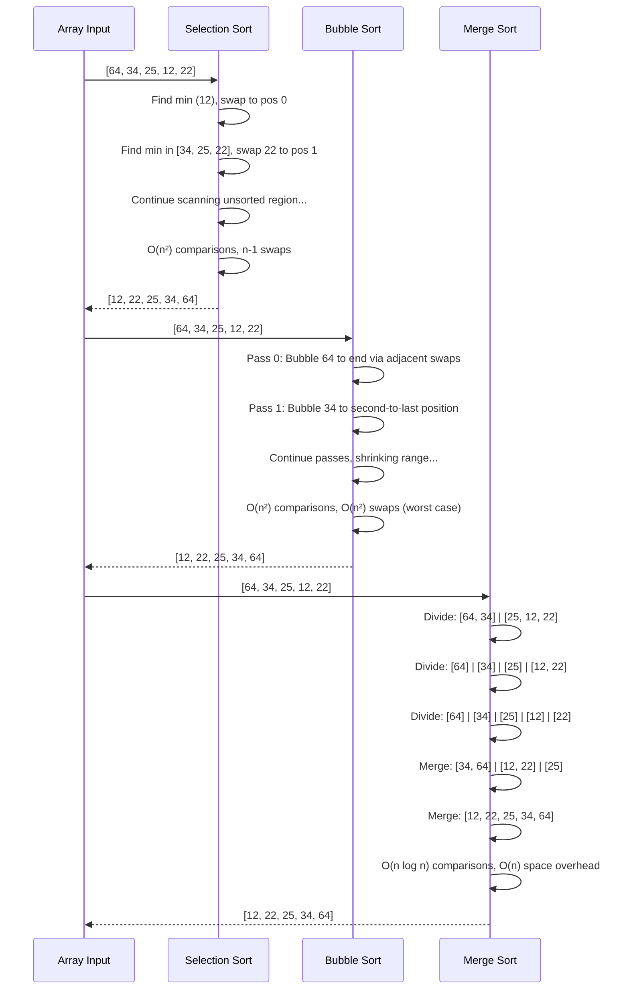

# LECTURE NOTES: Sorting Algorithms in Python

## Section 1: Mastering the Three Sorting Paradigms

By the end of this deep dive, you will:

- **Implement** all three sorting algorithms from scratch and understand the exact mechanics of each pass through the data
- **Analyze** the time and space complexity trade-offs in realistic scenarios, including best-case, average-case, and pathological inputs
- **Debug** common implementation errors that arise from off-by-one errors, pointer management, and recursive base cases
- **Choose** the optimal sorting algorithm for a given constraint (write-minimization, stability, in-place requirements, or time guarantees)
- **Recognize** how these foundational algorithms appear in production systems (Python's Timsort, database query optimization, distributed sorting)

---

## Section 2: The Sorting Landscape – Building Intuition Through the Warehouse Analogy

### The Analogy Universe: The Warehouse Sorting System

Imagine you are managing a massive distribution warehouse where packages arrive unsorted on a conveyor belt. Your job: arrange them by delivery zone (ascending order). You have three different team strategies:

1. **Selection Sort** = The "Find the Minimum" crew
2. **Bubble Sort** = The "Adjacent Swap" crew  
3. **Merge Sort** = The "Divide and Conquer" crew

Each strategy has different labor costs, space requirements, and efficiency profiles. The warehouse manager (you) must choose wisely based on constraints.

### Technical Definition: What Sorting Algorithms Actually Do

A **sorting algorithm** is a deterministic procedure that reorders elements in a sequence such that they satisfy a total ordering relation (typically `≤`). More formally:

Given an array `A` of `n` elements from a totally ordered set, a sorting algorithm produces a permutation `A'` such that:
- `A'[0] ≤ A'[1] ≤ ... ≤ A'[n-1]`
- The multiset of elements remains unchanged (no elements added or lost)
- **Stability** (optional): If `A[i] = A[j]` and `i < j`, then `A'[i]` appears before `A'[j]` in the output

### Why It Matters: The Engineering Impact

**Performance:** Sorting dominates computational cost in many systems. A naive O(n²) sort on 1 million items means ~10¹² comparisons. An O(n log n) sort means ~20 million comparisons—a 50,000× speedup.

**Stability:** In databases, you might sort by last name, then by first name. Unstable sorts destroy the secondary ordering. Unstable = data corruption.

**Space Trade-off:** In-place sorting (O(1) space) is critical on embedded systems or when sorting massive datasets where doubling memory is impossible. But it often sacrifices time guarantees.

---

## Section 3: The Three Algorithms – Architecture and Implementation

### Selection Sort: The Greedy Minimum Finder

**The Blueprint:**

Selection sort divides the array into two regions:
- **Left region (sorted):** Elements 0 to `i-1` are in final position
- **Right region (unsorted):** Elements `i` to `n-1` need processing

**Each iteration:**
1. Scan the unsorted region to find the minimum element
2. Swap it with the element at position `i` (leftmost unsorted)
3. Increment `i`; repeat until `i = n-1`

**Key insight:** Exactly `n-1` swaps occur, regardless of input order. This is optimal for write-heavy scenarios (e.g., flash memory where writes degrade the device).

**Implementation:**

```python
def selection_sort(arr):
    """
    Selection Sort: O(n²) time, O(1) space, in-place, NOT stable.
    
    Args:
        arr: List of comparable elements (modified in-place)
    
    Returns:
        None (modifies arr directly)
    """
    n = len(arr)
    
    # Outer loop: position to fill in sorted region
    for i in range(n - 1):  # n-1 iterations; last element automatically sorted
        min_idx = i
        
        # Inner loop: find minimum in unsorted region [i, n)
        for j in range(i + 1, n):
            if arr[j] < arr[min_idx]:
                min_idx = j
        
        # Single swap per outer iteration
        # This is the defining characteristic of selection sort
        arr[i], arr[min_idx] = arr[min_idx], arr[i]
    
    return arr


# Example trace: [64, 34, 25, 12, 22]
# i=0: min=12 at idx 3 → [12, 34, 25, 64, 22]
# i=1: min=22 at idx 4 → [12, 22, 25, 64, 34]
# i=2: min=25 at idx 2 → [12, 22, 25, 64, 34]
# i=3: min=34 at idx 4 → [12, 22, 25, 34, 64]
```

**Warehouse analogy:** The "Find the Minimum" crew walks through the unsorted pile, identifies the smallest package, and places it in the next sorted slot. They do this `n-1` times. Total work: always the same, whether packages are pre-sorted or reverse-sorted.

---

### Bubble Sort: The Adjacent Swap Master

**The Blueprint:**

Bubble sort repeatedly scans the array, comparing adjacent pairs and swapping if they violate the sort order. Larger elements "bubble up" to the end with each pass.

**Each pass `i`:**
1. Compare `arr[0]` with `arr[1]`, swap if needed
2. Compare `arr[1]` with `arr[2]`, swap if needed
3. Continue until position `n - 1 - i`
4. After pass `i`, the last `i+1` elements are in final position

**Key insight:** The inner loop shrinks each pass (`len(arr) - 1 - i`). If no swaps occur in a pass, the array is sorted—early termination is possible.

**Implementation:**

```python
def bubble_sort(arr):
    """
    Bubble Sort: O(n²) worst/avg, O(n) best, O(1) space, in-place, STABLE.
    
    Args:
        arr: List of comparable elements (modified in-place)
    
    Returns:
        None (modifies arr directly)
    """
    n = len(arr)
    
    # Outer loop: number of passes
    for i in range(n):
        swapped = False
        
        # Inner loop: adjacent comparisons
        # Range shrinks by i each pass (last i elements already sorted)
        for j in range(n - 1 - i):
            if arr[j] > arr[j + 1]:
                # Swap adjacent elements if out of order
                arr[j], arr[j + 1] = arr[j + 1], arr[j]
                swapped = True
        
        # Optimization: if no swaps occurred, array is sorted
        if not swapped:
            break
    
    return arr


# Example trace: [5, 2, 8, 1, 9]
# Pass 0: [2, 5, 1, 8, 9] → 9 bubbles to end
# Pass 1: [2, 1, 5, 8, 9] → 8 in place, 9 already sorted
# Pass 2: [1, 2, 5, 8, 9] → 5 in place
# Pass 3: [1, 2, 5, 8, 9] → no swaps, BREAK (early termination)
```

**Warehouse analogy:** The "Adjacent Swap" crew walks the line of packages, comparing neighbors. If the right package is smaller, they swap. Larger packages gradually move right. After each full pass, the heaviest package is in its final position.

---

### Merge Sort: The Divide-and-Conquer Powerhouse

**The Blueprint:**

Merge sort is a recursive algorithm:
1. **Divide:** Split the array in half recursively until single elements remain
2. **Conquer:** Merge pairs of sorted subarrays by comparing heads and appending the smaller element
3. **Combine:** Recursively merge larger sorted subarrays

**Key insight:** Merging two sorted arrays of size `m` and `n` takes O(m + n) comparisons. The tree of merges has depth log(n), and each level processes all n elements, yielding O(n log n) guaranteed time.

**Implementation:**

```python
def merge_sort(arr):
    """
    Merge Sort: O(n log n) all cases, O(n) space, NOT in-place, STABLE.
    
    Args:
        arr: List of comparable elements
    
    Returns:
        New sorted list (original unchanged)
    """
    # Base case: single element or empty is already sorted
    if len(arr) <= 1:
        return arr
    
    # Divide: split array in half
    mid = len(arr) // 2
    left = merge_sort(arr[:mid])      # Recursively sort left half
    right = merge_sort(arr[mid:])     # Recursively sort right half
    
    # Conquer: merge sorted halves
    return merge(left, right)


def merge(left, right):
    """
    Merge two sorted arrays into a single sorted array.
    
    Args:
        left: Sorted list
        right: Sorted list
    
    Returns:
        Merged sorted list
    """
    result = []
    i = j = 0  # Pointers for left and right subarrays
    
    # Compare heads of left and right; append smaller
    while i < len(left) and j < len(right):
        if left[i] <= right[j]:  # <= ensures stability
            result.append(left[i])
            i += 1
        else:
            result.append(right[j])
            j += 1
    
    # Append remaining elements (one subarray will be exhausted)
    result.extend(left[i:])    # Append rest of left if any
    result.extend(right[j:])   # Append rest of right if any
    
    return result


# Example trace: [38, 27, 43, 3]
# Divide: [38, 27] and [43, 3]
# Divide: [38], [27], [43], [3]
# Merge: [27, 38] and [3, 43]
# Merge: [3, 27, 38, 43]
```

**Warehouse analogy:** The "Divide and Conquer" crew splits the conveyor belt into smaller sections, sorts each independently, then merges sorted sections back together. The merge step is intelligent: two workers hold the fronts of two sorted piles and always grab the smaller package next.

---

### Visual Architecture: Comparative State Progression



---

## Section 4: Edge Cases and Common Pitfalls – Where Novices Stumble

### The "Happy Path" vs. Reality

**Selection Sort Pitfalls:**

**Pitfall 1: Off-by-One in Outer Loop**

```python
# ❌ WRONG: This attempts n iterations, causing index out of bounds
def selection_sort_wrong(arr):
    for i in range(len(arr)):  # Oops! Should be len(arr) - 1
        min_idx = i
        for j in range(i + 1, len(arr)):
            if arr[j] < arr[min_idx]:
                min_idx = j
        arr[i], arr[min_idx] = arr[min_idx], arr[i]
    # When i = len(arr) - 1, range(i + 1, len(arr)) is empty
    # Last element is never compared; also unnecessary work

# ✅ CORRECT: n-1 iterations sufficient; last element auto-sorted
def selection_sort_correct(arr):
    for i in range(len(arr) - 1):  # n-1 iterations
        min_idx = i
        for j in range(i + 1, len(arr)):
            if arr[j] < arr[min_idx]:
                min_idx = j
        arr[i], arr[min_idx] = arr[min_idx], arr[i]
```

**Pitfall 2: Not Resetting `min_idx` Each Iteration**

```python
# ❌ WRONG: min_idx persists across iterations
def selection_sort_broken(arr):
    min_idx = 0  # Declared outside loop!
    for i in range(len(arr) - 1):
        for j in range(i + 1, len(arr)):
            if arr[j] < arr[min_idx]:
                min_idx = j
        arr[i], arr[min_idx] = arr[min_idx], arr[i]
    # min_idx may point to an element already in sorted region
    # Produces incorrect results

# ✅ CORRECT: Reset min_idx to current position each iteration
def selection_sort_correct(arr):
    for i in range(len(arr) - 1):
        min_idx = i  # Reset to current position
        for j in range(i + 1, len(arr)):
            if arr[j] < arr[min_idx]:
                min_idx = j
        arr[i], arr[min_idx] = arr[min_idx], arr[i]
```

---

### Bubble Sort Pitfalls

**Pitfall 1: Failing to Shrink Inner Loop Range**

```python
# ❌ WRONG: Inner loop always runs full length
def bubble_sort_inefficient(arr):
    for i in range(len(arr)):
        for j in range(len(arr) - 1):  # Should be len(arr) - 1 - i
            if arr[j] > arr[j + 1]:
                arr[j], arr[j + 1] = arr[j + 1], arr[j]
    # Redundant comparisons of already-sorted elements
    # Still O(n²), but with unnecessary constant factor

# ✅ CORRECT: Shrink range each