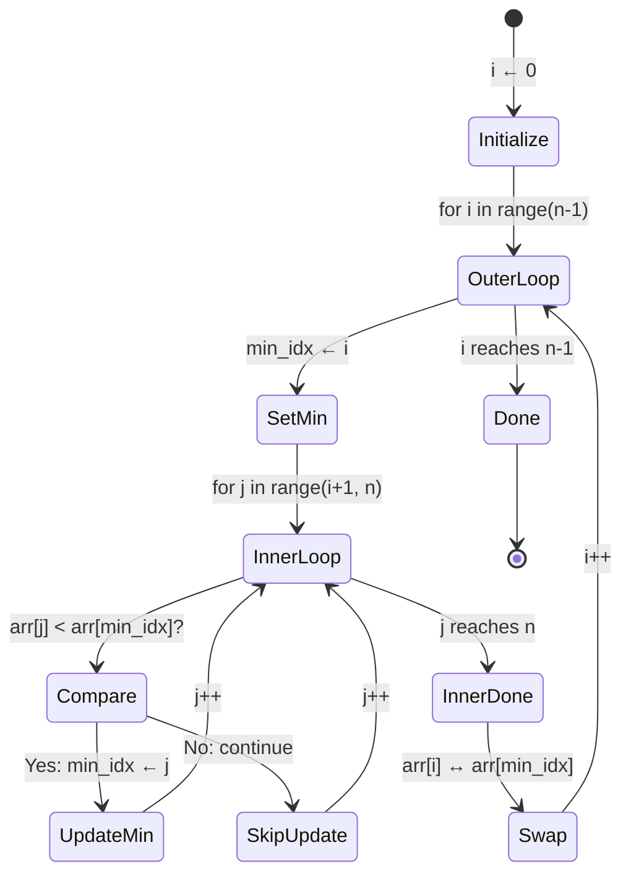
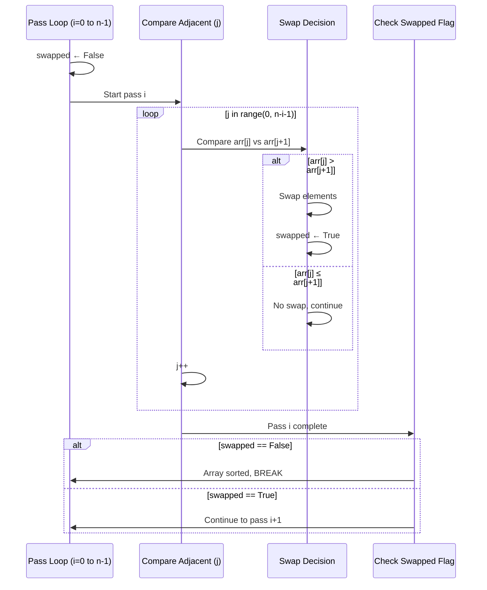

# Lecture Notes: Sorting Algorithms in Python

## 1. Learning Objectives

By the end of this deep dive, you will be able to:

- **Implement** selection sort, bubble sort, and merge sort from scratch with correct index management, handling edge cases like empty arrays, single-element lists, and duplicate values.
- **Analyze** the time and space complexity of each algorithm rigorously, predicting performance on datasets of varying sizes and identifying which algorithm dominates at scale.
- **Debug** common pitfalls in each algorithm, including off-by-one errors, stability violations, incorrect swap logic, and memory mismanagement in recursive calls.
- **Architect** sorting solutions for constrained environments (selection/bubble for O(1) space) versus performance-critical systems (merge sort for guaranteed O(n log n)).
- **Recognize** when each algorithm is appropriate and how they fit into production systems like Python's built-in Timsort.

---

## 2. The Theoretical Framework (The "Why" & "What")

### Analogy Re-Introduction: The Kitchen Brigade

Imagine a professional kitchen where a chef must organize a pile of recipe cards by preparation time (shortest to longest) before service. Three sous chefs volunteer, each with a different strategy:

1. **Selection Sort Chef:** Walks the entire pile, identifies the recipe with the shortest prep time, places it at the front of the organized stack. Repeats. Methodical, makes minimal movements (swaps), but requires many passes through the pile.

2. **Bubble Sort Chef:** Walks the pile comparing adjacent recipes, swapping them if the left card has longer prep time than the right. After each complete walk-through, the longest recipe has "bubbled" to the end. Simple pattern, but inefficient for large disorganized piles—unless the pile is already nearly organized.

3. **Merge Sort Chef:** Divides the pile in half, hands each half to an assistant to organize independently, then carefully interleaves the two organized stacks back together by always picking the next shortest recipe from whichever stack has it. Complex coordination, but dramatically faster for large piles.

The head chef doesn't care *how* recipes are organized—they care about **throughput** (time before service) and **workspace constraints** (limited counter space). A small kitchen (limited memory) uses selection or bubble. A high-volume restaurant (performance-critical) uses merge sort or better.

### Technical Definition

A **sorting algorithm** is a deterministic procedure that rearranges elements of a collection into a specified order (ascending/descending) based on a comparison function. The three algorithms examined today represent a spectrum of complexity-to-performance tradeoffs:

- **Selection Sort:** Greedy, in-place, O(n²) *always* (no best or worst case), minimal swaps (~n), unstable.
- **Bubble Sort:** Iterative, in-place, O(n²) worst/average but O(n) best (already sorted), adaptive to input order, stable.
- **Merge Sort:** Divide-and-conquer, *not in-place*, O(n log n) guaranteed across all cases, stable, requires O(n) auxiliary space.

### Why It Matters

Sorting is foundational to computer science. Every database index, search result ranking, cache eviction policy, and data pipeline relies on efficient sorting. At production scale, the difference is catastrophic:

- A **quadratic algorithm on 1 million items** = ~10¹² operations (minutes of CPU time, timeouts, unhappy users).
- A **linearithmic algorithm on 1 million items** = ~20 million operations (milliseconds, responsive systems).

Understanding these three algorithms teaches you:

- **How to reason about algorithmic tradeoffs:** time vs. space, simplicity vs. performance, stability vs. speed.
- **How to optimize for constraints:** Limited memory? Use selection. Need guaranteed performance? Use merge. Data nearly sorted? Use bubble with early termination.
- **How production systems are engineered:** Python's `sort()` uses **Timsort**, which adapts between merge sort and insertion sort based on input characteristics—a lesson in pragmatic algorithm design.

---

## 3. Deep Dive: Selection Sort

### The Blueprint

Selection sort operates on a simple greedy principle: **maintain a sorted region on the left, repeatedly extract the minimum from the unsorted region on the right, and swap it into place.**

The algorithm divides the array into two regions:
- **Sorted region (left):** Elements in indices [0, i) are in their final positions.
- **Unsorted region (right):** Elements in indices [i, n) are not yet sorted.

Each iteration advances the boundary by one:

1. **Iteration 0:** Find minimum in [0, n), swap with index 0. Sorted region = [0].
2. **Iteration 1:** Find minimum in [1, n), swap with index 1. Sorted region = [0, 1].
3. **Iteration i:** Find minimum in [i, n), swap with index i. Sorted region = [0, i].

After n-1 iterations, the last element must be the maximum and is automatically sorted.

**Comparison count:** The outer loop runs n-1 times. The inner loop runs (n-1), (n-2), ..., 1 comparisons respectively. Total: (n-1) + (n-2) + ... + 1 = **n(n-1)/2 = O(n²)** regardless of input order.

**Swap count:** Exactly **n-1 swaps** (one per outer iteration). This is the *minimum* among all comparison-based sorts and is a key advantage when writes are expensive (e.g., flash memory).

**Stability:** Selection sort is **unstable**. When you swap the minimum element into position i, you may violate the relative order of equal elements. Example: `[3a, 1, 3b]` → After finding minimum 1 at index 1, swap with index 0 → `[1, 3a, 3b]`. But if we started with `[3a, 3b, 1]`, the swap produces `[1, 3b, 3a]`—the order of 3a and 3b reversed.

### Visual Architecture



**State flow explanation:**
- **Initialize:** Set outer loop counter (i) at sorted boundary.
- **OuterLoop:** Boundary advances; sorted region grows left-to-right by one element per iteration.
- **SetMin:** Reset min_idx to current boundary position (i), assuming it's the minimum.
- **InnerLoop:** Scan unsorted region [i+1, n), updating min_idx only if a smaller element is found.
- **Swap:** Single swap moves minimum to sorted boundary. This happens *once* per outer iteration, never during the search.

### Code Implementation

```python
def selection_sort(arr):
    """
    Selection sort: repeatedly find minimum in unsorted region, 
    swap to sorted boundary.
    
    Args:
        arr: List of comparable elements (modified in-place)
    
    Returns:
        None (modifies arr in-place)
    
    Time: O(n²) all cases
    Space: O(1) extra space
    Stable: No
    """
    n = len(arr)
    
    # Outer loop: boundary between sorted [0, i) and unsorted [i, n)
    for i in range(n - 1):
        min_idx = i  # Assume leftmost unsorted is minimum
        
        # Inner loop: find actual minimum in unsorted region [i+1, n)
        for j in range(i + 1, n):
            if arr[j] < arr[min_idx]:
                min_idx = j  # Track index only; don't swap yet
        
        # Single swap per outer iteration: move minimum to sorted boundary
        arr[i], arr[min_idx] = arr[min_idx], arr[i]
    
    return arr


# Trace: [64, 34, 25, 12, 22]
# i=0: Find min in [0,5]→12 at idx 3, swap arr[0]↔arr[3] → [12, 34, 25, 64, 22]
# i=1: Find min in [1,5]→22 at idx 4, swap arr[1]↔arr[4] → [12, 22, 25, 64, 34]
# i=2: Find min in [2,5]→25 at idx 2, swap arr[2]↔arr[2] → [12, 22, 25, 64, 34]
# i=3: Find min in [3,5]→34 at idx 4, swap arr[3]↔arr[4] → [12, 22, 25, 34, 64] ✓
```

---

## 4. Deep Dive: Bubble Sort

### The Blueprint

Bubble sort operates on **adjacent comparisons and swaps**. The algorithm repeatedly walks through the array, comparing neighboring elements and swapping if they violate sort order (left > right for ascending). After each complete pass, the largest unsorted element "bubbles" to its correct position at the end.

The key insight: **after pass i, the last i elements are in their final sorted positions and need not be revisited.**

Phase by phase:

1. **Pass 0:** Compare arr[0]↔arr[1], swap if needed. Compare arr[1]↔arr[2], swap if needed. Continue to arr[n-2]↔arr[n-1]. Largest element now at position n-1.
2. **Pass 1:** Repeat, but stop at arr[n-3]↔arr[n-2]. Second-largest now at position n-2.
3. **Pass i:** Compare pairs in [0, n-i-2]. Element at position n-i-1 is now sorted.

The algorithm terminates when a complete pass produces no swaps (array already sorted).

**Comparison count (worst case):** Same as selection sort: (n-1) + (n-2) + ... + 1 = **O(n²)**

**Swap count (worst case):** Up to n(n-1)/2 swaps (reverse-sorted input). Selection sort always does fewer swaps.

**Best case:** If array is already sorted and you use the optimization flag, **O(n)** with a single pass and zero swaps.

**Stability:** Bubble sort is **stable** because it uses `>` (strict greater-than). Equal elements never swap positions.

### Visual Architecture



**Sequence explanation:**
- **Pass Loop:** Outer loop controls number of passes; each pass guarantees one element in final position.
- **Compare Adjacent:** Inner loop walks unsorted region [0, n-i-1], comparing adjacent pairs.
- **Swap Decision:** If left > right (for ascending), swap and set flag; otherwise continue.
- **Early Exit:** If a pass produces zero swaps (flag never set to True), array is sorted; exit immediately.

### Code Implementation

```python
def bubble_sort(arr):
    """
    Bubble sort: repeatedly compare adjacent elements, swap if out of order.
    Largest unsorted element "bubbles" to end after each pass.
    
    Args:
        arr: List of comparable elements (modified in-place)
    
    Returns:
        None (modifies arr in-place)
    
    Time: O(n²) worst/average; O(n) best (with optimization)
    Space: O(1) extra space
    Stable: Yes
    """
    n = len(arr)
    
    # Outer loop: each pass guarantees one more element in final position
    for i in range(n):
        swapped = False  # Optimization flag for early termination
        
        # Inner loop: compare adjacent pairs in unsorted region
        # Range shrinks by i each pass (last i elements already sorted)
        for j in range(0, n - i - 1):
            if arr[j] > arr[j + 1]:  # Out of order?
                arr[j], arr[j + 1] = arr[j + 1], arr[j]
                swapped = True
        
        # Early termination: if no swaps occurred, array is sorted
        if not swapped:
            break
    
    return arr


# Trace: [64, 34, 25, 12, 22]
# Pass 0: (64,34)→[34,64,...], (64,25)→[34,25,64,...], (64,12)→[34,25,12,64,...]
#         (64,22)→[34,25,12,22,64], swapped=True
# Pass 1: (34,25)→[25,34,...], (34,12)→[25,12,34,...], (34,22)→[25,12,22,34,64]
# Pass 2: (25,12)→[12,25,...], (25,22)→[12,22,25,34,64], swapped=True
# Pass 3: (12,22)→no swap, swapped=False → BREAK
# Final: [12, 22, 25, 34, 64] ✓
```

---

## 5. Deep Dive: Merge Sort

### The Blueprint

Merge sort is a **divide-and-conquer** algorithm that recursively splits the problem into smaller subproblems, solves them independently, then combines solutions. This recursive structure guarantees O(n log n) performance across all cases.

The algorithm operates in two phases:

**Divide phase (recursion):**
1. If array length ≤ 1, return (base case: trivially sorted).
2. Find midpoint: mid = len(arr) // 2.
3. Recursively sort left half: arr[0:mid].
4. Recursively sort right half: arr[mid:n].

**Conquer phase (merge):**
1. Merge two sorted halves using a two-pointer technique.
2. Compare head elements of left and right; append smaller one to result.
3. Append remaining elements from whichever half is exhausted.

**Division depth:** For an array of size n, recursion depth = ⌈log₂(n)⌉. Each level performs O(n) work merging, so total = O(n log n).

**Stability:** The merge function uses `<=` (not `<`) when comparing, preserving the relative order of equal elements.

**Space complexity:** Merge sort creates new arrays during recursion and merging. Worst case: O(n) auxiliary space (not in-place). This is the