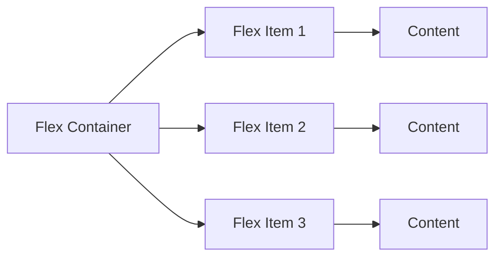
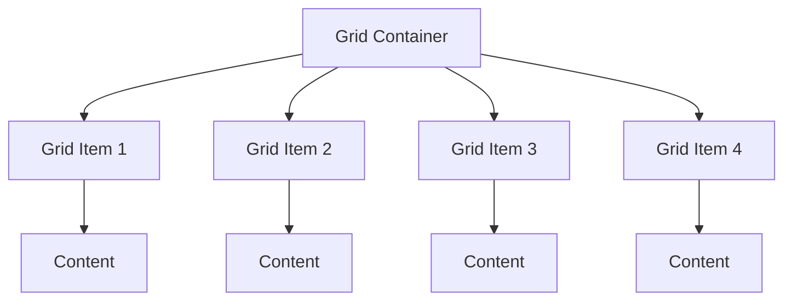
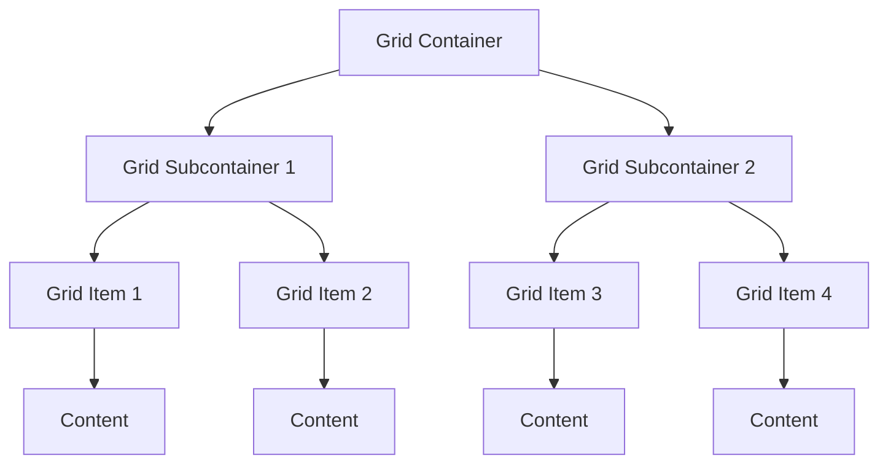

## Lecture Notes: CSS Layout Fundamentals

### Mastering the Art of Spatial Arrangement

By the end of this deep dive, you will:

- Precisely define and apply the CSS box model to your layouts
- Leverage the power of Flexbox to create responsive, dynamic user interfaces
- Harness the versatility of Grid to build complex, adaptive grid-based designs
- Debug common layout issues and optimize for performance

### Spatial Choreography: The CSS Box Model

*Analogy Universe: The Theatrical Stage*

In the world of web design, the CSS box model is akin to the theatrical stage - a defined space where the various elements of your user interface come together in a carefully orchestrated performance. Just as a stage director meticulously arranges the set pieces and actors, the box model allows you, the web developer, to control the size, positioning, and interaction of each HTML element on the page.

The technical definition of the CSS box model is as follows: it is a fundamental concept in CSS that describes the rectangular box that wraps around every HTML element. This box consists of four main components: content, padding, border, and margin. Understanding how these components work together is crucial for creating visually harmonious and responsive layouts.

Why does this matter? The box model is the foundation upon which all CSS layout techniques are built. Mastering its nuances empowers you to create complex, adaptive user interfaces that adapt seamlessly to different screen sizes and user interactions. By precisely controlling the size and positioning of each element, you can craft layouts that are both visually appealing and functionally robust.

### The Theatrical Troupe: Flexbox Fundamentals

*Analogy Universe: The Theatrical Stage*

Imagine your web page as a grand theatrical production, with each HTML element playing a unique role in the overall performance. Flexbox is the director's tool for arranging these elements on the stage, allowing you to create dynamic, responsive layouts with ease.

At its core, Flexbox is a CSS layout mode that provides a flexible way to distribute elements along a single axis (either horizontally or vertically). It works by treating the parent container as the "stage" and the child elements as the "actors." The director (you, the developer) can then use Flexbox properties to control the size, position, and alignment of these actors, ensuring a seamless and visually harmonious performance.

The key Flexbox properties that allow you to direct this theatrical troupe include `flex-direction` (the axis of the layout), `justify-content` (the horizontal alignment), `align-items` (the vertical alignment), and `flex-wrap` (whether the items should wrap to the next line). By masterfully combining these properties, you can create layouts that adapt to different screen sizes and user interactions, ensuring that your "actors" always take center stage.

### Constructing the Set: Grid Layouts for Responsive Design

*Analogy Universe: The Theatrical Stage*

Just as a stage set is carefully designed to support the action of a theatrical production, the CSS Grid layout system allows you to construct intricate, responsive web page layouts with precision and control.

Grid is a two-dimensional layout system that divides the page into a series of rows and columns, creating a grid-like structure. This grid acts as the "stage" upon which your web elements (the "actors") can be placed and arranged. By defining the size and positioning of these grid "cells," you can create complex, adaptive layouts that seamlessly adjust to different screen sizes and user interactions.

The key Grid properties that allow you to construct your set include `grid-template-columns` and `grid-template-rows` (to define the size and placement of the grid cells), `grid-gap` (to control the spacing between cells), and `grid-area` (to position individual elements within the grid). By masterfully combining these properties, you can create complex, responsive layouts that adapt to different screen sizes and user interactions, ensuring that your "actors" always have the perfect stage upon which to perform.

### Debugging the Production: Troubleshooting Common Layout Issues

*Analogy Universe: The Theatrical Stage*

Just as a theatrical production can be derailed by unexpected technical difficulties, web layouts can also encounter unexpected challenges that require the keen eye of an experienced developer to resolve. Let's explore some common layout issues and how to address them:

**The Wandering Actors: Unexpected Element Positioning**
*Anti-pattern:* Relying solely on `position: absolute` or `position: fixed` to control element placement can lead to layouts that are fragile and difficult to maintain. These positioning methods remove elements from the normal document flow, making it hard to predict how they will interact with other elements on the page.

*Best Practice:* Leverage the power of the CSS box model and Flexbox/Grid to control element positioning. Use `position: relative` in combination with `top`, `right`, `bottom`, and `left` properties to fine-tune the placement of elements within the normal document flow.

**The Unruly Stage: Overflow and Clipping Issues**
*Anti-pattern:* Ignoring the `overflow` property can result in elements spilling outside of their designated containers, leading to layout issues and potentially breaking the overall design.

*Best Practice:* Always set `overflow` properties on parent containers to control how child elements behave when they exceed the container's dimensions. Use `overflow: hidden` to clip overflowing content, or `overflow: auto` to add scrollbars as needed.

**The Unsynchronized Ensemble: Inconsistent Spacing and Alignment**
*Anti-pattern:* Relying on ad-hoc spacing and alignment techniques, such as using `margin` and `padding` values without a clear strategy, can result in layouts that feel disjointed and unprofessional.

*Best Practice:* Develop a consistent spacing and alignment system using Flexbox and Grid properties. Leverage `margin`, `padding`, `justify-content`, and `align-items` to create a harmonious and visually coherent layout.

By addressing these common layout issues, you can ensure that your web "production" runs smoothly, with each element playing its part in a visually stunning and functionally robust performance.

### Elevating the Experience: Advanced CSS Layout Techniques

*Analogy Universe: The Theatrical Stage*

As a seasoned web developer, your role is akin to that of a theatrical director who not only understands the fundamentals of stage design but also knows how to push the boundaries of what's possible. In the realm of CSS layout, this means exploring advanced techniques that can elevate your user interfaces to new heights of responsiveness and visual impact.

One such technique is the strategic use of CSS Subgrids. Imagine a theatrical set with multiple levels, each requiring its own grid-based layout. CSS Subgrids allow you to create a grid within a grid, enabling you to maintain a consistent grid structure across nested elements and ensuring that your "actors" always have the perfect stage upon which to perform.

Another advanced technique is the employment of CSS Shapes, which allow you to create non-rectangular layouts and content flows. Imagine a theatrical production where the stage itself is not a simple rectangle, but rather a unique, organic shape that adds an extra layer of visual interest and dynamism to the performance. CSS Shapes enable you to do the same on the web, breaking free from the constraints of the traditional box model and creating layouts that are truly one-of-a-kind.

By mastering these advanced layout techniques, you can elevate your web "productions" to new heights of responsiveness, visual impact, and user engagement. Just as a talented theatrical director can transform a simple stage into a work of art, you can use these CSS tools to create web experiences that captivate and inspire your audience.

### Cheat Sheet: CSS Layout Fundamentals

1. The CSS box model consists of four key components: content, padding, border, and margin. Precisely controlling these components is crucial for creating visually harmonious and responsive layouts.

2. Flexbox is a powerful CSS layout mode that allows you to arrange elements along a single axis (horizontally or vertically). Key Flexbox properties include `flex-direction`, `justify-content`, `align-items`, and `flex-wrap`.

3. CSS Grid is a two-dimensional layout system that divides the page into a series of rows and columns. Key Grid properties include `grid-template-columns`, `grid-template-rows`, `grid-gap`, and `grid-area`.

4. Common layout issues include unexpected element positioning, overflow and clipping problems, and inconsistent spacing and alignment. Address these issues by leveraging the box model, Flexbox, and Grid properties.

5. Advanced CSS layout techniques, such as CSS Subgrids and Shapes, enable you to create even more complex, responsive, and visually dynamic user interfaces that captivate your audience.