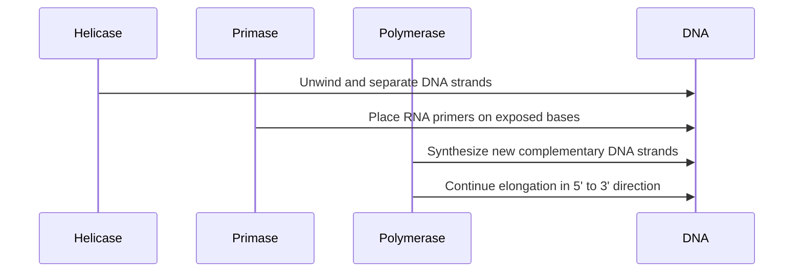

## Lecture Notes: DNA Replication

### Mastering the Genetic Code Factory

By the end of this deep dive, you will:

- Explain the core mechanics of DNA replication at the molecular level
- Differentiate the roles of Helicase, Polymerase, and Primase in the replication process
- Describe the mechanisms that ensure replication fidelity, including proofreading and mismatch repair
- Understand the distinction between leading and lagging strand synthesis
- Explain the biological consequences of replication errors and how cells maintain genomic stability

### The Genetic Code Factory: An Analogy

Imagine a bustling factory, where the production line is our DNA molecule. The factory is responsible for creating exact replicas of its blueprints - the genetic code - to be distributed to new cells. 

In this factory analogy, the Helicase acts as the zipper opener, moving down the assembly line and separating the DNA "blueprint" into two separate strands. The Primase enzymes act as the starter markers, synthesizing short RNA primer sequences (typically 8-12 nucleotides) on the template strands that provide the essential 3'-OH group needed for DNA synthesis to begin. The Polymerase enzymes are the skilled copy machines, meticulously constructing new complementary strands by reading the exposed bases on each template strand and adding matching nucleotides.

Just like a real factory, there are many moving parts that must work in harmony to ensure efficient and accurate DNA replication. Let's dive into the technical details of this remarkable molecular machinery.

### The Mechanics of DNA Replication

DNA replication is the process by which a DNA molecule is copied to produce two identical DNA molecules. This is a fundamental process that occurs during cell division, allowing genetic information to be faithfully passed on to new cells.

At the heart of DNA replication are three key players: Helicase, Polymerase, and Primase. Here's how they work together:



1. **Helicase**: This enzyme is responsible for unwinding and separating the double-stranded DNA molecule, creating a replication fork. Helicase travels along the DNA, breaking the hydrogen bonds between the base pairs and exposing the individual strands.

2. **Primase**: As the DNA strands are separated, Primase enzymes synthesize short RNA primer sequences (typically 8-12 nucleotides) on the template strands. These primers provide the essential 3'-OH group that DNA polymerase requires to begin adding nucleotides and synthesizing new DNA strands. The Helicase foreman continues opening the zipper, while Primase starter markers indicate where the copy machines should begin their work.

3. **Polymerase**: The Polymerase enzymes are the workhorses of DNA replication. They read the exposed bases on the template strands and synthesize new complementary DNA strands, building the replicated molecules. Polymerase can only add new nucleotides in the 5' to 3' direction, so the replication process occurs simultaneously on both strands, but in opposite directions.

This leads to an interesting distinction between the "leading strand" (continuously synthesized in the 5' to 3' direction) and the "lagging strand" (synthesized in short, discontinuous Okazaki fragments that are later joined together).

```python
# PSEUDOCODE: Conceptual representation of DNA replication process
def replicate_dna(dna_sequence):
    """
    Conceptual simulation of the DNA replication process.
    Note: This is pseudocode for educational purposes.
    
    Args:
        dna_sequence (str): The original DNA sequence to be replicated.
    
    Returns:
        Tuple[str, str]: The leading and lagging strand DNA sequences.
    """
    leading_strand = ""
    lagging_strand = ""
    
    # Step 1: Helicase unwinds and separates the DNA strands
    template_strand_1, template_strand_2 = unwind_dna(dna_sequence)
    
    # Step 2: Primase places RNA primers on the template strands
    primer_1 = place_primer(template_strand_1)
    primer_2 = place_primer(template_strand_2)
    
    # Step 3: DNA Polymerase synthesizes new complementary DNA strands
    leading_strand = synthesize_dna(template_strand_1, primer_1)
    lagging_strand = synthesize_dna_fragments(template_strand_2, primer_2)
    
    return leading_strand, lagging_strand
```

The key difference between the leading and lagging strands is that the leading strand can be continuously synthesized, while the lagging strand must be constructed in short, discontinuous fragments (Okazaki fragments) that are later joined together.

### Error Correction Mechanisms in DNA Replication

While the DNA replication process is generally robust and highly accurate, cells have evolved sophisticated error correction mechanisms to maintain genomic stability:

1. **Replication Fork Stalling**: If the replication fork encounters a DNA lesion or other obstacle, the fork can become stalled. This can lead to genomic instability and potentially cell death. Cells detect fork stalling through accumulation of single-stranded DNA or activation of the DNA damage response pathways, which then recruit specialized repair enzymes to resolve the blockage and restart replication. In our factory analogy, this is like quality control inspectors detecting a jam in the production line and calling in maintenance crews to clear the obstruction.

2. **Replication Errors and Correction**: Polymerase enzymes are generally highly accurate, but they can occasionally make mistakes when incorporating new nucleotides. These errors can lead to mutations in the genetic code. Cells employ two main mechanisms to maintain replication fidelity:

**Proofreading**: DNA polymerase has built-in 3' to 5' exonuclease activity that allows it to immediately detect and remove incorrectly paired nucleotides during synthesis. This proofreading function occurs in real-time as the polymerase adds new bases, like a copy machine that instantly detects and corrects smudges as it prints.

**Mismatch Repair**: After replication is complete, mismatch repair proteins (such as MutS and MutL in prokaryotes, MSH and MLH in eukaryotes) scan newly synthesized DNA and recognize distortions in the DNA helix caused by mismatched base pairs. These quality control inspectors distinguish the parental strand from the newly synthesized strand using methylation patterns, allowing them to selectively repair errors in the daughter strand. This post-replication surveillance catches errors that escaped the polymerase's proofreading function.

By understanding these error correction mechanisms, you can appreciate how cells maintain the integrity of the genetic code through multiple layers of quality control, ensuring genomic stability across generations.

### Key Takeaways (Cheat Sheet)

1. Helicase unwinds and separates the DNA strands, Primase places RNA primers, and Polymerase synthesizes new complementary strands.
2. The leading strand is continuously synthesized, while the lagging strand is constructed in short, discontinuous Okazaki fragments.
3. DNA replication fidelity is maintained through DNA polymerase proofreading (3' to 5' exonuclease activity) and mismatch repair systems that recognize and correct errors in newly synthesized DNA.
4. When replication forks encounter DNA lesions or obstacles and become stalled, cells activate DNA damage response pathways that recruit specialized repair enzymes to resolve the blockage and maintain genomic stability.
5. The factory analogy helps visualize the complex, coordinated process of DNA replication at the molecular level.