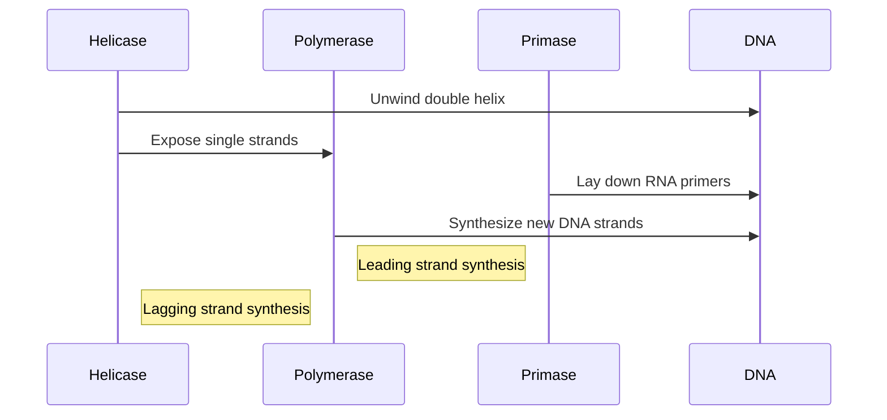

## Lecture Notes: DNA Replication

### Mastering the Molecular Machinery of Replication

By the end of this deep dive, you will:

- Differentiate the roles of Helicase, Polymerase, and Primase in DNA replication
- Explain the concept of leading and lagging strands and their significance
- Implement a Python simulation of the replication process using appropriate data structures
- Analyze the performance trade-offs between different replication strategies
- Troubleshoot common replication errors and propose mitigation strategies

### The Replication Facility: An Analogy

The DNA replication process can be likened to a bustling construction site, where a team of specialized molecular players collaborate to faithfully duplicate the genetic blueprint. In this analogy, the DNA molecule is the "blueprint" that needs to be faithfully replicated, and the replication process is akin to constructing an identical copy of the structure.

Similar to a construction site, the DNA replication process relies on a coordinated effort of several key molecular players, each with a specialized role to ensure the faithful duplication of the genetic material. The Helicase acts as the "foreman," responsible for unwinding the DNA double helix, creating a replication "fork" where the work can commence. The Polymerase enzymes are the "skilled builders," tasked with synthesizing new DNA strands by adding complementary nucleotides to the growing DNA chains. Finally, the Primase serves as the "foundation layer," laying down short RNA primers to kickstart the Polymerase's work on the lagging strand.

Understanding the roles and interactions of these molecular components is crucial for mastering the intricacies of DNA replication.

### The Replication Machinery in Action

The DNA replication process begins with the Helicase enzyme, which acts as a molecular "unzipping tool." It travels along the DNA, separating the double helix into two single strands, creating a replication fork. This fork serves as the hub of activity, where the Polymerase enzymes can commence the synthesis of new DNA.



The Polymerase enzymes then get to work, with one strand (the "leading strand") being synthesized continuously in the 5' to 3' direction, while the other strand (the "lagging strand") is synthesized in a discontinuous, fragmented manner. These Okazaki fragments are later joined together by the Ligase enzyme to form a complete, complementary DNA strand.

The leading strand synthesis is relatively straightforward, as the Polymerase can simply add nucleotides to the 3' end of the template strand in a continuous manner. In contrast, the lagging strand presents a unique challenge, as the Polymerase must work in the opposite direction (3' to 5') and synthesize the new strand in a discontinuous, fragmented manner. To overcome the challenge of lagging strand synthesis, the Primase lays down short RNA primers on the lagging strand, which the Polymerase can then use as a starting point to synthesize the new DNA fragments, known as Okazaki fragments.

### Simulating the Replication Process

Let's implement a Python simulation to visualize the DNA replication process and understand the underlying data structures:

```python
class DNAStrand:
    def __init__(self, sequence):
        self.sequence = sequence
        self.complement = self.get_complement()

    def get_complement(self):
        complement_map = {'A': 'T', 'T': 'A', 'C': 'G', 'G': 'C'}
        return ''.join(complement_map[base] for base in self.sequence)

class ReplicationFork:
    def __init__(self, dna_strand):
        self.leading_strand = DNAStrand(dna_strand.sequence)
        self.lagging_strand = DNAStrand(dna_strand.sequence)
        self.okazaki_fragments = []

    def replicate(self):
        # Unwind the DNA double helix
        self.leading_strand.sequence = self.leading_strand.sequence[:]
        self.lagging_strand.sequence = self.lagging_strand.sequence[::-1]

        # Synthesize the leading strand
        self.leading_strand.sequence += self.leading_strand.complement[-1]

        # Synthesize the lagging strand
        while self.lagging_strand.sequence:
            primer_length = 10
            primer = self.lagging_strand.sequence[-primer_length:]
            self.okazaki_fragments.append(DNAStrand(primer + self.lagging_strand.complement[-primer_length-1:-1]))
            self.lagging_strand.sequence = self.lagging_strand.sequence[:-primer_length]

        return self.leading_strand, self.okazaki_fragments

# Example usage
original_dna = DNAStrand('ATCGATTGAC')
replication_fork = ReplicationFork(original_dna)
leading_strand, okazaki_fragments = replication_fork.replicate()

print("Leading Strand:", leading_strand.sequence)
print("Lagging Strand Fragments:")
for fragment in okazaki_fragments:
    print(fragment.sequence)
```

This simulation demonstrates the key aspects of DNA replication, including the roles of the leading and lagging strands, the creation of Okazaki fragments, and the complementary base pairing. By understanding the underlying data structures and algorithms, you can better appreciate the elegance and complexity of the replication process.

### Troubleshooting Replication Errors

While the replication process is generally highly accurate, there are a few common issues that can arise:

1. **Replication Fidelity**: Polymerase enzymes can occasionally make mistakes, leading to incorrect base pairing and mutations in the resulting DNA. This is mitigated by the Polymerase's proofreading abilities and the presence of repair mechanisms.

```python
# Example of a replication error
def replicate_with_error(self):
    self.leading_strand.sequence += 'T'  # Incorrect base addition
    self.lagging_strand.sequence = self.lagging_strand.sequence[:-1] + 'G'  # Incorrect base substitution
    return self.leading_strand, self.okazaki_fragments
```

2. **Replication Stalling**: Obstacles such as DNA damage or tightly bound proteins can cause the replication fork to stall, leading to incomplete or inaccurate replication. Specialized mechanisms, like translesion synthesis, help the Polymerase bypass these roadblocks.

3. **Replication Timing**: The leading and lagging strand synthesis must be carefully coordinated to maintain the integrity of the replication process. Imbalances in the timing or processivity of the Polymerase enzymes can result in gaps or overlaps in the final DNA sequence.

Understanding these potential issues and the strategies employed by the cell to mitigate them is crucial for troubleshooting and optimizing the replication process.

### Advanced Applications: Replication in the Context of Genome Maintenance

DNA replication is a fundamental process, but it is also closely tied to other essential cellular functions, such as DNA repair and chromosome segregation. For example, the replication machinery must work in harmony with the DNA damage response pathways to ensure that any errors or lesions are promptly identified and corrected.

Furthermore, the efficient and accurate replication of the entire genome is a critical step in cell division, as each daughter cell must receive a complete and faithful copy of the genetic information. The coordination between replication, chromosome condensation, and segregation is a complex, highly regulated process that is essential for maintaining genomic integrity.

By understanding the role of DNA replication within the broader context of genome maintenance, you can develop a more comprehensive perspective on the importance of this process and its implications for cellular function, development, and disease.

### Key Takeaways: DNA Replication Cheat Sheet

1. Helicase unwinds the DNA double helix, creating a replication fork where the synthesis of new strands occurs.
2. Polymerase enzymes synthesize the new DNA strands, with the leading strand being synthesized continuously and the lagging strand being synthesized discontinuously in Okazaki fragments.
3. Primase lays down RNA primers to kickstart the Polymerase's work on the lagging strand.
4. Replication fidelity is maintained through Polymerase proofreading and DNA repair mechanisms, but errors can still occur.
5. Replication is closely integrated with other genome maintenance processes, such as DNA damage response and chromosome segregation.