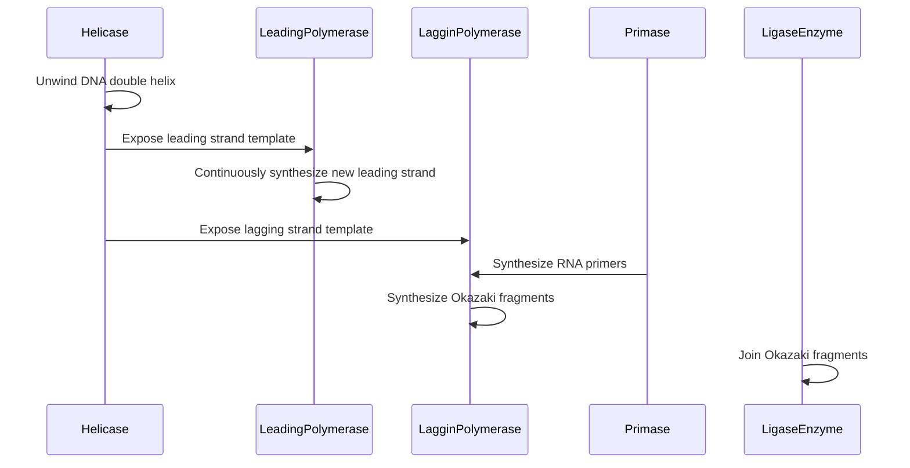

## Lecture Notes: DNA Replication

### The Molecular Machinery Behind Genetic Inheritance

By the end of this deep dive, you will:

- Explain the core functions of DNA helicase, DNA polymerase, and the leading/lagging strand
- Implement a simulation of DNA replication using Python and the Biopython library
- Analyze the performance trade-offs between leading and lagging strand replication
- Troubleshoot common replication errors and propose mitigation strategies
- Design a robust, fault-tolerant DNA replication system for a high-fidelity genetic engineering workflow

### The Replication Garage: Understanding the Toolkit

Imagine a bustling automotive garage, where teams of mechanics work tirelessly to maintain and repair a fleet of vehicles. In this analogy, the DNA double helix is the "vehicle" that needs to be replicated, and the various molecular players are the specialized mechanics performing their tasks.

At the heart of DNA replication lies the **DNA helicase**, the molecular "blowtorch" that unwinds the double-stranded DNA, separating the two parent strands. This is akin to the mechanic using a blowtorch to disassemble the engine casing, exposing the inner workings.

Next, the **DNA polymerase** enzymes act as the "master technicians," responsible for synthesizing new DNA strands complementary to the parent strands. Just as a mechanic would carefully rebuild an engine, the polymerases must precisely replicate the genetic information.

The replication process, however, is not as straightforward as it may seem. Due to the directional nature of DNA, one strand (the **leading strand**) is replicated continuously, while the other (the **lagging strand**) is replicated in short, discontinuous fragments called Okazaki fragments. This is analogous to a mechanic assembling one side of the engine block in a single, fluid motion, while the other side requires a series of smaller, more intricate steps.

### The Replication Workflow: A Step-by-Step Breakdown



1. **DNA Helicase**: The helicase enzyme unwinds the double-stranded DNA, exposing the individual parent strands.
2. **Leading Strand Synthesis**: The leading strand polymerase continuously synthesizes a new DNA strand complementary to the exposed leading strand template.
3. **Lagging Strand Synthesis**: The lagging strand polymerase, along with the primase enzyme, synthesizes short Okazaki fragments complementary to the exposed lagging strand template. These fragments are later joined by the ligase enzyme.

This intricate dance of molecular players ensures the faithful replication of the genetic material, with the leading and lagging strands working in tandem to duplicate the entire genome.

### Implementing DNA Replication in Python

Let's take a closer look at how we can simulate DNA replication using Python and the Biopython library:

```python
from Bio.Seq import Seq
from Bio.SeqRecord import SeqRecord

# Define the original DNA sequence
original_dna = Seq("ATCGATTGCATCGCATGCATGCATGCATGCATGCATGC")

# Create the leading and lagging strand templates
leading_template = original_dna
lagging_template = original_dna.reverse_complement()

# Simulate leading strand synthesis
leading_strand = Seq("")
for nucleotide in leading_template:
    leading_strand += {"A": "T", "T": "A", "C": "G", "G": "C"}[nucleotide]

# Simulate lagging strand synthesis
lagging_strand = Seq("")
primer_length = 10
while len(lagging_strand) < len(leading_strand):
    # Synthesize an Okazaki fragment
    okazaki_fragment = Seq("")
    for _ in range(primer_length):
        okazaki_fragment += {"A": "T", "T": "A", "C": "G", "G": "C"}[lagging_template[len(lagging_strand)]]
        lagging_strand += okazaki_fragment

# Save the replicated DNA sequences
leading_record = SeqRecord(leading_strand, id="leading_strand")
lagging_record = SeqRecord(lagging_strand, id="lagging_strand")
```

This code demonstrates the core mechanics of DNA replication, including the creation of leading and lagging strand templates, the continuous synthesis of the leading strand, and the discontinuous synthesis of the lagging strand with Okazaki fragments.

### Replication Challenges: Overcoming Obstacles

While the replication process is generally reliable, there are several common challenges that can arise:

**1. Replication Forks Colliding**:
If two replication forks meet head-on, it can lead to DNA damage and genomic instability. Cells employ specialized mechanisms, such as fork reversal and fork restart, to resolve these collisions.

**2. Replication Errors**:
DNA polymerases are not infallible, and occasional mismatches or insertions/deletions can occur. Proofreading mechanisms and mismatch repair systems help maintain high replication fidelity.

**3. Lagging Strand Discontinuities**:
The discontinuous nature of lagging strand synthesis can introduce gaps or overlaps between Okazaki fragments. Proper coordination between the leading and lagging strand machineries, as well as the action of the ligase enzyme, is crucial for seamless lagging strand completion.

**4. Replication Pausing and Stalling**:
Various factors, such as DNA damage, protein-DNA interactions, or replication fork barriers, can cause the replication machinery to pause or stall. Cells have evolved specialized responses, like the DNA damage checkpoint, to manage these disruptions.

By understanding these common challenges and the mechanisms in place to address them, you can design robust, fault-tolerant DNA replication systems for high-fidelity genetic engineering workflows.

### Advanced Applications: Replication in the Bigger Picture

DNA replication is a fundamental process that underpins many aspects of molecular biology and biotechnology. Beyond the immediate replication of the genome, this mechanism has far-reaching implications:

1. **Genetic Inheritance**: Accurate DNA replication is crucial for the faithful transmission of genetic information from one generation to the next, ensuring the preservation of species and the diversity of life.

2. **Genetic Engineering**: Understanding the replication machinery allows researchers to manipulate and engineer DNA sequences with high precision, enabling advancements in fields like synthetic biology, gene therapy, and genome editing.

3. **Evolutionary Adaptations**: Replication errors, if not properly corrected, can introduce genetic variations that may confer evolutionary advantages or disadvantages, driving the process of natural selection.

4. **Cancer and Disease**: Dysregulation of the DNA replication process can lead to genomic instability, a hallmark of cancer and other genetic disorders. Targeting replication-related mechanisms is a key focus in cancer research and drug development.

By mastering the intricacies of DNA replication, you can not only become a skilled genetic engineer but also gain a deeper appreciation for the fundamental mechanisms that sustain life and drive evolution.

### DNA Replication Cheat Sheet

1. **DNA Helicase**: The molecular "blowtorch" that unwinds the DNA double helix, exposing the parent strands.
2. **DNA Polymerase**: The "master technicians" responsible for synthesizing new DNA strands complementary to the parent strands.
3. **Leading Strand**: The DNA strand that is replicated continuously in the 5' to 3' direction.
4. **Lagging Strand**: The DNA strand that is replicated discontinuously in short Okazaki fragments.
5. **Primase**: The enzyme that synthesizes the RNA primers needed for the initiation of Okazaki fragment synthesis on the lagging strand.