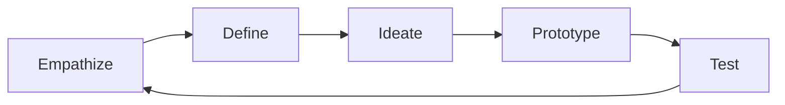

## Lecture Notes: Design Thinking

### The Architect's Toolkit: Mastering Design Thinking

By the end of this deep dive, you will:

- Define the core principles of Design Thinking and its practical engineering applications.
- Analyze the iterative Design Thinking framework and how it enables rapid innovation.
- Implement a Design Thinking process to tackle a complex technical challenge.
- Anticipate and mitigate common pitfalls when applying Design Thinking.
- Integrate Design Thinking into your overall software development lifecycle.

### The Architect's Mindset: Understanding Design Thinking

**Analogy Application: The Master Carpenter's Workshop**

As an architect, your role is akin to that of a master carpenter - you must not only possess technical mastery, but also the ability to envision and construct elegant, functional solutions. Just as a carpenter's workshop is filled with specialized tools, the architect's toolkit includes a variety of methodologies and frameworks. One of the most powerful of these is Design Thinking.

**Technical Definition:** Design Thinking is a human-centric, iterative problem-solving process that focuses on deeply understanding user needs, generating creative ideas, and rapidly prototyping and testing solutions. It is a structured approach to innovation that balances analytical and creative thinking.

**Why It Matters:** In the fast-paced, ever-changing world of software engineering, Design Thinking equips architects with the agility to navigate complexity, adapt to evolving requirements, and deliver solutions that truly delight users. By centering the user experience and embracing an experimental mindset, Design Thinking helps you build the right thing, not just build the thing right.

### The Design Thinking Workflow: A Carpenter's Approach

**The Blueprint: The Design Thinking Framework**

The Design Thinking framework consists of five core phases:



1. **Empathize:** Deeply understand the user's needs, pain points, and context through research, observation, and immersion.
2. **Define:** Synthesize your insights to clearly articulate the problem you are trying to solve.
3. **Ideate:** Generate a diverse range of creative ideas and solutions, without judgment or evaluation.
4. **Prototype:** Rapidly build low-fidelity representations of your ideas to test and learn.
5. **Test:** Gather feedback from users and iterate on your prototypes, continuously refining your solution.

**Visual Architecture:** The iterative nature of the Design Thinking process is key - you'll cycle through these phases multiple times, constantly learning and improving your solution.

**Code Implementation:** Here's a simplified Python implementation of the Design Thinking workflow:

```python
def design_thinking_process(user_research):
    """Implement the core Design Thinking framework."""
    
    # Empathize
    user_insights = empathize(user_research)
    
    # Define
    problem_statement = define_problem(user_insights)
    
    # Ideate
    ideas = ideate(problem_statement)
    
    # Prototype
    prototypes = prototype(ideas)
    
    # Test
    feedback = test_prototypes(prototypes, user_research)
    
    # Iterate
    while feedback.needs_improvement:
        ideas = ideate(problem_statement)
        prototypes = prototype(ideas)
        feedback = test_prototypes(prototypes, user_research)
    
    return feedback.final_solution
```

### Mastering Design Thinking: Navigating Complexity

**The "Happy Path" vs. Reality:** While the Design Thinking framework may appear straightforward, real-world application often involves navigating complex, ambiguous, and rapidly changing contexts. Experts in Design Thinking are adept at identifying and mitigating common pitfalls.

**Anti-pattern: Skipping the Empathize Phase**
*Bad Code:*
```python
def design_thinking_process(user_research):
    """Implement the core Design Thinking framework."""
    
    # Define
    problem_statement = define_problem(user_research)
    
    # Ideate
    ideas = ideate(problem_statement)
    
    # Prototype
    prototypes = prototype(ideas)
    
    # Test
    feedback = test_prototypes(prototypes, user_research)
    
    return feedback.final_solution
```
This approach, which skips the crucial Empathize phase, is doomed to fail. Without deeply understanding the user's needs and context, the resulting solution is likely to miss the mark.

*Good Code:*
```python
def design_thinking_process(user_research):
    """Implement the core Design Thinking framework."""
    
    # Empathize
    user_insights = empathize(user_research)
    
    # Define
    problem_statement = define_problem(user_insights)
    
    # Ideate
    ideas = ideate(problem_statement)
    
    # Prototype
    prototypes = prototype(ideas)
    
    # Test
    feedback = test_prototypes(prototypes, user_research)
    
    return feedback.final_solution
```
By starting with the Empathize phase, we ensure that our understanding of the problem is firmly grounded in the user's reality.

**Anti-pattern: Failing to Iterate**
*Bad Code:*
```python
def design_thinking_process(user_research):
    """Implement the core Design Thinking framework."""
    
    # Empathize
    user_insights = empathize(user_research)
    
    # Define
    problem_statement = define_problem(user_insights)
    
    # Ideate
    ideas = ideate(problem_statement)
    
    # Prototype
    prototypes = prototype(ideas)
    
    # Test
    feedback = test_prototypes(prototypes, user_research)
    
    return feedback.final_solution
```
This implementation, while following the basic Design Thinking steps, fails to iterate on the prototypes based on user feedback. The resulting solution is likely to be suboptimal.

*Good Code:*
```python
def design_thinking_process(user_research):
    """Implement the core Design Thinking framework."""
    
    # Empathize
    user_insights = empathize(user_research)
    
    # Define
    problem_statement = define_problem(user_insights)
    
    # Ideate
    ideas = ideate(problem_statement)
    
    # Prototype
    prototypes = prototype(ideas)
    
    # Test
    feedback = test_prototypes(prototypes, user_research)
    
    # Iterate
    while feedback.needs_improvement:
        ideas = ideate(problem_statement)
        prototypes = prototype(ideas)
        feedback = test_prototypes(prototypes, user_research)
    
    return feedback.final_solution
```
By incorporating a continuous feedback loop and iterating on the prototypes, we ensure that the final solution is truly optimized for the user's needs.

### Integrating Design Thinking: Architecting for the Future

**Connecting the Dots:** As a senior engineer, you'll need to integrate Design Thinking into the broader software development lifecycle. This means aligning it with other methodologies, such as Agile, and ensuring that it's not a siloed activity, but rather a mindset that permeates the entire organization.

One way to achieve this is by incorporating Design Thinking into your architecture decision-making process. For example, when evaluating potential technical solutions, you can apply the Design Thinking framework to ensure that the chosen approach not only meets the functional requirements, but also delights the end-users.

Similarly, you can leverage Design Thinking to tackle complex system-level challenges, such as improving the user experience of a multi-component application or optimizing the data flow across a distributed microservices architecture.

By mastering Design Thinking and seamlessly integrating it into your overall engineering practice, you'll position yourself as a true "Architect's Architect" - a leader who can navigate ambiguity, drive innovation, and deliver solutions that truly make a difference.

### Key Takeaways (Cheat Sheet)

1. **Define the Problem:** Clearly articulate the problem you're trying to solve, based on a deep understanding of user needs and context.
2. **Embrace Iteration:** Continuously prototype, test, and refine your solutions based on user feedback.
3. **Avoid Pitfalls:** Be vigilant in identifying and mitigating common Design Thinking anti-patterns, such as skipping the Empathize phase or failing to iterate.
4. **Integrate Holistically:** Align Design Thinking with your overall software development lifecycle and architecture decision-making processes.
5. **Cultivate an Experimental Mindset:** Approach Design Thinking with a spirit of curiosity, creativity, and a willingness to take calculated risks.