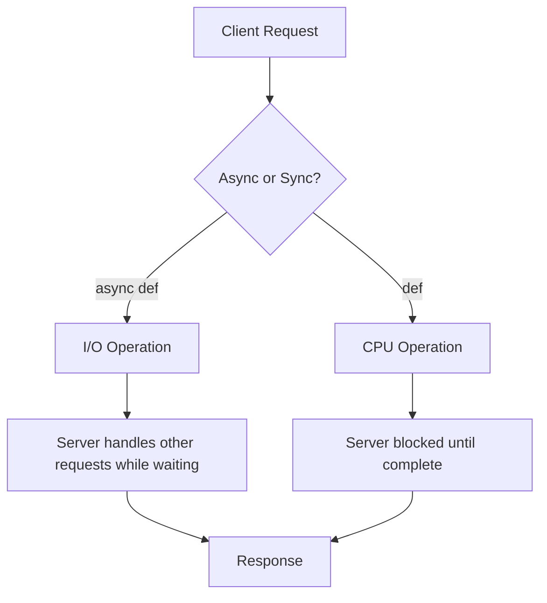

# FastAPI Fundamentals

## What You'll Learn

- **Build** a working REST API with FastAPI that handles HTTP requests and returns JSON responses
- **Explain** how FastAPI uses Python type hints to automatically validate data and generate documentation
- **Apply** path parameters, query parameters, and request bodies to create flexible API endpoints
- **Compare** synchronous and asynchronous request handling to choose the right approach for your use cases

## FastAPI Essentials

### What Is FastAPI?

FastAPI is a modern Python web framework designed specifically for building APIs quickly with automatic data validation and interactive documentation.

APIs allow different software systems to communicate. FastAPI makes creating these communication channels straightforward using standard Python features. When someone makes a request to your API, FastAPI automatically checks if the data is valid, converts it to the right format, and generates documentation showing others how to use your API—all based on how you write your Python code.

### Why It Matters

Without a framework like FastAPI, building an API means writing hundreds of lines of repetitive code. You'd manually check every piece of incoming data, convert strings to numbers, validate email formats, and write documentation by hand. When requirements change, you'd update code in multiple places and hope you didn't miss anything.

FastAPI solves this by using Python's type hints as a single source of truth. Write `user_id: int` once, and FastAPI automatically validates that incoming requests contain an integer, rejects invalid data with helpful error messages, and documents this requirement in your API docs.

This matters when building any backend service: a mobile app that needs data from a server, a microservice that other systems call, or a data pipeline that exposes results through an API. A typical REST API endpoint that validates user input might require 15-20 lines of manual validation code; FastAPI reduces this to a single type hint, eliminating boilerplate and the bugs that come with repetitive code.

## Core Concepts

### Your First FastAPI Application

The simplest possible API looks like this:

```python
from fastapi import FastAPI

app = FastAPI()

@app.get("/")
def read_root():
    return {"message": "Hello World"}
```

This five-line program creates a complete web server. `FastAPI()` creates your application instance. The `@app.get("/")` decorator tells FastAPI to run `read_root()` when someone visits the root URL with a GET request. The function returns a Python dictionary, and FastAPI automatically converts it to JSON.

Run this with `uvicorn main:app --reload` and visit `http://localhost:8000`. You'll see your JSON response. Visit `http://localhost:8000/docs` and you'll find interactive documentation that FastAPI generated automatically.

### Path Parameters: Dynamic URLs

Real APIs need to handle dynamic data. Path parameters capture values directly from the URL:

```python
@app.get("/users/{user_id}")
def get_user(user_id: int):
    return {"user_id": user_id, "name": "John Doe"}
```

The curly braces `{user_id}` mark a path parameter. The type hint `user_id: int` tells FastAPI to validate that incoming requests contain an integer. Visit `/users/123` and you get a valid response. Try `/users/abc` and FastAPI automatically returns a detailed error message explaining that it expected an integer.

This automatic validation prevents bugs before they happen. Without it, you'd write code like this:

```python
# Without FastAPI - error-prone and repetitive
def get_user(user_id):
    try:
        user_id = int(user_id)
    except ValueError:
        return {"error": "user_id must be an integer"}
    # Now actually do something with user_id
```

FastAPI eliminates this boilerplate entirely.

### Query Parameters: Optional Filters

Query parameters appear after the `?` in URLs like `/items?skip=0&limit=10`. They're perfect for optional filters and pagination:

```python
@app.get("/items")
def list_items(skip: int = 0, limit: int = 10):
    items = ["item1", "item2", "item3", "item4", "item5"]
    return items[skip : skip + limit]
```

Any function parameter that isn't in the path becomes a query parameter. The default values (`= 0` and `= 10`) make these parameters optional. Call `/items` without parameters and you get the first 10 items. Call `/items?skip=2&limit=2` and you get items starting from position 2.

FastAPI validates types here too. Try `/items?skip=two` and you'll get a clear error explaining the problem.

### Request Bodies: Accepting Complex Data

When clients need to send structured data to your API, you use request bodies. FastAPI integrates with Pydantic, a library that makes it easy to define and validate data structures:

```python
from pydantic import BaseModel

class User(BaseModel):
    username: str
    email: str
    age: int

@app.post("/users")
def create_user(user: User):
    return {"message": f"Created user {user.username}"}
```

The `User` class defines the expected structure. When a POST request arrives, FastAPI automatically validates that the JSON body contains the required fields with correct types. Send invalid data and you get detailed error messages listing exactly what's wrong.

Validation rules live with your data model. Add `age: int` and FastAPI ensures age is an integer. Change it to `age: Optional[int] = None` and age becomes optional. Your validation logic updates automatically.

### Response Models: Controlling Output

Response models control exactly what clients see in your API responses:

```python
class UserIn(BaseModel):
    username: str
    password: str
    email: str

class UserOut(BaseModel):
    username: str
    email: str

@app.post("/users", response_model=UserOut)
def create_user(user: UserIn):
    return user
```

Even though the function returns the full `UserIn` object with password, the `response_model=UserOut` parameter ensures FastAPI filters out the password before sending the response. This prevents accidental data leaks.

### Async Operations: Handling Many Requests

FastAPI supports both synchronous and asynchronous code. For I/O-bound operations like database queries or API calls, async lets your server handle many requests concurrently:

```python
@app.get("/slow-data")
async def get_slow_data():
    await some_database_query()
    await some_external_api_call()
    return {"data": "result"}
```

The `async def` and `await` keywords tell Python this function can pause while waiting for I/O. While waiting for the database, FastAPI can handle other requests. This dramatically improves throughput for I/O-heavy applications.

Using `async def` for CPU-intensive work doesn't help. Async benefits I/O operations, not calculations. For heavy computation, use regular `def` functions or background tasks.



### Dependency Injection: Reusable Logic

FastAPI's dependency injection system lets you reuse common logic across endpoints. Here's authentication as an example:

```python
from fastapi import Depends, HTTPException

def get_current_user(token: str):
    if token != "secret-token":
        raise HTTPException(status_code=401, detail="Invalid token")
    return {"username": "john"}

@app.get("/protected")
def protected_route(user: dict = Depends(get_current_user)):
    return {"message": f"Hello {user['username']}"}
```

The `Depends(get_current_user)` tells FastAPI to call `get_current_user` first and pass its result to `protected_route`. If `get_current_user` raises an exception, the main function never runs. This keeps your endpoint functions clean and focused.

You can chain dependencies too. A database session dependency might depend on a configuration dependency, which depends on environment variables. FastAPI handles the entire chain automatically.

## Key Takeaways

You don't always need Pydantic models. For simple cases with basic types like `int` and `str`, path and query parameters work fine. Use Pydantic models when you're accepting or returning structured data with multiple fields.

Use async for operations that wait on external resources: databases, file systems, network requests. Use regular functions for pure computation, data transformation, or when using libraries that don't support async.

FastAPI returns whatever you return from your function. Return a dictionary or Pydantic model for JSON. If you're seeing HTML, you might be returning a string or hitting the wrong endpoint.

Always run your development server with `--reload` so changes appear immediately. The interactive docs at `/docs` are invaluable for testing endpoints without writing client code. Type hints are your friend—the more specific your types, the better FastAPI can validate and document your API. `items: List[str]` is better than `items: list`, which is better than no type hint at all.

Build incrementally. Get a basic endpoint working, then add validation, then add database integration, then add authentication. Building incrementally prevents overwhelming debugging sessions.

FastAPI uses Python type hints as the foundation for automatic validation, serialization, and documentation. Path parameters capture dynamic URL segments, query parameters handle optional filters, and request bodies accept complex structured data through Pydantic models. Async functions improve throughput for I/O-bound operations by letting the server handle multiple requests concurrently while waiting for databases or external APIs. Dependencies inject reusable logic like authentication and database sessions into endpoints, keeping your code clean and maintainable.

These fundamentals prepare you for more advanced topics like database integration with SQLAlchemy, background tasks for long-running operations, and WebSocket support for real-time features. Each builds on the request-response cycle you've mastered here.