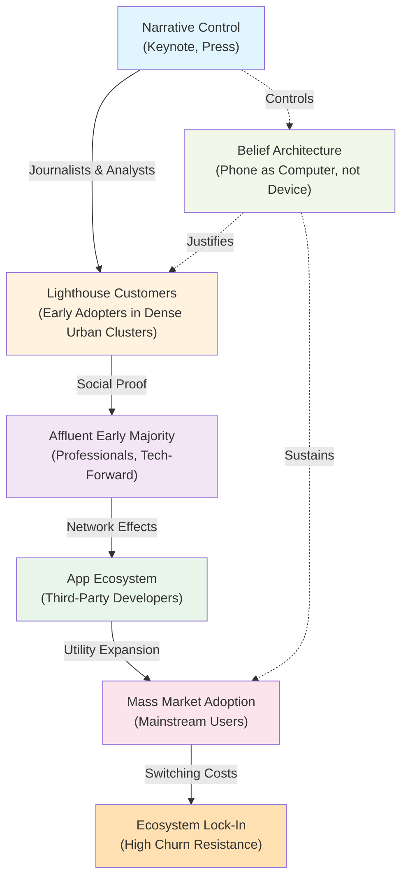

# Lecture Notes: GTM Strategy—The iPhone Launch as a Masterclass in Market Penetration Architecture

## Section 1: Deconstructing the Cathedral—What You'll Master Here

By the end of this deep dive, you will:

1. **Architect a multi-phase market entry system** that sequences product revelation, demand creation, and distribution simultaneously—not sequentially.
2. **Engineer the psychology of scarcity** into your GTM pipeline, understanding how artificial constraints drive adoption velocity.
3. **Map the decision cascade** from awareness → desire → accessibility, identifying which stakeholders must be convinced at each phase.
4. **Identify the "lighthouse customer"** archetype and why targeting 1% precisely beats targeting 100% broadly.
5. **Construct a narrative moat**—the defensive perimeter that prevents competitors from copying your market entry, not just your product.

---

## Section 2: The Cathedral and the Bazaar—Reframing GTM as Architectural Design

### The Analogy Universe: Building Construction

Think of a GTM strategy not as a marketing campaign, but as an architectural design problem.l**. A cathedral isn't built all at once. It's built in phases: first the foundation (target audience identification), then the load-bearing walls (key opinion leaders and early adopters), then the nave (mass market), then the spires (ecosystem and network effects). Each phase must be structurally sound before the next phase begins, or the entire edifice collapses.

**Technical Definition:**

A Go-To-Market (GTM) strategy is a sequenced system for moving a target population through adoption stages (awareness → consideration → purchase → advocacy) by strategically targeting decision-makers at each stage with tailored messaging and distribution channels.ity. It is not a marketing plan; it is a **systems engineering problem** where the "product" being delivered is not the artifact itself, but the *shift in belief and behavior* required for adoption.

**Why This Matters:**

Most founders treat GTM as an afterthought—a "marketing problem" to be solved after the product is built. This is architecturally catastrophic. The iPhone's success wasn't determined by its technical superiority alone (it wasn't the most feature-rich phone in 2007). It was determined by **how Steve Jobs architected the revelation of the phone's value proposition** to move a skeptical, entrenched market (dominated by BlackBerry and Nokia) toward a new mental model of what a phone could be.

The GTM strategy *is* the product strategy. They are inseparable.

---

## Section 3: The Blueprint—iPhone's Cascading Cathedral Build

### Phase 1: The Foundation Layer—Controlling the Narrative

Apple controlled the narrative through a single, carefully orchestrated keynote presentation rather than a traditional advertising campaign. it.

The January 9, 2007 Macworld keynote was not a product launch; it was a **controlled revelation**. Steve Jobs didn't say "Here's a phone." He said: "Today, we're introducing three revolutionary products: an iPod, a phone, and an internet communicator." Then, he revealed they were one device.

This framing is critical. He didn't compete on features. He competed on **category redefinition**. The market was asking: "How many megapixels? How fast is the processor?" Jobs answered a question nobody was asking: "What if a phone could be as intuitive as touching a song?"

**The Architectural Insight:** The foundation layer targets **narrative gatekeepers**—journalists, analysts, tech influencers—not consumers. These are the nodes through which all downstream belief propagates. Control them, and you control the entire cascade.

### Phase 2: The Load-Bearing Walls—Lighthouse Customers

Apple's second move was surgical: **restrict supply artificially**. The iPhone launched on June 29, 2007, but availability was constrained to AT&T exclusively in the United States. No other carriers. No international launch. This wasn't a supply-chain failure; it was architectural deliberation.

Why? Because you want your first adopters to be **lighthouse customers**—high-status, visible individuals whose adoption signals credibility to the next tier of the market. If the iPhone had been available everywhere, it would have been adopted by random early adopters, diluting the prestige signal. Whether by design or carrier negotiation, the AT&T exclusivity had the effect of concentrating early adoption in affluent urban centers where AT&T coverage was strongest, creating geographic network effects.

**The Architectural Insight:** Scarcity is not a bug; it's a feature. It filters for high-conviction adopters and creates social proof density in high-visibility geographic clusters.

### Phase 3: The Nave—Ecosystem Lock-In

By the time the iPhone 3G launched (July 2008), the App Store had been announced. This is where the cathedral's true genius emerges: **the product itself becomes the distribution channel for its own ecosystem**.

Each app developer became a GTM agent, building on Apple's platform, creating reasons for new customers to adopt. The iPhone wasn't competing on hardware specs; it was competing on **network effects** (apps) and **switching costs** (data lock-in, muscle memory).

**The Architectural Insight:** The most sophisticated GTM strategies embed the mechanism for self-propagation *into the product itself*. The iPhone's GTM strategy wasn't separate from its product strategy; the App Store *was* the GTM strategy.

### Visual Architecture: The Cascade Model



This diagram shows the **cascade architecture**: each layer provides the foundation for the next. Critically, notice the dotted lines representing the **belief architecture** (the narrative framework) that justifies and sustains the entire cascade.

---

## Section 4: The Happy Path vs. Reality—Where GTM Strategies Fail

### Anti-Pattern 1: The "Spray and Pray" Approach

**Bad Code (Anti-Pattern):**
```
GTM_Strategy = {
    target_audience: "Everyone",
    channels: ["TV", "Radio", "Print", "Digital", "Social"],
    messaging: "Our product is great",
    timeline: "Launch everywhere simultaneously",
    budget_allocation: "Equal spend across all channels"
}

Result: Diluted message, no lighthouse effect, no narrative control
```

**Good Code (Best Practice):**
```
GTM_Strategy = {
    phase_1: {
        target_audience: "Narrative gatekeepers (journalists, analysts)",
        channels: ["Keynote", "Press briefings", "Industry events"],
        messaging: "Category redefinition (not feature comparison)",
        timeline: "6 months pre-launch",
        budget_allocation: "80% on narrative control"
    },
    phase_2: {
        target_audience: "Lighthouse customers (high-status early adopters)",
        channels: ["Exclusive retail", "VIP previews", "Premium distribution"],
        messaging: "Status signal and social proof",
        timeline: "3 months post-launch",
        budget_allocation: "Geographic concentration in high-visibility clusters"
    },
    phase_3: {
        target_audience: "Early majority (professionals, tech-forward)",
        channels: ["Word-of-mouth", "Ecosystem apps", "Social proof"],
        messaging: "Utility expansion and network effects",
        timeline: "6-12 months",
        budget_allocation: "Ecosystem investment (App Store)"
    }
}

Result: Controlled narrative, strong lighthouse effect, ecosystem momentum
```

### Anti-Pattern 2: Competing on Features, Not Beliefs

When the iPhone launched, it had **fewer features** than competing smartphones. It had no copy-paste (added in iPhone 3.2). No MMS (added in iPhone 3G). No 3G support initially. No removable battery. No expandable storage.

Competitors like Nokia and BlackBerry made the mistake of **competing on feature lists** instead of **competing on belief systems**. They said: "Our phone has more features." Apple said: "Your phone is a computer in your pocket."

The market chose the belief, not the feature list.

**The Mistake:** Novice GTM strategists assume the market makes rational, feature-based decisions. Expert GTM strategists know the market makes **belief-based decisions**, and features are merely the evidence that supports the belief.

### Anti-Pattern 3: Ignoring the Chasm

Geoffrey Moore's "Crossing the Chasm" framework identifies a critical failure point: the gap between early adopters (who adopt for novelty) and the early majority (who adopt for utility). Most products die in this chasm because the GTM strategy that worked for early adopters doesn't work for the early majority.

Apple solved this through the App Store. The iPhone had limited utility as a "computer in your pocket" in 2007. But by 2008-2009, with thousands of apps, it had genuine utility for professionals, parents, and students. The GTM strategy **evolved** from "status signal" to "productivity tool."

**The Mistake:** Treating GTM as static. Expert GTM strategists know the strategy must evolve as the market matures.

---

## Section 5: Advanced Application—Embedding GTM into Product Architecture

The most sophisticated GTM strategies embed **adoption mechanisms directly into the product**. Consider three dimensions:

### Dimension 1: Viral Coefficient Architecture

The iPhone's App Store created a **viral coefficient > 1** for app developers. Each app developer had incentive to promote their app, which promoted the iPhone ecosystem, which attracted more developers. This is a self-reinforcing loop.

```
Viral_Coefficient = (Users_Acquired_Per_Existing_User) × (Conversion_Rate)

For iPhone ecosystem:
- Each developer acquires ~1,000-10,000 users (high coefficient)
- Conversion rate: App downloads / App Store visits ≈ 20-40%
- Result: Coefficient > 1 (exponential growth)
```

### Dimension 2: Switching Cost Moat

By 2010, iPhone users had invested in:
- Downloaded apps (not transferable to Android)
- iTunes library (DRM-protected, iPhone-optimized)
- Muscle memory (iOS interface)
- Social identity ("I'm an iPhone person")

These switching costs created a **churn-resistant user base**, protecting Apple from competitor attacks even when Android phones offered superior hardware.

### Dimension 3: Network Effect Density

iPhone owners clustered in affluent urban areas, creating **geographic network effects**. If 70% of your friends have iPhones in San Francisco, you have strong incentive to adopt (iMessage, AirDrop, shared experiences). This geographic density is why Apple's initial distribution strategy (AT&T exclusive, limited inventory) was architecturally sound.

---

## Section 6: Key Takeaways—The GTM Cheat Sheet

1. **GTM is a cascade architecture, not a broadcast strategy.** Control the narrative gatekeepers first (journalists, analysts), then the lighthouse customers (high-status early adopters), then the early majority. Each layer provides the foundation for the next.

2. **Scarcity is a feature, not a bug.** Artificial constraints on supply and distribution concentrate adoption in high-visibility clusters, creating network effects and social proof density.

3. **Compete on beliefs, not features.** The iPhone won not because it had more features, but because it redefined what a phone *should be*. Feature lists are evidence; beliefs are architecture.

4. **Embed adoption mechanisms into the product.** The App Store wasn't a post-launch addition; it was the GTM strategy. Each developer became a GTM agent.

5. **Evolve the strategy as the market matures.** The narrative that sells to early adopters (status signal) differs from the narrative that sells to the early majority (productivity tool). Expert GTM strategists adapt; novices don't.

---

**The Cathedral Insight:** The iPhone's GTM strategy succeeded because Apple treated market entry as an architectural problem, not a marketing problem. Each phase was deliberately sequenced, each stakeholder was strategically targeted, and each mechanism was designed to reinforce the next. This is the difference between a product launch and a market transformation.