## Lecture Notes: HTML Structure and Semantic Markup

### Mastering the Markup Blueprint

By the end of this deep dive, you will:

- Explain the core structure and syntax of HTML documents
- Identify and properly utilize semantic HTML tags for optimal accessibility
- Implement robust form elements and input types for seamless user interactions
- Troubleshoot common HTML issues and apply best practices for clean, maintainable markup

### The Markup Universe: A Structured Narrative

In the world of web development, HTML (Hypertext Markup Language) is the foundational language that gives structure and meaning to the content we present on the internet. Much like a well-designed building, an HTML document is constructed with a specific blueprint in mind, using a set of standardized elements and tags to define the various components that make up the user experience.

At the most fundamental level, an HTML document is a hierarchical tree-like structure, with the `<html>` tag serving as the root, the `<head>` and `<body>` tags as the primary branches, and a myriad of specialized elements (e.g., `<h1>`, `<p>`, `<div>`, `<form>`) as the leaves. This structured approach not only provides a clear organizational framework but also enables search engines, screen readers, and other user agents to understand the semantic meaning of the content, leading to better accessibility, discoverability, and overall user experience.

### The Anatomy of an HTML Document

The core structure of an HTML document consists of the following essential elements:

1. **`<html>`**: The root element that encloses the entire document.
2. **`<head>`**: The container for metadata, such as the page title, character encoding, and linked stylesheets.
3. **`<body>`**: The section that holds the visible content of the web page.

Within the `<body>` tag, you'll find a variety of semantic HTML elements that give meaning and structure to the content. Some common examples include:

- **Headings**: `<h1>`, `<h2>`, `<h3>`, `<h4>`, `<h5>`, `<h6>` - Used to establish a clear hierarchy and outline for the page.
- **Paragraphs**: `<p>` - Denote blocks of text content.
- **Lists**: `<ul>` (unordered), `<ol>` (ordered), `<li>` (list items) - Organize content into structured lists.
- **Links**: `<a>` - Allow users to navigate between web pages or sections.
- **Images**: `` - Embed visual content on the page.
- **Forms**: `<form>`, `<input>`, `<label>`, `<button>` - Enable user input and interactions.



The visual diagram above illustrates the typical structure of an HTML document, showcasing the hierarchical relationship between the root `<html>` element, the `<head>` and `<body>` sections, and various semantic tags within the body.

```mermaid
graph TD
    A[<html>] --> B[<head>]
    A --> C[<body>]
    C --> D[<h1>]
    C --> E[<p>]
    C --> F[<img>]
    C --> G[<a>]
    C --> H[<form>]
        H --> I[<label>]
        H --> J[<input>]
        H --> K[<button>]
```

### Semantic Markup: Giving Meaning to Content

While the basic structure of an HTML document is essential, the true power of HTML lies in its ability to convey semantic meaning through the use of appropriate tags. Semantic markup goes beyond simply defining the visual presentation of content; it helps search engines, screen readers, and other user agents understand the purpose and context of the information on the page.

Some examples of semantic HTML tags include:

- **`<header>`**, **`<nav>`**, **`<main>`**, **`<article>`**, **`<section>`**, **`<aside>`**, **`<footer>`**: These tags provide a clear semantic structure to the page, making it easier to navigate and understand the content hierarchy.
- **`<em>`** and **`<strong>`**: Emphasize text with semantic meaning, rather than just visual styling.
- **`<figure>`** and **`<figcaption>`**: Semantically group an image or illustration with its caption.
- **`<time>`**: Provide a standardized way to represent date and time information.
- **`<address>`**: Denote contact information for the page or article author.

By using these semantic tags, you can create HTML documents that are not only visually appealing but also more accessible, SEO-friendly, and maintainable over time.

```html
<header>
  <nav>
    <ul>
      <li><a href="#">Home</a></li>
      <li><a href="#">About</a></li>
      <li><a href="#">Services</a></li>
      <li><a href="#">Contact</a></li>
    </ul>
  </nav>
</header>

<main>
  <article>
    <h1>Welcome to Our Website</h1>
    <p>We are a leading provider of <strong>innovative solutions</strong> for our clients.</p>
    <figure>
      
      <figcaption>Our Company Logo</figcaption>
    </figure>
  </article>
</main>

<footer>
  <address>
    123 Main Street<br>
    Anytown, USA 12345<br>
    <a href="mailto:info@example.com">info@example.com</a>
  </address>
  <p>&copy; 2023 Example Company. All rights reserved.</p>
</footer>
```

The code snippet above demonstrates the use of semantic HTML tags to structure the content of a web page. The `<header>`, `<nav>`, `<main>`, `<article>`, `<figure>`, and `<footer>` elements provide a clear, meaningful hierarchy that can be easily understood by both human readers and machine agents.

### Crafting Robust Forms and Inputs

Forms are a crucial part of many web applications, allowing users to input data, submit feedback, or interact with the system in various ways. HTML provides a rich set of form-related elements and attributes to create intuitive and accessible user experiences.

Some key form elements include:

- **`<form>`**: The container for the entire form.
- **`<input>`**: Allows users to enter various types of data (text, numbers, dates, etc.).
- **`<label>`**: Provides a textual label for an input field, improving accessibility.
- **`<select>`** and **`<option>`**: Create dropdown menus for users to choose from a set of options.
- **`<textarea>`**: Enables multi-line text input.
- **`<button>`**: Provides a clickable element to submit the form or trigger other actions.

```html
<form action="/submit" method="post">
  <label for="name">Name:</label>
  <input type="text" id="name" name="name" required>

  <label for="email">Email:</label>
  <input type="email" id="email" name="email" required>

  <label for="message">Message:</label>
  <textarea id="message" name="message" rows="5" required></textarea>

  <label for="topic">Topic:</label>
  <select id="topic" name="topic" required>
    <option value="">Select a topic</option>
    <option value="inquiry">Inquiry</option>
    <option value="feedback">Feedback</option>
    <option value="other">Other</option>
  </select>

  <button type="submit">Submit</button>
</form>
```

The example above showcases a simple contact form with various input types, including text, email, textarea, and a dropdown menu. Notice the use of the `required` attribute to ensure users provide all necessary information before submitting the form.

### Troubleshooting and Best Practices

While the core structure and semantics of HTML may seem straightforward, there are several common issues and best practices to keep in mind when crafting robust, maintainable markup.

**Common Issues:**
- **Improper nesting of tags**: Ensuring that elements are properly closed and nested within the correct parent-child relationships is crucial for a well-formed document.
- **Lack of semantic meaning**: Using generic tags like `<div>` and `<span>` without considering their semantic purpose can lead to less accessible and less SEO-friendly content.
- **Inconsistent use of attributes**: Forgetting to include required attributes (e.g., `alt` on `` tags) or using them inconsistently can negatively impact accessibility and search engine optimization.

**Best Practices:**
- **Validate your HTML**: Use tools like the [W3C Markup Validator](https://validator.w3.org/) to ensure your code adheres to the HTML specification and is free of errors.
- **Leverage semantic tags**: Whenever possible, use semantic HTML elements to convey the meaning and purpose of your content.
- **Provide alternative text for images**: Always include the `alt` attribute on `` tags to describe the image for users who cannot see it.
- **Use appropriate input types**: Choose the most specific input type (e.g., `email`, `number`, `date`) to provide the best user experience and input validation.
- **Label form fields properly**: Pair `<input>` elements with corresponding `<label>` tags to improve accessibility and usability.
- **Optimize for accessibility**: Consider the needs of users with disabilities and ensure your HTML markup is compatible with assistive technologies like screen readers.

By understanding the core structure, semantic tags, and best practices of HTML, you can create web pages that are not only visually appealing but also highly accessible, SEO-friendly, and maintainable over time.

### Mastering HTML: A Holistic Approach

HTML is the foundational building block of the web, providing the structure and meaning that enable rich, interactive user experiences. By mastering the art of HTML markup, you can craft web pages that are not only visually stunning but also highly accessible, search engine-friendly, and future-proof.

Remember, the true power of HTML lies in its ability to convey semantic meaning through the use of appropriate tags and elements. By leveraging the full spectrum of HTML's capabilities, from the basic document structure to the advanced form elements and accessibility features, you can create web experiences that truly stand out in the digital landscape.

### Key Takeaways: HTML Cheat Sheet

1. **Document Structure**: The core elements are `<html>`, `<head>`, and `<body>`, which form the backbone of an HTML document.
2. **Semantic Markup**: Use appropriate tags like `<header>`, `<nav>`, `<main>`, `<article>`, `<section>`, `<aside>`, and `<footer>` to provide meaning and structure to your content.
3. **Form Elements**: Utilize `<form>`, `<input>`, `<label>`, `<select>`, `<option>`, `<textarea>`, and `<button>` to create robust, accessible user input experiences.
4. **Accessibility**: Always include `alt` attributes on `` tags and pair `<input>` elements with corresponding `<label>` tags to ensure your HTML is compatible with assistive technologies.
5. **Validation and Best Practices**: Regularly validate your HTML code, use semantic tags whenever possible, and optimize for search engines and accessibility to create high-quality, maintainable web pages.