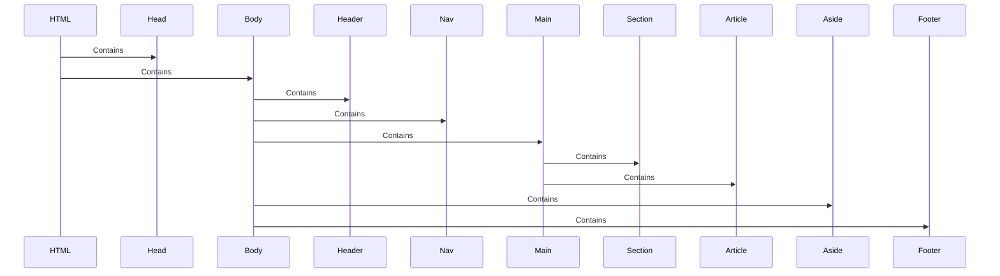

## Lecture Notes: HTML Structure and Semantic Markup

### Understanding the Structure and Semantics of Web Pages

By the end of this deep dive, you will:

- Identify the core structural elements of an HTML document
- Apply semantic markup to convey meaning and accessibility
- Construct robust and responsive web forms with appropriate input types
- Leverage advanced HTML5 elements to enhance user experience
- Troubleshoot common HTML structure and markup issues

### Blueprinting the Web: The Anatomy of an HTML Document

**Analogy Application:** Just as a building's architectural blueprint defines its structure, layout, and purpose, the HTML document provides the underlying structure and semantics for web pages. Just as a building cannot stand without a solid foundation, an HTML page requires a well-defined structure to function properly.

**Technical Definition:** HTML (Hypertext Markup Language) is the standard markup language used to create and structure web pages. It provides a set of tags and elements that define the semantic meaning and visual presentation of content on the internet.

**Why It Matters:** Mastering HTML structure and semantic markup is crucial for building accessible, search engine-friendly, and maintainable web applications. Proper HTML structure ensures that content is properly organized, easy to navigate, and can be accurately interpreted by search engines, screen readers, and other web technologies.

### Framing the Page: Core HTML Structural Elements

The core structural elements of an HTML document include:

1. `<html>`: The root element that encompasses the entire web page.
2. `<head>`: The container for metadata, such as the page title, character encoding, and linked resources.
3. `<body>`: The main content area of the web page, where all visible elements are placed.

Within the `<body>`, you can use various semantic elements to convey the meaning and purpose of different sections of the page:

- `<header>`: Defines the introductory content, such as the site logo, navigation, and hero sections.
- `<nav>`: Specifies a section of navigation links.
- `<main>`: Represents the central, unique content of the page.
- `<section>`: Organizes content into thematic groupings.
- `<article>`: Encapsulates a self-contained, independent piece of content.
- `<aside>`: Denotes content that is tangentially related to the main content.
- `<footer>`: Provides information about the author, copyright, and other end-of-page details.



### Designing Web Forms: The Building Blocks of User Input

Web forms are essential for collecting user data and enabling interactive experiences on the web. The core HTML form elements include:

1. `<form>`: The container for the entire form.
2. `<input>`: Allows users to enter various types of data, such as text, numbers, dates, and more.
3. `<label>`: Provides a textual label for an input element, improving accessibility.
4. `<select>`: Creates a dropdown list for users to choose from.
5. `<textarea>`: Allows users to enter multi-line text.
6. `<button>`: Provides a clickable button for form submission or other actions.

Here's an example of a well-designed contact form with validation and accessibility features:

```html
<form>
  <label for="name">Name:</label>
  <input type="text" id="name" name="name" required>

  <label for="email">Email:</label>
  <input type="email" id="email" name="email" required>

  <label for="message">Message:</label>
  <textarea id="message" name="message" required></textarea>

  <button type="submit">Send</button>
</form>
```

### Mastering Edge Cases: Handling Form Validation and Accessibility

**The "Happy Path" vs. Reality:** While the basic form structure is straightforward, real-world forms often require more advanced validation and accessibility considerations.

**Common Pitfalls:**
1. **Lack of Input Validation:** Failing to validate user input can lead to security vulnerabilities and poor user experience.
2. **Inadequate Accessibility:** Not properly labeling form elements or providing clear error messages can make forms inaccessible to users with disabilities.
3. **Inconsistent UI:** Inconsistent styling or layout of form elements can create a disjointed user interface.

**Best Practices:**
1. **Implement Robust Validation: Use the `required` attribute, appropriate input types (e.g., `type="email"`), and client-side and server-side validation techniques to ensure data integrity and a positive user experience.
2. **Enhance Accessibility: Provide clear labels, descriptive error messages, appropriate ARIA attributes, and keyboard navigation support to ensure the form is accessible to users with disabilities.s.
3. **Maintain a Consistent UI:** Apply consistent styles and layout to form elements to create a seamless user experience.

```html
<!-- Example of a well-designed form with validation and accessibility -->
<form>
  <div>
    <label for="name">Name:</label>
    <input type="text" id="name" name="name" required>
    <span class="error-message">Please enter your name.</span>
  </div>

  <div>
    <label for="email">Email:</label>
    <input type="email" id="email" name="email" required>
    <span class="error-message">Please enter a valid email address.</span>
  </div>

  <div>
    <label for="message">Message:</label>
    <textarea id="message" name="message" required></textarea>
    <span class="error-message">Please enter your message.</span>
  </div>

  <button type="submit">Send</button>
</form>
```

### Elevating User Experiences: Advanced HTML5 Elements

HTML5 introduced several new elements that can enhance the user experience and improve the semantic structure of web pages:

1. `<video>` and `<audio>`: Provide native support for embedding multimedia content.
2. `<canvas>`: Allows for dynamic, scriptable 2D and 3D graphics.
3. `<datalist>`: Enables autocomplete functionality for `<input>` elements.
4. `<details>` and `<summary>`: Create expandable/collapsible content sections.
5. `<figure>` and `<figcaption>`: Group related images, diagrams, or code snippets with captions.

By leveraging these advanced HTML5 elements, you can create more engaging and accessible web experiences that better convey the meaning and purpose of your content.

### Key Takeaways (Cheat Sheet)

1. The core structural elements of an HTML document are `<html>`, `<head>`, and `<body>`.
2. Semantic markup using elements like `<header>`, `<nav>`, `<main>`, `<section>`, `<article>`, `<aside>`, and `<footer>` improves accessibility and SEO.
3. HTML forms use elements like `<form>`, `<input>`, `<label>`, `<select>`, `<textarea>`, and `<button>` to collect user input.
4. Implement robust form validation and accessibility best practices to ensure a positive user experience.
5. Leverage advanced HTML5 elements like `<video>`, `<audio>`, `<canvas>`, `<datalist>`, `<details>`, `<summary>`, `<figure>`, and `<figcaption>` to enhance user experiences.