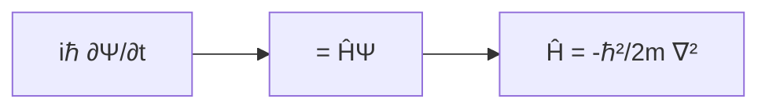
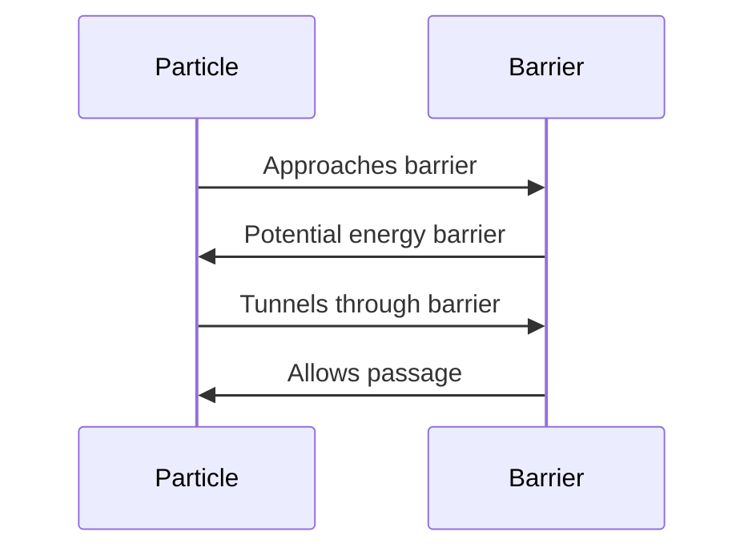

## Lecture Notes: Intro to Quantum Mechanics

### Mastering the Wave-Particle Duality

By the end of this deep dive, you will:

- Explain the fundamental principles of wave-particle duality in quantum mechanics
- Derive the Schrödinger equation and understand its physical interpretation
- Apply the Schrödinger equation to solve simple quantum mechanical problems
- Analyze the limitations and edge cases of the wave-particle duality model
- Evaluate the impact of quantum mechanics on modern technology and future applications

### The Quantum Kitchen: Ingredients of the Subatomic World

Quantum mechanics is the fundamental theory that describes the behavior of matter and energy at the atomic and subatomic scale. Just as a chef in a kitchen must understand the properties of various ingredients to create delicious dishes, a quantum physicist must grasp the peculiar behavior of quantum "ingredients" to unravel the mysteries of the microscopic world.

The key ingredient in the quantum kitchen is the wave-particle duality - the idea that elementary particles, such as electrons, can exhibit both wave-like and particle-like properties. This dual nature of quantum objects is the foundation upon which the entire framework of quantum mechanics is built.

In the classical world we are familiar with, objects are either waves (like sound or light) or particles (like baseballs or billiard balls). Quantum mechanics, however, tells us that at the smallest scales, this distinction breaks down, and quantum particles display a blend of both wave and particle characteristics. This discovery, made by pioneers like Louis de Broglie and Erwin Schrödinger, revolutionized our understanding of the physical world.

### The Schrödinger Equation: Mapping the Quantum Landscape

The mathematical expression that encapsulates the wave-particle duality is the Schrödinger equation. This fundamental equation, derived by the Austrian physicist Erwin Schrödinger, describes the behavior of a quantum system in terms of a wave function, denoted by the Greek letter Ψ (psi).

The Schrödinger equation can be written as:



Where:
- `i` is the imaginary unit
- `ℏ` is the reduced Planck constant
- `Ψ` is the wave function
- `t` is time
- `Ĥ` is the Hamiltonian operator, representing the total energy of the system
- `m` is the mass of the particle
- `∇²` is the Laplacian operator, representing the kinetic energy term

The Schrödinger equation tells us that the wave function Ψ evolves over time according to the Hamiltonian operator Ĥ, which encodes the total energy of the system. By solving the Schrödinger equation for a given system, we can determine the wave function Ψ, which in turn allows us to calculate the probabilities of finding the particle in different states or locations.

The power of the Schrödinger equation lies in its ability to predict the behavior of quantum systems with remarkable accuracy, enabling us to design and engineer a wide range of modern technologies, from transistors in electronics to the development of new materials.

### Quantum Tunneling: Passing through the Barrier

One of the most fascinating consequences of the wave-particle duality is the phenomenon of quantum tunneling. Imagine a quantum particle, such as an electron, approaching a potential energy barrier. In the classical world, the particle would not be able to cross the barrier unless it had enough kinetic energy to overcome the potential energy.

However, in the quantum realm, the wave-like nature of the particle allows it to "tunnel" through the barrier, even if its kinetic energy is lower than the potential energy of the barrier. This seemingly impossible feat is a direct result of the Schrödinger equation and the wave-like behavior of quantum particles.



Quantum tunneling has numerous applications in modern technology, from the operation of scanning tunneling microscopes to the design of semiconductor devices like tunnel diodes and flash memory. Understanding this phenomenon is crucial for developing advanced quantum technologies, such as quantum computers and quantum cryptography.

### Limitations and Edge Cases: When the Wave-Particle Duality Breaks Down

While the wave-particle duality and the Schrödinger equation provide a powerful framework for understanding quantum mechanics, there are certain limitations and edge cases where this model breaks down or requires more sophisticated treatments.

One such example is the case of measurement in quantum mechanics. When a quantum system is measured, the wave function "collapses" into a specific state, and the probabilistic nature of the system is disrupted. This measurement problem has led to the development of various interpretations of quantum mechanics, such as the Copenhagen interpretation and the many-worlds interpretation, which are still actively debated by physicists.

Another limitation is the inability of the Schrödinger equation to accurately describe the behavior of particles moving at relativistic speeds, where the effects of special relativity become significant. In such cases, a more advanced formulation, such as the Dirac equation, is required to capture the full complexity of quantum phenomena.

```python
def quantum_tunneling(energy, barrier_height, barrier_width):
    """
    Calculates the probability of quantum tunneling through a potential energy barrier.
    
    Args:
        energy (float): Kinetic energy of the particle.
        barrier_height (float): Potential energy of the barrier.
        barrier_width (float): Width of the potential energy barrier.
    
    Returns:
        float: Probability of the particle tunneling through the barrier.
    """
    if energy < barrier_height:
        # Apply the Schrödinger equation to calculate the tunneling probability
        probability = exp(-2 * sqrt(2 * m * (barrier_height - energy)) * barrier_width / ℏ)
        return probability
    else:
        # Particle has enough energy to classically overcome the barrier
        return 1.0
```

Understanding the limitations and edge cases of the wave-particle duality model is crucial for developing a deeper, more nuanced understanding of quantum mechanics and its applications in modern technology.

### Quantum Mechanics: Shaping the Future of Technology

The principles of wave-particle duality and the Schrödinger equation have had a profound impact on the development of modern technology. From the invention of the transistor to the emergence of quantum computing, the insights gained from quantum mechanics have been instrumental in driving technological progress.

Looking to the future, the continued advancement of quantum technologies, such as quantum cryptography, quantum sensing, and quantum simulation, holds the promise of revolutionizing fields as diverse as communication, computing, and materials science. As we delve deeper into the quantum realm, the wave-particle duality and the Schrödinger equation will remain at the heart of our understanding and exploration of the fundamental building blocks of the universe.

### Quantum Mechanics Cheat Sheet

1. The wave-particle duality is the concept that elementary particles can exhibit both wave-like and particle-like properties.
2. The Schrödinger equation describes the behavior of a quantum system in terms of a wave function, Ψ, which evolves over time according to the Hamiltonian operator, Ĥ.
3. Quantum tunneling allows particles to pass through potential energy barriers, even if their kinetic energy is lower than the barrier height.
4. The measurement problem in quantum mechanics disrupts the probabilistic nature of the system, leading to various interpretations of quantum mechanics.
5. The Schrödinger equation has limitations in describing the behavior of particles moving at relativistic speeds, requiring more advanced formulations like the Dirac equation.