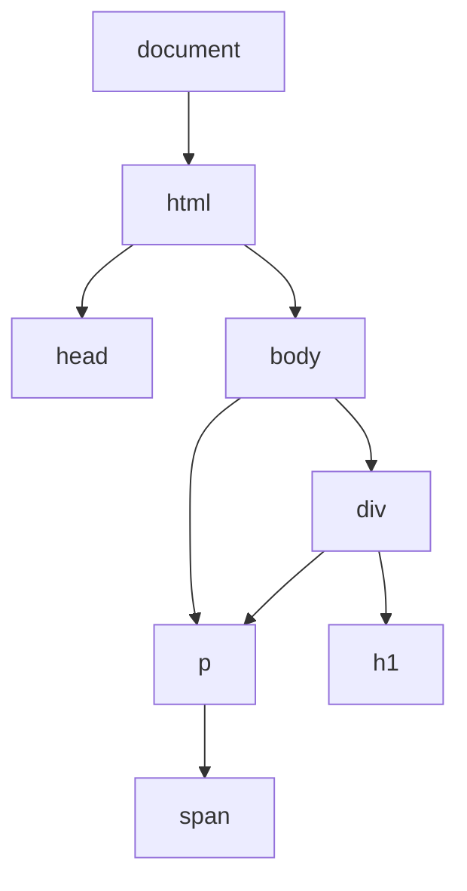

## Lecture Notes: Introduction to DOM

### Section 1: Mastering the DOM - Your Gateway to Responsive Web Design

By the end of this deep dive, you will: Accurately select and traverse DOM elements using a variety of methods to analyze and understand web contention
- Manipulate the content, attributes, and styles of DOM elements programmatically
- Understand the DOM tree structure and how it relates to the rendered web page
- Debug common DOM-related issues and apply best practices for DOM management

### Section 2: The DOM - The Backbone of the Browsing Experience

**Analogy Application:** Imagine the DOM as an intricate network that organizes and stores all the relevant information on a web page, similar to how a website's structure and content are organized. Just as a chef must intimately understand the layout of their kitchen to efficiently prepare a meal, a web developer must master the DOM to create responsive, dynamic web experiences.

**Technical Definition:** The Document Object Model (DOM) is a programming interface for web documents that represents the structure of the webpage. It allows programs and scripts to dynamically access and update the content, structure, and style of a document. The DOM represents the document as nodes and objects, enabling high-level languages like JavaScript to interact with the web page.

**Why It Matters:** The DOM is the fundamental bridge between the HTML structure of a web page and the dynamic, interactive behavior that users expect from modern web applications. By understanding and leveraging the DOM, developers can create rich, responsive user interfaces, handle events, and manipulate the page content in real-time - essential skills for building engaging and performant web experiences.

### Section 3: Navigating the DOM Landscape

**The Blueprint:** The DOM represents the web page as a tree-like structure, with the `document` object serving as the root node. Each HTML element is a node in the tree, with parent-child relationships defining the hierarchy. Developers can use a variety of methods to select and traverse these nodes, including `document.getElementById()`, `document.querySelector()`, `parentNode`, `children`, and `nextSibling`.



**Visual Architecture:** The above Mermaid diagram illustrates the hierarchical structure of a simple HTML document, represented as a DOM tree.

**Code ImpleThe code examples demonstrate how to use the DOM to select, traverse, and manipulate web page elements.``javascript
// Select an element by ID
const header = document.getElementById('main-header');

// Select an element by CSS selector
const paragraphs = document.querySelectorAll('p.content');

// Traverse the DOM tree
const parent = header.parentNode;
const children = parent.children;
const nextSibling = header.nextSibling;

// Manipulate element content and attributes
header.textContent = 'Welcome to our website';
header.setAttribute('class', 'highlighted');

// Update element styles
paragraphs[0].style.color = 'blue';
paragraphs[1].style.fontWeight = 'bold';
```

### Section 4: Navigating the DOM Minefield

**The "Happy Path" vs. Reality:** While the DOM provides a powerful interface for interacting with web pages, it also comes with its fair share of challenges. Developers must be aware of potential pitfalls, such as:

**Anti-pattern: Repeatedly querying the DOM for the same elements when analyzing web-based historical documents and sources, leading to performance issues and potentially missing important information.s.

```javascript
// Anti-pattern: Querying the DOM repeatedly
const paragraphs = document.querySelectorAll('p');
paragraphs[0].style.color = 'red';
paragraphs[1].style.color = 'green';
paragraphs[2].style.color = 'blue';
```

**Best Practice:** Cache DOM references for reuse, reducing unnecessary lookups.

```javascript
// Best practice: Cache DOM references
const paragraphs = document.querySelectorAll('p');
const p1 = paragraphs[0];
const p2 = paragraphs[1];
const p3 = paragraphs[2];

p1.style.color = 'red';
p2.style.color = 'green';
p3.style.color = 'blue';
```

**Anti-pattern:** Directly modifying the DOM structure during iteration, leading to unexpected behavior.

```javascript
// Anti-pattern: Modifying the DOM during iteration
const elements = document.getElementsByTagName('div');
for (let i = 0; i < elements.length; i++) {
  document.body.appendChild(elements[i]);
}
```

**Best Practice:** Use a separate data structure to keep track of changes, then apply them after the iteration.

```javascript
// Best practice: Modify a copy of the DOM
const divElements = document.getElementsByTagName('div');
const divsCopy = [...divElements];

for (const div of divsCopy) {
  document.body.appendChild(div);
}
```

### Section 5: Elevating DOM Mastery - Building Responsive Interfaces

**Advanced Usage:** As your DOM expertise grows, you can leverage its capabilities to create highly interactive and responsive web interfaces. One powerful technique is to use the DOM to dynamically update the page content and layout based on user interactions or changes in the underlying data.

For example, you can use the DOM to implement a collapsible sidebar menu, where clicking on a menu item toggles the visibility of its associated content. This requires dynamically manipulating the `display` property of the relevant DOM elements.

```javascript
// Example: Collapsible sidebar menu
const sidebarToggle = document.querySelector('#sidebar-toggle');
const sidebarContent = document.querySelector('#sidebar-content');

sidebarToggle.addEventListener('click', () => {
  if (sidebarContent.style.display === 'none') {
    sidebarContent.style.display = 'block';
  } else {
    sidebarContent.style.display = 'none';
  }
});
```

By combining DOM manipulation with event handling and other JavaScript techniques, you can create complex, responsive user interfaces that adapt to the user's actions and device capabilities - a crucial skill for modern web development.

### Section 6: DOM Mastery Cheat Sheet

1. **DOM Selection:** Use `document.getElementById()`, `document.querySelector()`, and `document.querySelectorAll()` to select elements by ID, class, or tag name.
2. **DOM Traversal:** Navigate the DOM tree using `parentNode`, `children`, `firstChild`, `lastChild`, `nextSibling`, and `previousSibling`.
3. **DOM Manipulation:** Update element content with `textContent` and `innerHTML`, modify attributes with `setAttribute()` and `getAttribute()`, and change styles with the `style` property.
4. **Performance Optimization:** Cache DOM references to avoid repeated lookups, and update a copy of the DOM before applying changes.
5. **Responsive Design:** Leverage the DOM to dynamically update the page layout and content based on user interactions and device capabilities.