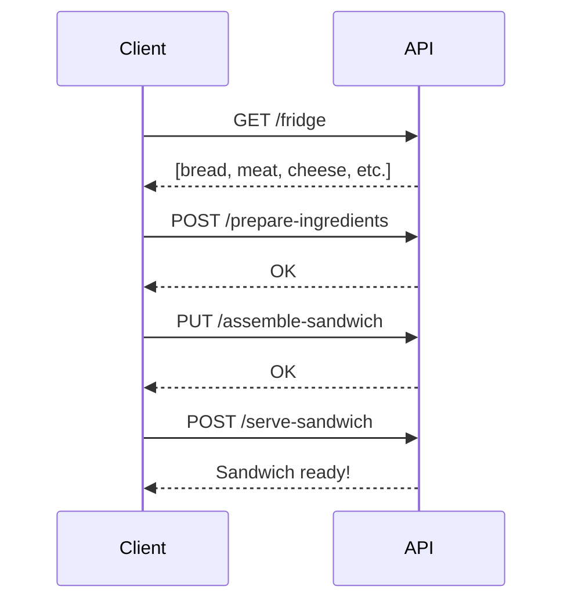

## Lecture Notes: APIs and Client-Server Architecture

### Section 1: Mastering the API Ecosystem

By the end of this deep dive, you will:

- Explain the core structure and syntax of JSON data, including the use of key-value pairs, arrays, and common data types.
- Implement robust client-server communication using HTTP requests and responses
- Architect a simple REST API with appropriate resource endpoints and conventions
- Debug common API-related issues like incorrect status codes and data parsing errors
- Integrate an API into a larger web application, optimizing for performance and reliability

### Section 2: The Kitchen as an API

Imagine your kitchen as a system with different components, like appliances, ingredients, and workflows. Just like a web API, your kitchen has "endpoints" represented by the different stations, tools, and processes that you can interact with as a client. This analogy will be maintained throughout the section.

At the technical level, an API (Application Programming Interface) is a set of rules and protocols that define how software components should interact. It acts as an intermediary, allowing clients to request data or trigger actions without needing to understand the underlying implementation details.

Why do APIs matter in the world of software engineering? They enable modular, scalable, and loosely coupled architectures. By encapsulating functionality behind well-defined interfaces, APIs allow different systems to communicate and collaborate, even if they were developed independently. This is a key enabler for modern, distributed applications.

### Section 3: Anatomy of a Kitchen API Request

Let's look at how you, as a client, can interact with the different components in your kitchen to make a sandwich. This involves a series of steps, similar to an API "workflow":

1. **GET /fridge**: Retrieve the list of available ingredients.
2. **POST /prepare-ingredients**: Assemble the necessary items (e.g., bread, meat, cheese).
3. **PUT /assemble-sandwich**: Construct the final sandwich.
4. **POST /serve-sandwich**: Plate the sandwich and make it available.

![Mermaid Sequence Diagram](

```mermaid
sequenceDiagram
    participant You as Client
    participant Kitchen as API
    You->>Kitchen: GET /fridge
    Kitchen-->>You: [bread, meat, cheese, etc.]
    You->>Kitchen: POST /prepare-ingredients
    Kitchen-->>You: OK
    You->>Kitchen: PUT /assemble-sandwich
    Kitchen-->>You: OK
    You->>Kitchen: POST /serve-sandwich
    Kitchen-->>You: Sandwich ready!
```
)

In this example, the different actions or resources within the kitchen, like accessing the fridge or preparing ingredients, can be thought of as "endpoints" that you, as the client, can interact with. You send requests to these endpoints, and the kitchen system responds with the appropriate data or status.

Let's take a closer look at the technical implementation:

```javascript
// GET /fridge
function getFridge() {
  return [
    { id: 1, name: 'Bread', quantity: 2 },
    { id: 2, name: 'Ham', quantity: 1 },
    { id: 3, name: 'Cheese', quantity: 1 },
  ];
}

// POST /prepare-ingredients
function prepareIngredients(ingredients) {
  // Validate input, gather and clean the ingredients
  return { status: 'OK' };
}

// PUT /assemble-sandwich
function assembleSandwich(ingredients) {
  // Construct the sandwich using the provided ingredients
  return { status: 'OK' };
}

// POST /serve-sandwich
function serveSandwich() {
  // Plate the sandwich and make it available
  return { status: 'Sandwich ready!' };
}
```

### Section 4: Handling API Errors and Edge Cases

It's important to handle errors and edge cases when working with APIs. One common issue is failing to validate input data, which can lead to errors. A better approach is to validate the input, handle edge cases, and return appropriate error responses with relevant HTTP status codes.

For example, instead of blindly accepting the ingredients and returning 'OK', we should first check that the input is an array and that each item has the required properties (name and quantity). If the input is invalid, we can return an error response with a relevant message.

Another common issue is incorrectly mapping HTTP status codes to the API's responses. By anticipating and handling these types of edge cases, you can ensure that your API provides a robust and reliable interface for clients to interact with.

### Section 5: Integrating APIs into Web Applications

APIs are a fundamental building block of modern web applications. Once you've mastered the basics of API design and implementation, you can leverage them to create powerful, modular, and scalable systems.

Integrating APIs into your web application can be very powerful, as it allows you to focus on building the core user experience and business logic, rather than implementing complex functionalities from scratch. This promotes code reuse, maintainability, and scalability.

However, when integrating APIs, it's important to consider performance and reliability. Factors like latency, rate limiting, and error handling can significantly impact the user experience. Implementing robust error handling, caching mechanisms, and graceful degradation can help ensure a smooth and reliable user experience, even when dealing with API-related issues.

### Section 6: API Mastery Cheat Sheet

1. **JSON Basics**: JSON (JavaScript Object Notation) is a lightweight data interchange format that is easy for humans to read and write, and easy for machines to parse and generate. It is commonly used for transmitting data between a server and web application, as an alternative to XML.

2. **Client-Server Communication**: The client-server architecture is a distributed application structure that partitions tasks or workloads between the providers of a resource or service (servers) and service requesters (clients). In web applications, clients (typically web browsers) send HTTP requests to servers, which respond with the requested data or functionality.

3. **API Fundamentals**: An API (Application Programming Interface) is a set of rules, protocols, and tools for building software applications. It specifies how software components should interact. APIs enable modular, scalable, and loosely coupled architectures by encapsulating functionality behind well-defined interfaces.

4. **REST API Concepts**: REST (Representational State Transfer) is an architectural style for designing web services. REST APIs define resources (e.g., /users, /products) and expose them through standardized HTTP endpoints (e.g., GET /users, POST /products). They follow conventions for CRUD (Create, Read, Update, Delete) operations and use appropriate HTTP methods (GET, POST, PUT, DELETE).

5. **Error Handling and Edge Cases**: Robust API design anticipates and handles a variety of edge cases and error conditions. This includes thoroughly validating input data, returning appropriate HTTP status codes, and providing meaningful error messages to clients. Proper error handling is crucial for creating a reliable and user-friendly API.