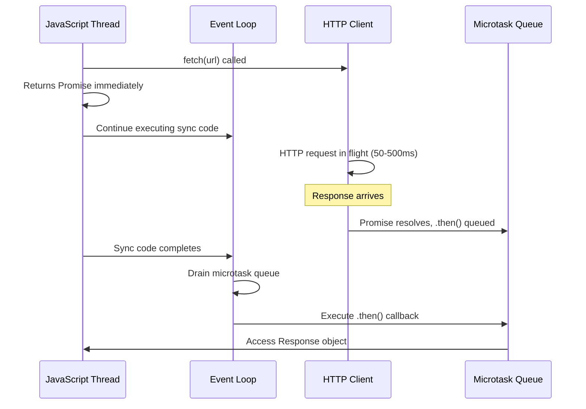

# Lecture Notes: Fetch API

## Section 1: Building Your Mental Model of Network I/O

By the end of this deep dive, you will:

- **Distinguish** synchronous blocking operations from asynchronous non-blocking patterns, and articulate when each model is appropriate.
- **Implement** GET and POST requests using the Fetch API with proper error handling, timeout logic, and response parsing.
- **Diagnose** race conditions, callback hell, and promise chain failures in real-world API consumption scenarios.
- **Architect** resilient network layers that gracefully degrade under latency spikes and partial failures.
- **Debug** network waterfalls and identify performance bottlenecks using browser DevTools and request/response inspection.

---

## Section 2: The Restaurant Kitchen Analogy—A Rigorous Framework

### Analogy Application: Synchronous vs. Asynchronous as Kitchen Operations

Imagine a restaurant kitchen with **one chef**. In a **synchronous (blocking) model**, the chef takes an order, stops all other work, personally prepares every dish from start to finish, and only then accepts the next order. The kitchen is idle while waiting for water to boil or the oven to preheat. Customers queue up, watching the wall clock.

In an **asynchronous (non-blocking) model**, the chef takes an order, delegates it to sous chefs and kitchen stations, then immediately moves to the next order. The oven preheats *while* the grill cooks the steak *while* the pastry station preps dessert. The head chef orchestrates without blocking. Orders complete out-of-sequence, but throughput multiplies.

**JavaScript's Event Loop** is the head chef. **Promises** are kitchen tickets. **Fetch** is the order-taking window. The actual network I/O happens in the browser's HTTP client (a separate thread). The JavaScript thread is free to execute other code while the network request is in flight. When the response arrives, the callback is queued to the microtask queue, not executed immediately.

### Technical Definition: Synchronous vs. Asynchronous Execution

**Synchronous execution** is a blocking operation where the call stack waits for a function to return before proceeding. The thread is occupied.

```
Call Stack: [functionA] → [functionB] → [functionC] (sequential, blocking)
```

**Asynchronous execution** is a non-blocking operation where a function is initiated but does not wait for completion. Control returns immediately; the result arrives later via a callback, promise, or event.

```
Call Stack: [initiateAsync] → (returns control) → [nextInstruction]
Callback/Promise: (resolves later, queued to microtask queue)
```

### Why It Matters: The Engineering Reality

In JavaScript, **the network is always slow**. A typical HTTP request takes 50–500ms. If JavaScript were synchronous-only, every API call would freeze the entire UI. Buttons wouldn't respond. Animations would stutter. Users would see a "Not Responding" dialog.

**Asynchronous Fetch** allows the browser to:
1. Issue a network request
2. Continue executing JavaScript
3. Render the DOM
4. Respond to user input
5. Process the response when it arrives

This is not a convenience—it is a **fundamental architectural requirement** for responsive applications.

---

## Section 3: The Fetch API Blueprint—Internal Mechanics

### The Blueprint: How Fetch Orchestrates the Network

The Fetch API is a modern replacement for `XMLHttpRequest`. It returns a **Promise** that resolves with a **Response** object.

The execution timeline:

1. **Initiation:** `fetch(url)` is called. Control returns immediately. A Promise is created and returned.
2. **Network Queue:** The browser's HTTP client queues the request. The JavaScript thread is free.
3. **Resolution:** When the network response arrives (headers + body), the Promise resolves with a Response object.
4. **Microtask Queue:** The `.then()` callback is queued to the microtask queue, not the call stack.
5. **Event Loop:** On the next cycle, the microtask queue is drained, and your callback executes.

**Critical Detail:** Fetch resolves on *any* HTTP status (200, 404, 500). It rejects only on network failures (no internet, DNS failure, CORS block). Status checking is **your responsibility**.

### Visual Architecture: The Event Loop and Fetch Lifecycle



### Code Implementation: GET Request with Full Error Handling

```javascript
/**
 * Fetches a resource and returns parsed JSON.
 * Demonstrates proper error handling, status checking, and timeout logic.
 */
async function fetchUserData(userId, timeoutMs = 5000) {
  // Create an AbortController for timeout enforcement
  const controller = new AbortController();
  const timeoutId = setTimeout(() => controller.abort(), timeoutMs);

  try {
    // Issue the GET request with signal for cancellation
    const response = await fetch(`https://api.example.com/users/${userId}`, {
      method: 'GET',
      headers: {
        'Content-Type': 'application/json',
        'Authorization': `Bearer ${localStorage.getItem('authToken') || ''}`, // Custom header
      },
      signal: controller.signal, // Attach abort signal
    });

    // CRITICAL: Fetch does NOT reject on 404 or 500.
    // You must check status explicitly.
    if (!response.ok) {
      throw new Error(`HTTP ${response.status}: ${response.statusText}`);
    }

    // Parse the response body as JSON
    const data = await response.json();

    // Validate the structure (defensive programming)
    if (!data.id || !data.name) {
      throw new Error('Malformed response: missing required fields');
    }

    return data;

  } catch (error) {
    // Handle three distinct failure modes
    if (error.name === 'AbortError') {
      console.error(`Request timeout after ${timeoutMs}ms`);
      throw new Error('Request timed out');
    } else if (error instanceof TypeError) {
      console.error('Network error (no internet or CORS block):', error);
      throw new Error('Network unreachable');
    } else {
      console.error('Request failed:', error.message);
      throw error;
    }
  } finally {
    clearTimeout(timeoutId); // Always clean up the timer
  }
}

// Usage
(async () => {
  try {
    const user = await fetchUserData(42, 5000);
    console.log('User:', user);
  } catch (error) {
    console.error('Failed to load user:', error.message);
    // Render error UI, retry logic, fallback, etc.
  }
})();
```

### Code Implementation: POST Request with Body Serialization

```javascript
/**
 * Creates a new resource via POST.
 * Demonstrates request body construction, JSON serialization, and response handling.
 */
async function createPost(title, content, userId) {
  const payload = {
    title,
    content,
    userId,
    createdAt: new Date().toISOString(),
  };

  try {
    const response = await fetch('https://api.example.com/posts', {
      method: 'POST',
      headers: {
        'Content-Type': 'application/json',
        'X-Client-Version': '1.2.3', // Custom header for versioning
      },
      // Serialize the payload to JSON string
      body: JSON.stringify(payload),
    });

    if (!response.ok) {
      // For POST failures, read the error response body
      const errorData = await response.json();
      throw new Error(`POST failed: ${errorData.message || response.statusText}`);
    }

    const createdPost = await response.json();
    return createdPost;

  } catch (error) {
    console.error('Create post failed:', error.message);
    throw error;
  }
}

// Usage with error boundary
createPost('My First Post', 'This is content', 1)
  .then(post => console.log('Created post:', post.id))
  .catch(error => {
    // Log to error tracking service (Sentry, etc.)
    logErrorToService(error);
  });
```

---

## Section 4: The "Happy Path" vs. Reality—Where Novices Stumble

### Common Pitfalls and Race Conditions

**Novice Mistake #1: Assuming Fetch Rejects on HTTP Errors**

```javascript
// ❌ BAD: This does NOT catch 404 or 500
fetch('/api/data')
  .then(response => response.json())
  .catch(error => console.log('Request failed')); // Only catches network errors

// ✅ GOOD: Explicitly check response.ok
fetch('/api/data')
  .then(response => {
    if (!response.ok) throw new Error(`HTTP ${response.status}`);
    return response.json();
  })
  .catch(error => console.log('Request failed'));
```

**Why it matters:** A 404 response from the server is a *successful HTTP transaction*. Fetch does not know if a 404 is a bug or expected behavior. You decide.

---

**Novice Mistake #2: Race Conditions in Rapid Sequential Requests**

```javascript
// ❌ BAD: If user types quickly, responses may arrive out-of-order
let currentRequest;
function searchUsers(query) {
  currentRequest = fetch(`/api/search?q=${query}`)
    .then(r => r.json())
    .then(data => {
      // This might execute AFTER a newer request completes
      renderResults(data);
    });
}

// User types: "a" → "ab" → "abc"
// Responses arrive: 200ms, 50ms, 150ms
// Result: "ab" search results overwrite "abc" results (stale data)

// ✅ GOOD: Abort previous request
let controller = null;
function searchUsers(query) {
  if (controller) controller.abort(); // Cancel previous request
  controller = new AbortController();

  fetch(`/api/search?q=${query}`, { signal: controller.signal })
    .then(r => r.json())
    .then(data => renderResults(data))
    .catch(error => {
      if (error.name !== 'AbortError') console.error(error);
    });
}
```

**Why it matters:** In real applications, users interact faster than networks respond. Without request cancellation, you render stale data, confusing users and creating data consistency bugs.

---

**Novice Mistake #3: Double-Parsing and Resource Leaks**

```javascript
// ❌ BAD: Attempting to parse response body twice
fetch('/api/data')
  .then(response => response.json())
  .then(data1 => {
    // Response body is a ReadableStream; once consumed, it's gone
    // Attempting to call .json() again on the same response will fail
    return fetch('/api/data').then(r => r.json()); // ❌ Must fetch again
  });

// ✅ GOOD: Parse once, reuse the data
fetch('/api/data')
  .then(response => response.json())
  .then(data => {
    // Use data multiple times
    console.log(data);
    return processData(data);
  });
```

**Why it matters:** The Response body is a stream. Once you call `.json()` or `.text()`, the stream is consumed. Subsequent calls fail silently or throw. This is a subtle but critical detail.

---

**Novice Mistake #4: Forgetting to Handle Aborted Requests**

```javascript
// ❌ BAD: Doesn't distinguish between timeout and actual error
const controller = new AbortController();
setTimeout(() => controller.abort(), 5000);

fetch('/api/data', { signal: controller.signal })
  .then(r => r.json())
  .catch(error => {
    // Is this a timeout, network error, or HTTP error? Unknown.
    console.error('Something failed:', error);
  });

// ✅ GOOD: Distinguish error types
fetch('/api/data', { signal: controller.signal })
  .then(r => {
    if (!r.ok) throw new Error(`HTTP ${r.status}`);
    return r.json();
  })
  .catch(error => {
    if (error.name === 'AbortError') {
      console.error('Request was cancelled or timed out');
    } else if (error instanceof SyntaxError) {
      console.error('Response was not valid JSON');
    } else {
      console.error('Network or server error:', error.message);
    }
  });
```

**Why it matters:** Proper error classification enables graceful degradation. A timeout might trigger a retry. A CORS error might show a different message. A malformed response might log to your error tracking service.

---

## Section 5: Advanced Application—Building a Resilient API Client

### The Production-Grade Fetch Wrapper

In a real system, you don't call `fetch()` directly. You build an abstraction layer that handles:
- Automatic retries with exponential backoff
- Request deduplication (multiple requests for the same resource coalesce into one)
- Circuit breaker pattern (fail fast if the service is down)
- Logging and observability

```javascript
/**
 * A production-grade API client with retry logic, deduplication, and error handling.
 * This is the abstraction layer you'd use across your entire application.
 */
class APIClient {
  constructor(baseURL, maxRetries = 3, retryDelayMs = 1000) {
    this.baseURL = baseURL;
    this.maxRetries = maxRetries;
    this.retryDelayMs = retryDelayMs;
    this.pendingRequests = new Map(); // Deduplication cache
    this.circuitBreaker = { state: 'CLOSED', failures: 0, threshold: 5, resetTimeMs: 30000, openedAt: null };
  }

  /**
   * Check if the circuit is open (service is down).
   * Implements a state machine: CLOSED → OPEN → HALF_OPEN → CLOSED
   * If too many failures occur, fail fast without making requests.
   * After resetTimeMs, transition to HALF_OPEN to allow a test request.
   */
  isCircuitOpen() {
    const now = Date.now();
    
    // If circuit is OPEN, check if it's time to transition to HALF_OPEN
    if (this.circuitBreaker.state === 'OPEN') {
      if (this.circuitBreaker.openedAt && now - this.circuitBreaker.openedAt > this.circuitBreaker.resetTimeMs) {
        this.circuitBreaker.state = 'HALF_OPEN';
        this.circuitBreaker.failures = 0;
        return false; // Allow a test request
      }
      return true; // Circuit is still OPEN
    }
    
    // If circuit is CLOSED, check if we've exceeded the failure threshold
    if (this.circuitBreaker.failures >= this.circuitBreaker.threshold) {
      this.circuitBreaker.state = 'OPEN';
      this.circuitBreaker.openedAt = now;
      return true;
    }
    
    return false; // Circuit is CLOSED
  }

  /**
   * Fetch with automatic retries and exponential backoff.
   */
  async fetchWithRetry(url, options = {}, attempt = 0) {
    // If circuit is open, reject immediately
    if (this.isCircuitOpen()) {
      throw new Error('Circuit breaker is open; service unavailable');
    }

    // Create an AbortController for timeout enforcement
    const controller = new AbortController();
    const timeoutMs = options.timeout || 10000;
    const timeoutId = setTimeout(() => controller.abort(), timeoutMs);

    try {
      const response = await fetch(url, {
        ...options,
        signal: controller.signal