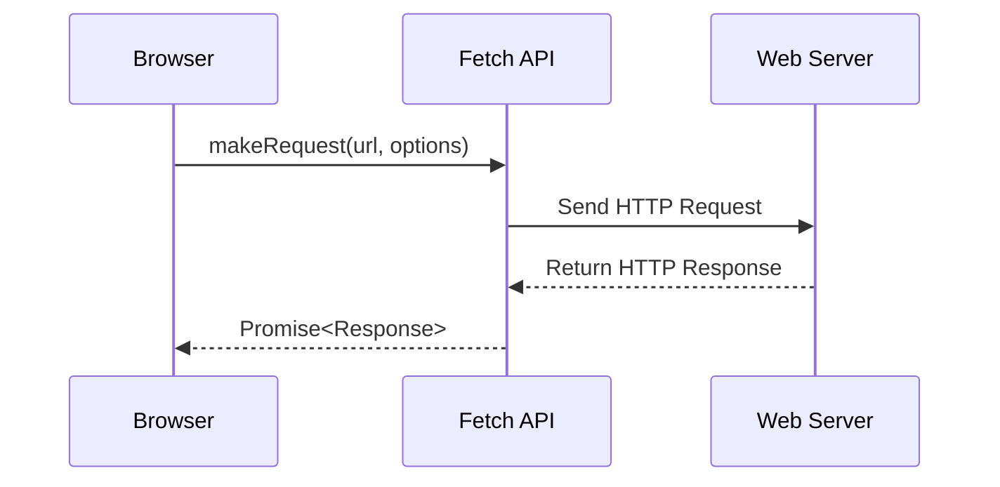
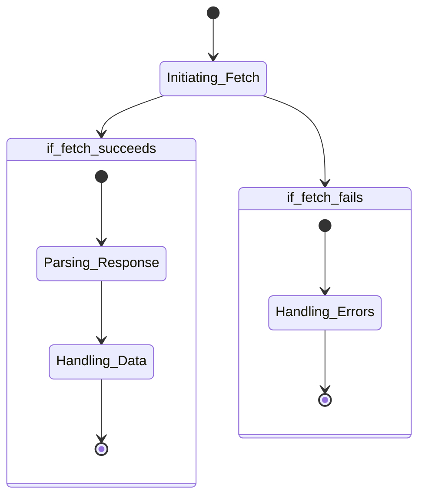

## Lecture Notes: Fetch API

### The Sous Chef's Guide to Asynchronous Cooking

By the end of this deep dive, you will:

- Distinguish between synchronous and asynchronous programming in JavaScript
- Implement the Fetch API to make GET and POST requests to web servers
- Debug common issues that arise when working with the Fetch API
- Architect a robust system for handling API responses asynchronously

### The Kitchen and the Courier

In the fast-paced kitchen of modern web development, we often need to outsource certain tasks to external services - much like a head chef relying on a trusted courier to fetch ingredients from the market. Just as the chef cannot afford to wait idly while the courier makes their rounds, our JavaScript applications cannot block the main execution thread waiting for a response from a remote API.

The **asynchronous** nature of the Fetch API allows our applications to continue running smoothly while we await responses from external sources. This is akin to the chef preparing other dishes or tending to other kitchen duties while the courier is out on their errand.

Formally speaking, **asynchronous programming** refers to the ability of a program to execute multiple tasks concurrently, without having to wait for one task to complete before starting another. This is in contrast to **synchronous programming**, where tasks are executed sequentially, and the program must wait for one task to finish before moving on to the next.

### Mastering the Fetch API

The Fetch API is a modern, promise-based interface for making HTTP requests from the browser. It provides a more streamlined and powerful alternative to the traditional XMLHttpRequest object, allowing developers to easily fetch resources from web servers and handle the responses asynchronously.



The core of the Fetch API is the `fetch()` function, which takes a URL and an optional options object as arguments. The function returns a Promise that resolves to a Response object, which encapsulates the server's response. This allows us to handle the response asynchronously using Promise-based syntax, rather than the callback-based approach of the older XMLHttpRequest API.

```javascript
fetch('https://api.example.com/data')
  .then(response => response.json())
  .then(data => {
    console.log(data);
  })
  .catch(error => {
    console.error('Error:', error);
  });
```

In this example, the `fetch()` function sends a GET request to the specified URL. When the server responds, the Promise returned by `fetch()` resolves to a Response object, which we can then use to extract the response data (in this case, by parsing it as JSON). If any errors occur during the request, the Promise will reject, and we can handle the error in the `catch()` block.

### Navigating the Fetch Landscape

While the Fetch API simplifies many aspects of making HTTP requests, it's important to understand its inner workings to handle edge cases and potential pitfalls effectively.



For example, let's consider a common scenario where the server returns a 404 Not Found response. In this case, the Fetch API will not reject the Promise, as the request was successful (i.e., the server responded with a valid HTTP status code). Instead, the Promise will resolve, and we'll need to check the `response.ok` property to determine if the response was successful.

```javascript
fetch('https://api.example.com/non-existent-resource')
  .then(response => {
    if (response.ok) {
      return response.json();
    } else {
      throw new Error(`HTTP error ${response.status}`);
    }
  })
  .then(data => {
    console.log(data);
  })
  .catch(error => {
    console.error('Error:', error);
  });
```

In this example, we first check the `response.ok` property to determine if the response was successful (i.e., had a status code in the 200-299 range). If the response is not successful, we throw a new Error with the HTTP status code, which will be caught in the `catch()` block.

### Fetch and the Delivery Van

Now, let's consider a more advanced scenario where we need to send data to the server using a POST request. The Fetch API makes this process straightforward, allowing us to include the request body and headers in the options object passed to the `fetch()` function.

```javascript
const formData = new FormData();
formData.append('name', 'John Doe');
formData.append('email', 'john.doe@example.com');

fetch('https://api.example.com/users', {
  method: 'POST',
  body: formData
})
  .then(response => response.json())
  .then(data => {
    console.log('User created:', data);
  })
  .catch(error => {
    console.error('Error:', error);
  });
```

In this example, we create a `FormData` object to represent the data we want to send to the server. We then pass this object as the `body` property in the options object for the `fetch()` function, along with the `method` property set to `'POST'`. The server's response is then handled asynchronously, just like in the previous GET request example.

### Mastering the Art of Asynchronous Cooking

The Fetch API is a powerful tool for building modern, responsive web applications. By understanding the underlying principles of asynchronous programming and the nuances of the Fetch API, you can create robust, fault-tolerant systems that seamlessly integrate with remote services.

Remember, the key to mastering the Fetch API is to treat it like a trusted courier in your kitchen - rely on it to fetch the necessary ingredients, but don't let it hold up your other cooking tasks. By embracing the asynchronous nature of the Fetch API, you can create web applications that are efficient, scalable, and a pleasure to use.

### Cheat Sheet: Fetch API Essentials

1. **Asynchronous Programming**: Fetch API allows your application to continue running while awaiting a response from a remote server, unlike synchronous programming where the application blocks until the response is received.
2. **The `fetch()` Function**: The core of the Fetch API, `fetch()` takes a URL and an optional options object as arguments, and returns a Promise that resolves to a Response object.
3. **Handling Responses**: Check the `response.ok` property to determine if the response was successful (status code in the 200-299 range). Use `response.json()` or `response.text()` to parse the response body.
4. **Error Handling**: Fetch API Promises will only reject on network errors. Use a `catch()` block to handle any errors that occur during the request.
5. **Making POST Requests**: Include the `method` and `body` properties in the options object passed to `fetch()` to send data to the server.