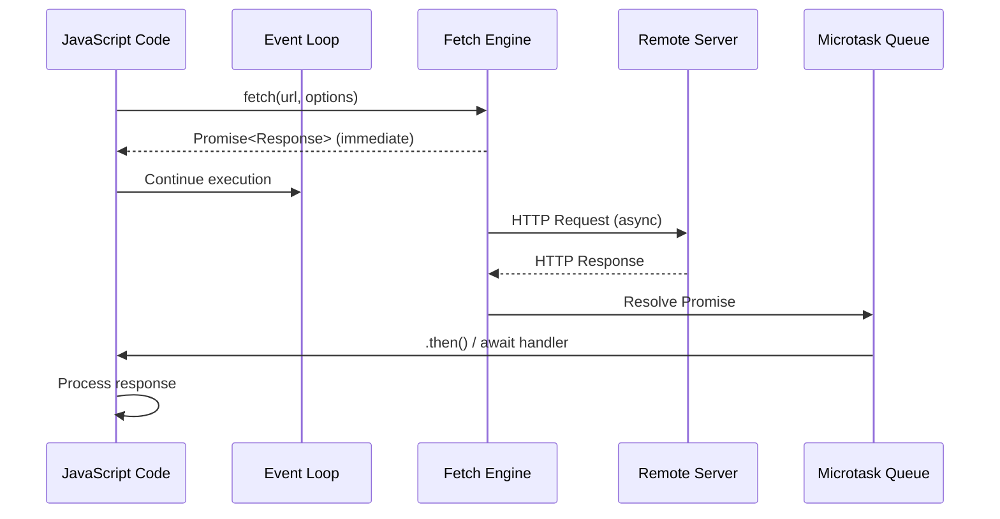

# Lecture Notes: Fetch API

## Section 1: Building Your Mental Model of Network Communication

By the end of this deep dive, you will:

1. **Distinguish** the execution models of synchronous vs. asynchronous code and articulate why blocking operations are architectural liabilities in modern JavaScript.
2. **Implement** GET and POST requests using the Fetch API with proper error handling, request configuration, and response parsing.
3. **Debug** common Fetch failures—CORS violations, malformed JSON, unhandled rejections—by reading error states correctly.
4. **Design** resilient API clients that handle network latency, timeouts, and partial failures without freezing the UI thread.
5. **Optimize** request patterns by choosing between sequential, parallel, and batched Fetch operations based on system constraints.

---

## Section 2: The Restaurant Kitchen as Your Execution Model

### Analogy Application: From Order-Taking to Dispatch

Imagine a restaurant kitchen as your JavaScript runtime. In a **synchronous kitchen**, the head chef takes your order, walks to the stove, cooks your meal personally, and doesn't take another order until yours is plated. The line backs up. Customers wait idle. This is blocking I/O.

In an **asynchronous kitchen**, the head chef takes your order, delegates it to a sous chef, and immediately takes the next order. The sous chef cooks in parallel. When your meal is ready, a runner brings it to your table. The head chef never stops working. This is non-blocking I/O with callbacks, promises, or async/await.

The **Fetch API** is your order-taking system. It submits a request to a remote server (the kitchen), returns a **Promise** (a ticket), and lets your code continue executing. When the server responds, the Promise resolves, and your code processes the result.

### Technical Definition

The **Fetch API** is a modern, Promise-based HTTP client interface standardized in ES6+ that replaces the legacy XMLHttpRequest. It provides a clean abstraction for making asynchronous network requests with:

- **Request configuration** (method, headers, body, credentials)
- **Response streaming** (JSON, text, blob, arrayBuffer)
- **Non-blocking execution** (returns a Promise immediately)
- **Built-in abort capability** (AbortController)

**Synchronous code** executes line-by-line, blocking further execution until each operation completes. **Asynchronous code** initiates long-running operations (network requests, timers, file I/O) and registers callbacks or Promises to handle results without blocking.

### Why It Matters: The Engineering Reality

In production systems, synchronous network calls are catastrophic. A 500ms API latency × 1000 concurrent users = 500 seconds of blocked threads. Your application becomes unresponsive. Users see frozen UIs. The entire event loop stalls.

Fetch solves this by maintaining the JavaScript event loop's single-threaded responsiveness. While the network request travels over the wire, your code can:
- Handle user interactions (clicks, scrolls)
- Render animations
- Process other asynchronous events
- Serve multiple concurrent requests with zero additional threads

This is why Fetch is non-negotiable in modern web development.

---

## Section 3: The Anatomy of Promise-Based Network Flow

### The Blueprint: Internal Mechanics

When you call `fetch(url)`, the following sequence occurs:

1. **Immediate Return:** `fetch()` returns a Promise *instantly*. The network request is initiated in the background via the browser's HTTP client.
2. **Request Serialization:** Your request object (method, headers, body) is serialized and sent to the server.
3. **Network Transit:** The request travels over TCP/IP. No blocking occurs.
4. **Response Reception:** When the response headers are received, the Promise resolves (if status is 2xx-3xx). Network errors (DNS failure, connection refused) reject the Promise. The response body is streamed separately and must be explicitly consumed.
5. **Body Streaming:** The response body is *not* automatically parsed. You must explicitly call `.json()`, `.text()`, or `.blob()` to consume it.
6. **Callback Execution:** Your `.then()` or `await` handler executes in the next microtask queue cycle.

**Critical insight:** A successful HTTP 404 response *resolves* the Promise. Only network failures *reject* it. This is a common gotcha.

### Visual Architecture: Request-Response Lifecycle



This diagram illustrates the critical separation: `fetch()` returns immediately, allowing the event loop to continue, while the actual HTTP exchange happens asynchronously.

**Critical distinction:** HTTP 2xx-3xx responses *resolve* the Promise. Network errors (DNS failure, connection refused, timeout) *reject* it. HTTP 4xx-5xx responses also *resolve* the Promise—they do not trigger rejection. This is why explicit `response.ok` checking is mandatory.

### Code Implementation: GET and POST Patterns

```javascript
// ============================================
// EXAMPLE 1: Simple GET Request
// ============================================

async function fetchUserData(userId) {
  try {
    // fetch() returns a Promise immediately
    const response = await fetch(
      `https://api.example.com/users/${userId}`,
      {
        method: 'GET', // Explicit (default)
        headers: {
          'Accept': 'application/json',
          'Authorization': `Bearer ${token}`
        }
      }
    );

    // Critical: Check HTTP status manually
    if (!response.ok) {
      throw new Error(`HTTP ${response.status}: ${response.statusText}`);
    }

    // Parse JSON body (also async)
    // Note: .json() consumes the response body stream.
    // Subsequent calls to .json() will fail. If you need the body twice,
    // clone the response: response.clone().json()
    const user = await response.json();
    return user;

  } catch (error) {
    // Catches both network errors AND parsing errors
    console.error('Fetch failed:', error.message);
    throw error;
  }
}

// ============================================
// EXAMPLE 2: POST Request with JSON Body
// ============================================

async function createPost(title, content, authorId) {
  const payload = {
    title,
    content,
    authorId,
    createdAt: new Date().toISOString()
  };

  try {
    const response = await fetch(
      'https://api.example.com/posts',
      {
        method: 'POST',
        headers: {
          'Content-Type': 'application/json',
          'Authorization': `Bearer ${token}`
        },
        // Serialize payload to JSON string
        body: JSON.stringify(payload),
        // Send cookies with cross-origin requests
        // Server must respond with Access-Control-Allow-Credentials: true
        // or the browser will reject the response
        credentials: 'include'
      }
    );

    if (!response.ok) {
      const errorBody = await response.json();
      throw new Error(
        `Server rejected: ${errorBody.message || response.statusText}`
      );
    }

    const createdPost = await response.json();
    return createdPost;

  } catch (error) {
    console.error('POST failed:', error);
    throw error;
  }
}

// ============================================
// EXAMPLE 3: Parallel Requests (Best Practice)
// ============================================

async function loadDashboard(userId) {
  try {
    // Initiate all requests concurrently (not sequentially)
    const [user, posts, comments] = await Promise.all([
      fetch(`/api/users/${userId}`).then(r => r.json()),
      fetch(`/api/posts?author=${userId}`).then(r => r.json()),
      fetch(`/api/comments?author=${userId}`).then(r => r.json())
    ]);

    return { user, posts, comments };

  } catch (error) {
    // If ANY request fails, Promise.all rejects
    console.error('Dashboard load failed:', error);
    throw error;
  }
}
```

**Key observations:**

- `response.ok` checks for 2xx-3xx status codes. Always use this.
- `.json()` is itself async and can throw on malformed JSON.
- `Promise.all()` runs requests concurrently, not sequentially.
- `credentials: 'include'` is required to send cookies on cross-origin requests.

---

## Section 4: The Minefield—Where Novices Stumble

### The "Happy Path" vs. Production Reality

Novices write:

```javascript
// ❌ ANTI-PATTERN: Ignoring HTTP errors
fetch('/api/data')
  .then(r => r.json())
  .then(data => console.log(data));
  // If server returns 500, this silently succeeds!
```

An HTTP 500 response *resolves* the Promise. Your code proceeds to `.json()` and processes the error response as if it were valid data. The UI displays garbage or crashes downstream.

**The fix:**

```javascript
// ✅ BEST PRACTICE: Explicit status checking
fetch('/api/data')
  .then(r => {
    if (!r.ok) throw new Error(`HTTP ${r.status}`);
    return r.json();
  })
  .then(data => console.log(data))
  .catch(err => console.error('Failed:', err));
```

### Common Antipattern #1: Sequential Requests When Parallel Is Possible

```javascript
// ❌ ANTI-PATTERN: Waterfall effect
async function loadUserProfile(userId) {
  const user = await fetch(`/api/users/${userId}`).then(r => r.json());
  const posts = await fetch(`/api/posts?author=${userId}`).then(r => r.json());
  const comments = await fetch(`/api/comments?author=${userId}`).then(r => r.json());
  // Total latency: ~300ms (assuming 100ms per request)
}

// ✅ BEST PRACTICE: Parallel execution
async function loadUserProfile(userId) {
  const [user, posts, comments] = await Promise.all([
    fetch(`/api/users/${userId}`).then(r => r.json()),
    fetch(`/api/posts?author=${userId}`).then(r => r.json()),
    fetch(`/api/comments?author=${userId}`).then(r => r.json())
  ]);
  // Total latency: ~100ms (only the slowest request matters)
}
```

The difference is architectural. Sequential requests multiply latency; parallel requests cap latency at the slowest request.

### Common Antipattern #2: CORS Misconfiguration

```javascript
// ❌ ANTI-PATTERN: Assuming CORS will work
fetch('https://external-api.com/data', {
  headers: { 'Authorization': 'Bearer secret-token' }
});
// Browser blocks this. No credentials sent on cross-origin requests by default.

// ✅ BEST PRACTICE: Explicit credential handling
fetch('https://external-api.com/data', {
  credentials: 'include', // Send cookies
  headers: { 'Authorization': 'Bearer secret-token' }
});
// Server must respond with Access-Control-Allow-Credentials: true
```

CORS is not a bug; it's a security feature. The browser enforces it. Understand it.

**Critical gotcha:** POST requests with custom headers (like `Authorization`) trigger a preflight OPTIONS request. The browser sends an OPTIONS request first to check if the server allows the actual POST. The server must respond with appropriate `Access-Control-Allow-Methods`, `Access-Control-Allow-Headers`, and `Access-Control-Allow-Credentials` headers. If the preflight fails, the actual POST is never sent. This is why CORS failures often appear as network errors, not HTTP errors.

### Common Antipattern #3: Unhandled Promise Rejections

```javascript
// ❌ ANTI-PATTERN: Fire and forget
fetch('/api/log', { method: 'POST', body: JSON.stringify(event) });
// If the request fails, nothing happens. No error logged.

// ✅ BEST PRACTICE: Always handle rejections
fetch('/api/log', { method: 'POST', body: JSON.stringify(event) })
  .catch(err => console.error('Logging failed (non-critical):', err));
```

Even "fire-and-forget" requests need `.catch()` handlers to prevent unhandled rejections that crash your application in some environments.

---

## Section 5: Advanced Pattern—Resilient API Client with Retry Logic

In production, a single Fetch call is insufficient. Networks fail. Servers timeout. You need retry logic, exponential backoff, and request cancellation.

```javascript
// ============================================
// PRODUCTION-GRADE API CLIENT
// ============================================

class ResilientAPIClient {
  constructor(baseURL, maxRetries = 3, timeoutMs = 5000) {
    this.baseURL = baseURL;
    this.maxRetries = maxRetries;
    this.timeoutMs = timeoutMs;
  }

  // Exponential backoff: 100ms, 200ms, 400ms, 800ms
  getBackoffDelay(attemptNumber) {
    return Math.min(1000 * Math.pow(2, attemptNumber), 10000);
  }

  async request(endpoint, options = {}) {
    let lastError;

    for (let attempt = 0; attempt <= this.maxRetries; attempt++) {
      try {
        // Create abort controller for timeout
        const controller = new AbortController();
        const timeoutId = setTimeout(
          () => controller.abort(),
          this.timeoutMs
        );

        const response = await fetch(
          `${this.baseURL}${endpoint}`,
          {
            ...options,
            signal: controller.signal
          }
        );

        clearTimeout(timeoutId);

        // Retry on 5xx errors, not 4xx
        if (response.status >= 500 && response.status < 600 && attempt < this.maxRetries) {
          const backoff = this.getBackoffDelay(attempt);
          console.warn(
            `HTTP ${response.status}. Retrying in ${backoff}ms...`
          );
          await new Promise(resolve => setTimeout(resolve, backoff));
          continue;
        }

        if (!response.ok) {
          const error = new Error(`HTTP ${response.status}: ${response.statusText}`);
          error.status = response.status;
          throw error;
        }

        // Validate content-type before parsing JSON
        const contentType = response.headers.get('content-type');
        if (!contentType?.includes('application/json')) {
          throw new Error(`Expected JSON response, got ${contentType || 'unknown'}`);
        }

        return await response.json();

      } catch (error) {
        lastError = error;

        // Don't retry on client errors (4xx) or abort errors
        const isClientError = error.status && error.status >= 400 && error.status < 500;
        if (error.name === 'AbortError' || isClientError) {
          throw error;
        }

        // Retry on network errors
        if (attempt < this.maxRetries) {
          const backoff = this.getBackoffDelay(attempt);
          console.warn(`Request failed: ${error.message}. Retrying...`);
          await new Promise(resolve => setTimeout(resolve, backoff));
        }
      }
    }

    throw lastError;
  }

  get(endpoint) {
    return this.request(endpoint, { method: 'GET' });
  }

  post(endpoint, body) {
    return this.request(endpoint, {
      method: 'POST',
      headers: { 'Content-Type': 'application/json' },
      body: JSON.stringify(body)
    });
  }
}

// Usage
const api = new ResilientAPIClient('https://api.example.com', 3, 5000);
const user = await api.get('/users/123');
const newPost = await api.post('/posts', { title: 'Hello' });
```

This client demonstrates:
- **Exponential backoff** to avoid overwhelming a recovering server
- **Timeout handling** via AbortController
- **Selective retry logic** (5xx errors yes, 4xx errors no)
- **Clean API** that abstracts complexity

This is the pattern you'll see in production codebases.

---

## Section 5.5: AbortController Deep Dive—Request Cancellation

AbortController is the standard mechanism for cancelling Fetch requests. This is essential for:
- Implementing request timeouts
- Cancelling requests when a user navigates away
- Cleaning up requests on component unmount (React, Vue, etc.)

```javascript
// Basic AbortController pattern
const controller = new AbortController();

// Cancel the request after 5 seconds
const timeoutId = setTimeout(() => controller.abort(), 5000);

try {
  const response = await fetch('/api/data', {
    signal: controller.signal // Pass the abort signal
  });
  clearTimeout(timeoutId);
  return await response.json();
} catch (error) {
  if (error.name === 'AbortError') {
    console.error('Request was cancelled or timed out');
  } else {
    console.error('Request failed:', error);
  }
}
```

**React example: Cancel on unmount**

```javascript
useEffect(() => {
  const controller = new AbortController();

  const fetchData = async () => {
    try {
      const response = await fetch('/api/data', {
        signal: controller.signal
      });
      const data = await response.json();
      setData(data);
    } catch (error) {
      if (error.name !== 'AbortError') {
        setError(error);
      }
    }
  };

  fetchData();

  // Cleanup: Cancel the request if component unmounts
  return () => controller.abort();
}, []);
```

This pattern prevents memory leaks and ensures requests don't update unmounted components.

---

## Section 5.6: Response Headers & Metadata

The Response object contains metadata beyond the body. Always inspect headers before parsing:

```javascript
const response = await fetch('/api/data');

// Access response metadata
console.log(response.status);           // HTTP status code (e.g., 200)
console.log(response.statusText);       // Status text (e.g., 'OK')
console.log(response.url);              // Final URL (after redirects)
console.log(response.headers);          // Headers object

// Read specific headers
const contentType = response.headers.get('content-type');
const cacheControl = response.headers.get('cache-control');
const etag = response.headers.get('etag');

// Validate content-type before parsing
if (contentType?.includes('application/json')) {
  const data = await response.json();
} else if (contentType?.includes('text/html')) {
  const html = await response.text();
} else {
  const blob = await response.blob();
}
```

**Why this matters:**
- A 204 No Content response has no body. Calling `.json()` will throw.
- A server error might return HTML instead of JSON. Parsing it as JSON fails.
- Content-Type headers tell you how to safely parse the response.
- ETags and Cache-Control headers enable efficient caching strategies.

---

## Section 6: Key Takeaways (Cheat Sheet)

1. **Fetch returns a Promise immediately.** Network I/O happens asynchronously. The event loop never blocks. Always use `await` or `.then()` to handle the result.

2. **HTTP status codes don't reject Promises.** Only network failures (DNS, connection refused, timeout) do. Always check `response.ok` or `response.status` explicitly.

3. **Response body parsing is async.** `.json()`, `.text()`, and `.blob()` return Promises. Await them. Failed parsing throws an error.

4. **Use `Promise.all()` for concurrent requests.** Sequential awaits multiply latency. Parallel requests cap latency at the slowest request.

5. **CORS is enforced by the browser.** Cross-origin requests require explicit `credentials: 'include'` and server-side `Access-Control-*` headers. It's not a bug; it's security.

6. **Production code needs retry logic, timeouts, and error handling.** A bare `fetch()` call is insufficient. Implement exponential backoff, AbortController timeouts, and selective retry policies.

7. **Always validate response metadata before parsing.** Check `response.headers.get('content-type')` before calling `.json()`. A 204 No Content or HTML error page will crash your parser.

8. **Use AbortController to cancel requests.** Implement timeouts, clean up on component unmount, and prevent memory leaks by cancelling in-flight requests.

---

**The Synthesis:** Fetch is the modern contract between your code and the network. It respects JavaScript's single-threaded, event-driven execution model while providing clean abstractions for HTTP communication