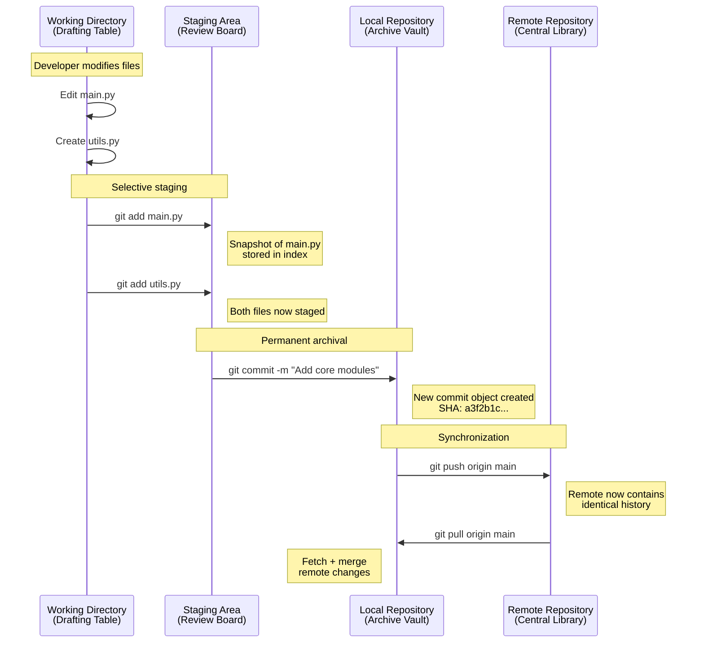

## Lecture Notes: Git Fundamentals and Repository Management

### Section 1: The Mastery Checkpoint

By the end of this deep dive, you will:

- **Initialize** a Git repository from scratch and explain the role of the hidden `.git` directory in tracking project history
- **Execute** the three-stage commit workflow (`init` → `add` → `commit`) with precision, understanding exactly what happens at each transition
- **Differentiate** between local and remote repositories, articulating why this distinction matters for team collaboration and disaster recovery
- **Clone** remote repositories from GitHub and establish bidirectional synchronization through `push` and `pull` operations
- **Debug** common repository state issues by reading Git's internal object model

---

### Section 2: The Architect's Blueprint Room

**Analogy Universe: The Architect's Blueprint Room**

Think of Git as an architect's blueprint room where every version of a building's design is permanently archived. The room contains three distinct workspaces:

1. **The Drafting Table** (Working Directory) — where you actively sketch and modify designs
2. **The Review Board** (Staging Area) — where you pin selected changes for formal approval
3. **The Archive Vault** (Repository) — where approved blueprints are permanently stored with timestamps and architect signatures

This blueprint room has a critical property: nothing is ever truly erased. Every design iteration, every crossed-out line, every approved revision exists in the vault forever. You can retrieve the building plans from six months ago as easily as yesterday's revision.

**Technical Definition**

Git is a *distributed version control system* (DVCS) that maintains a directed acyclic graph (DAG) of immutable snapshots called *commits*. Each commit contains:
- A cryptographic SHA-1 hash serving as its unique identifier
- A pointer to a *tree object* representing the complete directory structure
- Pointers to parent commit(s)
- Metadata (author, timestamp, message)

Unlike centralized systems (SVN, Perforce), every Git clone contains the **complete** history. There is no single point of failure.

**Why It Matters**

In production engineering, Git provides:
- **Atomic rollbacks**: Revert a broken deployment in seconds, not hours
- **Parallel development**: Fifty engineers can work on fifty features simultaneously without collision
- **Audit trails**: Compliance requirements demand knowing who changed what, when, and why
- **Disaster recovery**: If your server burns down, any developer's laptop contains the full history

---

### Section 3: Constructing the Archive — The Three-Stage Commit Workflow

**The Blueprint: Internal Mechanics**

When you initialize a repository, Git creates a hidden `.git` directory containing its entire brain:

```
.git/
├── HEAD              # Pointer to current branch
├── config            # Repository-specific settings
├── objects/          # The actual content (blobs, trees, commits)
├── refs/             # Branch and tag pointers
│   ├── heads/        # Local branches
│   └── remotes/      # Remote-tracking branches
└── index             # The staging area (binary file)
```

The `objects/` directory is Git's content-addressable filesystem. Every file, every directory structure, every commit is stored as a compressed object named by its SHA-1 hash. This creates automatic deduplication: identical files across commits share storage.

**Visual Architecture: The Commit Lifecycle**



**Code Implementation: Building Your First Repository**

```bash
# === PHASE 1: Repository Initialization ===
# Create project directory and enter it
mkdir blueprint-project && cd blueprint-project

# Initialize Git — this creates the .git directory
# The --initial-branch flag sets 'main' as default (not 'master')
git init --initial-branch=main
# Output: Initialized empty Git repository in /path/blueprint-project/.git/

# Verify the internal structure was created
ls -la .git/
# You'll see: HEAD, config, objects/, refs/, etc.

# === PHASE 2: Creating and Staging Content ===
# Create a Python module with actual content
cat > calculator.py << 'EOF'
"""Core arithmetic module for Blueprint Project."""

def add(a: float, b: float) -> float:
    """Return the sum of two numbers."""
    return a + b

def multiply(a: float, b: float) -> float:
    """Return the product of two numbers."""
    return a * b
EOF

# Check repository status — file is "untracked"
git status
# Output: Untracked files: calculator.py

# Stage the file — moves snapshot to the Review Board
git add calculator.py

# Verify staging worked
git status
# Output: Changes to be committed: new file: calculator.py

# === PHASE 3: Committing to the Archive ===
# Create permanent snapshot with descriptive message
# The -m flag provides the commit message inline
git commit -m "feat: add core arithmetic module with add/multiply functions"
# Output: [main (root-commit) 7a3f2b1] feat: add core...
#         1 file changed, 11 insertions(+)

# Inspect the commit history
git log --oneline
# Output: 7a3f2b1 feat: add core arithmetic module...
```

---

### Section 4: Where Blueprints Get Lost — Common Pitfalls and Recovery

**The "Happy Path" vs. Reality**

Novices treat Git as a save button. Experts understand it as a state machine with recoverable transitions. The difference emerges when things go wrong.

**Pitfall 1: The Phantom Commit (Forgetting to Stage)**

```bash
# ANTI-PATTERN: Editing and committing without staging
echo "def subtract(a, b): return a - b" >> calculator.py
git commit -m "Add subtract function"
# Output: nothing to commit, working tree clean

# The developer is confused — they edited the file!
# Reality: Changes exist only on the Drafting Table, never reached Review Board
```

```bash
# BEST PRACTICE: Always verify status before committing
git status                    # See what's staged vs. modified
git add calculator.py         # Explicitly stage
git diff --staged             # Review exactly what will be committed
git commit -m "feat: add subtract function"
```

**Pitfall 2: The Accidental Staging (Adding Too Much)**

```bash
# ANTI-PATTERN: Staging everything blindly
git add .                     # Stages ALL changes, including secrets
git commit -m "Update code"
# Oops: .env file with API keys is now in permanent history

# RECOVERY: Remove from staging before commit
git reset HEAD .env           # Unstages .env, keeps file on disk

# PREVENTION: Use .gitignore BEFORE first commit
echo ".env" >> .gitignore
echo "*.log" >> .gitignore
echo "__pycache__/" >> .gitignore
git add .gitignore
git commit -m "chore: add gitignore for secrets and artifacts"
```

**Pitfall 3: The Detached HEAD (Lost in the Archive)**

```bash
# ANTI-PATTERN: Checking out a commit hash directly
git checkout 7a3f2b1
# Warning: You are in 'detached HEAD' state...

# New commits here are NOT on any branch — they can be garbage collected!

# BEST PRACTICE: Create a branch if you need to work from an old commit
git checkout -b bugfix/investigate-old-state 7a3f2b1
# Now commits are safely attached to a named branch
```

---

### Section 5: The Distributed Archive — Local and Remote Synchronization

**The Two-Library Model**

Your local repository is a complete, self-sufficient archive. GitHub (or GitLab, Bitbucket) hosts a *remote* repository — think of it as the Central Library where all architects deposit copies of their blueprints.

Key insight: **remotes are just bookmarks**. When you run `git remote add origin https://github.com/user/repo.git`, you're creating a named reference to another Git repository. Nothing is transferred yet.

**Cloning: Copying the Entire Archive**

```bash
# Clone creates a complete local copy of the remote repository
# This includes ALL history, ALL branches, ALL tags
git clone https://github.com/torvalds/linux.git

# What actually happens:
# 1. Creates directory 'linux/'
# 2. Initializes .git/ inside it
# 3. Downloads all objects from remote
# 4. Creates remote-tracking branch 'origin/master'
# 5. Checks out default branch to working directory

# Verify the remote bookmark was created
cd linux && git remote -v
# Output:
# origin  https://github.com/torvalds/linux.git (fetch)
# origin  https://github.com/torvalds/linux.git (push)
```

**Pushing: Uploading Your Blueprints**

```bash
# After making local commits, synchronize with remote
git push origin main

# Breakdown:
# - 'origin' = the remote repository bookmark
# - 'main' = the branch to push

# CRITICAL: Push is rejected if remote has commits you don't have
# This prevents accidentally overwriting teammates' work
# Solution: pull first, resolve conflicts, then push
```

**The Full Synchronization Workflow**

```bash
# === Senior Engineer's Daily Workflow ===

# 1. Start day by syncing with remote
git fetch origin              # Download remote changes (doesn't modify local files)
git status                    # See if local is behind

# 2. Integrate remote changes
git pull origin main          # Fetch + merge in one command
# Alternative for cleaner history:
git pull --rebase origin main # Fetch + rebase (linear history)

# 3. Do your work
git add -p                    # Stage interactively (review each hunk)
git commit -m "feat: implement caching layer"

# 4. Push before leaving
git push origin main

# 5. If push is rejected (teammate pushed first):
git pull --rebase origin main # Rebase your commits on top of theirs
git push origin main          # Now it succeeds
```

**Advanced: Understanding Remote-Tracking Branches**

```bash
# 'origin/main' is a remote-tracking branch
# It's a local cache of where 'main' was on 'origin' during last fetch

git branch -a                 # List all branches including remotes
# Output:
# * main                      # Local branch
#   remotes/origin/main       # Remote-tracking branch
#   remotes/origin/feature-x  # Another remote branch

# See how far ahead/behind you are
git log origin/main..main     # Commits on local not yet pushed
git log main..origin/main     # Commits on remote not yet pulled
```

---

### Section 6: Key Takeaways (Cheat Sheet)

| Concept | Command | What It Does |
|---------|---------|--------------|
| **Initialize** | `git init` | Creates `.git/` directory, enabling version control |
| **Stage** | `git add <file>` | Copies file snapshot to staging area (index) |
| **Commit** | `git commit -m "msg"` | Creates permanent, immutable snapshot in repository |
| **Clone** | `git clone <url>` | Downloads complete repository including all history |
| **Push** | `git push origin main` | Uploads local commits to remote repository |

**The Five Laws of Git Mastery:**

1. **Commits are immutable snapshots**, not diffs. Git stores complete file states, using deduplication for efficiency.

2. **The staging area is your quality gate.** Use `git add -p` to review changes before committing. Never blindly `git add .`.

3. **Local and remote are peers, not parent-child.** Your laptop has the same authority as GitHub. Synchronization is explicit.

4. **SHA-1 hashes are addresses.** Every commit, tree, and blob has a unique identifier. If you have the hash, you can retrieve the content.

5. **When in doubt, check status.** `git status` tells you exactly where files live in the three-stage model. Read it before every commit and push.

---

*The architect who understands their blueprint room never loses a design. The engineer who masters Git never loses code.*