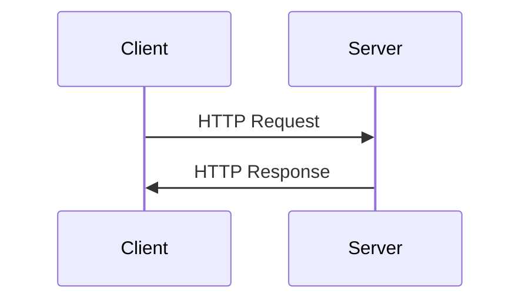

## Lecture Notes: HTTP Methods and Fetch API

### Mastering the Language of the Web: HTTP Methods Demystified

By the end of this deep dive, you will:

- Explain the purpose and usage of the core HTTP methods (GET, POST, PUT, PATCH, DELETE)
- Implement robust Fetch API calls to interact with web services
- Diagnose and debug common issues with HTTP requests and responses
- Architect a scalable, maintainable API integration in a modern web application

### The Kitchen Analogy: Cooking Up Successful Web Interactions

Imagine your web application as a bustling kitchen, where the HTTP methods are your essential cooking tools. Just as a chef has a repertoire of techniques to prepare a diverse menu, developers must master the HTTP method toolkit to build effective web-based systems.

At the technical level, HTTP methods are the verbs that define the intended action when making a request to a server. They provide a standardized language for web clients and servers to communicate and collaborate. Understanding the nuances of each method is crucial for crafting web interactions that are efficient, scalable, and secure.

Why does this matter? The HTTP protocol is the foundation of the modern web, powering everything from simple GET requests to complex, data-driven web applications. Mastering HTTP methods empowers you to design intuitive, RESTful APIs, implement robust CRUD (Create, Read, Update, Delete) functionality, and ensure your web applications adhere to best practices for security and performance.

### The HTTP Method Toolkit: Leveraging Each Tool for Maximum Efficiency

**The Blueprint:**

The core HTTP methods are:

- **GET:** Retrieve a representation of a resource
- **POST:** Create a new resource
- **PUT:** Update the entire representation of a resource
- **PATCH:** Update a partial representation of a resource
- **DELETE:** Remove a resource

These methods work in conjunction with the HTTP request/response cycle, where the client (e.g., a web browser) sends a request to the server, and the server responds with the appropriate data and status codes.



The key to effective usage of these methods lies in understanding their specific purposes and how they fit into the broader context of web interactions.

**Code Implementation:**

Let's explore a practical example of using the Fetch API in JavaScript to interact with a web service:

```javascript
// Fetch a list of products (GET)
fetch('/products')
  .then(response => response.json())
  .then(data => {
    console.log('Products:', data);
  })
  .catch(error => {
    console.error('Error fetching products:', error);
  });

// Create a new product (POST)
const newProduct = {
  name: 'New Product',
  description: 'This is a new product',
  price: 19.99
};

fetch('/products', {
  method: 'POST',
  headers: {
    'Content-Type': 'application/json'
  },
  body: JSON.stringify(newProduct)
})
  .then(response => response.json())
  .then(data => {
    console.log('New product created:', data);
  })
  .catch(error => {
    console.error('Error creating product:', error);
  });
```

### Navigating the HTTP Method Landscape: Avoiding Pitfalls and Embracing Best Practices

**The "Happy Path" vs. Reality:**

While the core HTTP methods may seem straightforward, real-world web development often involves navigating complex edge cases and potential pitfalls. Experts understand that the "happy path" is just the beginning, and they are prepared to handle scenarios such as:

- **Handling Errors:** Properly interpreting and responding to HTTP status codes (e.g., 404 Not Found, 500 Internal Server Error)
- **Managing Caching:** Leveraging HTTP headers like `Cache-Control` and `ETag` to optimize performance and reduce unnecessary network requests
- **Securing Sensitive Data:** Ensuring the appropriate use of `POST`, `PUT`, and `PATCH` methods for creating and updating resources

**Anti-pattern vs. Best Practice:**

An example of an anti-pattern would be using the `GET` method to update a resource. This violates the principle of idempotency (the ability to perform the same action multiple times without changing the result) and can lead to issues with caching and security.

Instead, the best practice would be to use the `PUT` or `PATCH` method to update a resource, ensuring the request body contains the necessary data.

### Integrating HTTP Methods into Larger Systems: Unlocking the Full Potential

As a senior engineer, you may be tasked with designing and implementing a comprehensive API integration within a complex, enterprise-level web application. In this context, your mastery of HTTP methods becomes even more crucial.

By aligning your API design with the HTTP method semantics, you create a system that is not only technically sound but also intuitive and maintainable for both developers and end-users. This holistic approach, combining your expertise in HTTP methods with broader system design principles, is what sets apart senior engineers who can truly unlock the full potential of web-based technologies.

### Key Takeaways: HTTP Methods and Fetch API Cheat Sheet

1. **HTTP Methods Defined:** GET (retrieve), POST (create), PUT (update), PATCH (partial update), DELETE (remove)
2. **Fetch API Basics:** Promise-based interface for making HTTP requests in JavaScript
3. **Idempotency:** GET and DELETE methods are idempotent, meaning multiple identical requests have the same effect
4. **Error Handling:** Always check HTTP status codes and handle errors appropriately
5. **Caching and Conditional Requests:** Leverage HTTP headers like `Cache-Control` and `ETag` to optimize performance