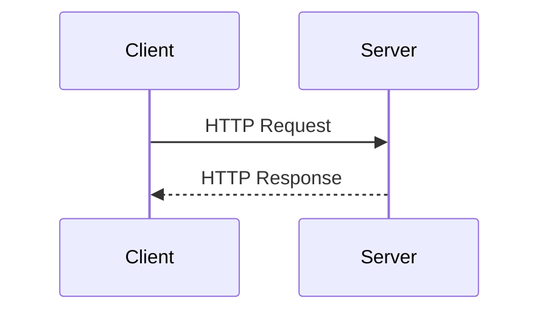

## Lecture Notes: HTTP Methods and Fetch API

### Mastering the Language of the Web: HTTP Methods Demystified

By the end of this deep dive, you will:

- Explain the core purpose and semantics of the 6 primary HTTP methods (GET, POST, PUT, PATCH, DELETE, HEAD)
- Implement robust Fetch API calls for common CRUD operations against a REST API
- Debug and troubleshoot common Fetch API edge cases and anti-patterns
- Architect a modular, extensible Fetch API wrapper to power your web application

### The Kitchen Analogy: Understanding HTTP as a Cooking Workflow

Imagine the web as a bustling kitchen, where servers are the chefs and clients (your browser) are the hungry patrons. When a patron (your app) wants to interact with the kitchen, they use a specific set of "cooking commands" - the HTTP methods - to communicate their intent.

Just like a real kitchen, the web has a well-defined protocol for how these commands are used. GET is like asking the chef for the daily special, POST is ordering a new dish, PUT is requesting a complete meal replacement, PATCH is asking to modify an existing dish, DELETE is clearing your plate, and HEAD is simply inquiring about the menu.

By understanding the semantics and appropriate usage of each HTTP method, you'll gain mastery over the fundamental language of web communication. This will empower you to build more robust, scalable, and maintainable client-server interactions.

### Introducing the HTTP Request/Response Lifecycle

At the heart of web communication lies the HTTP request/response cycle. When your application needs to interact with a server, it constructs an HTTP request - a structured message containing all the relevant information, including the HTTP method, headers, and optional payload data.



The server then processes this request, performs the necessary logic, and returns an HTTP response containing the result. This response includes status codes, headers, and the response body data. By understanding the nuances of this lifecycle, you'll be able to craft efficient, reliable, and secure web interactions.

### Diving into the HTTP Methods

#### GET: Retrieving Data
The GET method is the workhorse of the web, used to retrieve data from the server. It's like asking the chef for a specific dish from the menu. GET requests are designed to be idempotent, meaning that multiple identical requests should have the same effect as a single request.

```javascript
// Fetch a user's profile data
fetch('/api/users/123')
  .then(response => response.json())
  .then(data => console.log(data));
```

#### POST: Creating New Resources
The POST method is used to create new resources on the server, like ordering a new dish from the kitchen. POST requests are not idempotent - each request will create a new resource, even if the content is the same.

```javascript
// Create a new user
fetch('/api/users', {
  method: 'POST',
  headers: {
    'Content-Type': 'application/json'
  },
  body: JSON.stringify({
    name: 'John Doe',
    email: 'john@example.com'
  })
})
  .then(response => response.json())
  .then(data => console.log(data));
```

#### PUT: Replacing Existing Resources
The PUT method is used to completely replace an existing resource on the server, like requesting a new dish to replace the one you currently have. PUT requests are designed to be idempotent - multiple identical requests should have the same effect as a single request.

```javascript
// Update a user's profile
fetch('/api/users/123', {
  method: 'PUT',
  headers: {
    'Content-Type': 'application/json'
  },
  body: JSON.stringify({
    name: 'Jane Doe',
    email: 'jane@example.com'
  })
})
  .then(response => response.json())
  .then(data => console.log(data));
```

#### PATCH: Partially Updating Existing Resources
The PATCH method is used to make partial updates to an existing resource on the server, like requesting a modification to your existing dish. PATCH requests are also designed to be idempotent.

```javascript
// Update a user's email
fetch('/api/users/123', {
  method: 'PATCH',
  headers: {
    'Content-Type': 'application/json'
  },
  body: JSON.stringify({
    email: 'jane.doe@example.com'
  })
})
  .then(response => response.json())
  .then(data => console.log(data));
```

#### DELETE: Removing Resources
The DELETE method is used to remove a resource from the server, like clearing your plate in the kitchen. DELETE requests are designed to be idempotent - multiple identical requests should have the same effect as a single request.

```javascript
// Delete a user
fetch('/api/users/123', {
  method: 'DELETE'
})
  .then(response => response.json())
  .then(data => console.log(data));
```

#### HEAD: Retrieving Metadata
The HEAD method is used to retrieve the headers of an HTTP response, without the response body. This is like asking the chef about the details of a dish, without actually ordering it.

```javascript
// Check the last-modified date of a resource
fetch('/api/users/123', {
  method: 'HEAD'
})
  .then(response => {
    const lastModified = response.headers.get('Last-Modified');
    console.log(lastModified);
  });
```

### Mastering the Fetch API

The Fetch API is a modern, powerful, and flexible way to make HTTP requests from your JavaScript applications. It provides a clean, Promise-based interface for interacting with servers, making it easier to manage asynchronous operations and handle errors.

```javascript
// Fetch a user's profile data
fetch('/api/users/123')
  .then(response => {
    if (response.ok) {
      return response.json();
    } else {
      throw new Error(`HTTP Error ${response.status}`);
    }
  })
  .then(data => console.log(data))
  .catch(error => console.error(error));
```

The key advantages of the Fetch API over traditional approaches (like XMLHttpRequest) are:

1. **Promise-based**: Fetch returns a Promise, making it easier to chain multiple asynchronous operations.
2. **Streaming**: Fetch supports streaming response bodies, allowing you to process data as it arrives.
3. **Automatic JSON Parsing**: Fetch automatically parses JSON responses, reducing boilerplate code.
4. **Smaller Footprint**: Fetch is a built-in web API, so you don't need to include a separate library.

By mastering the Fetch API, you'll be able to write clean, maintainable, and robust code for your web applications' server interactions.

### Handling Fetch API Edge Cases

While the Fetch API is a powerful tool, it's important to be aware of some common edge cases and anti-patterns to ensure your code is bulletproof.

**Edge Case: Handling Non-JSON Responses**
Not all API responses will be in JSON format. You may need to handle other content types, such as XML, plain text, or binary data.

```javascript
fetch('/api/document')
  .then(response => {
    const contentType = response.headers.get('Content-Type');
    if (contentType.includes('application/json')) {
      return response.json();
    } else if (contentType.includes('text/plain')) {
      return response.text();
    } else {
      // Handle other content types
    }
  })
  .then(data => console.log(data))
  .catch(error => console.error(error));
```

**Anti-Pattern: Ignoring Error Handling**
It's crucial to properly handle errors in your Fetch API calls, both at the network level and the application level.

```javascript
// Bad: Ignoring errors
fetch('/api/users/123')
  .then(response => response.json())
  .then(data => console.log(data));

// Good: Handling errors
fetch('/api/users/123')
  .then(response => {
    if (response.ok) {
      return response.json();
    } else {
      throw new Error(`HTTP Error ${response.status}`);
    }
  })
  .then(data => console.log(data))
  .catch(error => console.error(error));
```

**Advanced Technique: Implementing a Reusable Fetch Wrapper**
For complex applications, it's often beneficial to create a reusable Fetch API wrapper that encapsulates common functionality, such as error handling, authentication, and response transformation.

```javascript
// Fetch API Wrapper
const apiFetch = (url, options = {}) => {
  return fetch(url, options)
    .then(response => {
      if (response.ok) {
        const contentType = response.headers.get('Content-Type');
        if (contentType.includes('application/json')) {
          return response.json();
        } else {
          return response.text();
        }
      } else {
        throw new Error(`HTTP Error ${response.status}`);
      }
    })
    .catch(error => {
      console.error(error);
      throw error;
    });
};

// Usage
apiFetch('/api/users/123')
  .then(data => console.log(data))
  .catch(error => console.error(error));
```

By understanding and addressing these edge cases, you'll be able to write Fetch API code that is robust, maintainable, and scalable.

### Connecting the Dots: Fetch API in the Big Picture

The Fetch API is a fundamental building block for modern web applications, enabling seamless client-server communication. By mastering HTTP methods and the Fetch API, you'll be able to architect flexible, extensible, and performant systems that power the dynamic experiences users expect.

Consider how the Fetch API might integrate with other core web technologies, such as:

- **Single Page Applications (SPAs)**: Fetch is essential for implementing efficient, Ajax-powered UIs that minimize full-page refreshes.
- **Progressive Web Apps (PWAs)**: Fetch, combined with service workers, enables offline-first experiences and reliable network resilience.
- **Microservices Architecture**: Fetch simplifies the task of making cross-service API calls in a distributed system.
- **WebSockets and Server-Sent Events**: Fetch can be used to establish and manage these real-time communication channels.

As your web applications grow in complexity, the Fetch API will continue to be a crucial tool in your arsenal, allowing you to build scalable, maintainable, and future-proof systems.

### Key Takeaways: HTTP Methods and Fetch API Cheat Sheet

1. **HTTP Methods**:
   - **GET**: Retrieve data from the server
   - **POST**: Create new resources on the server
   - **PUT**: Replace an existing resource on the server
   - **PATCH**: Partially update an existing resource on the server
   - **DELETE**: Remove a resource from the server
   - **HEAD**: Retrieve the headers of an HTTP response, without the response body

2. **Fetch API Basics**:
   - Promise-based interface for making HTTP requests
   - Automatic JSON parsing for responses
   - Supports streaming response bodies

3. **Fetch API Error Handling**:
   - Always check the `response.ok` flag to ensure successful requests
   - Handle different content types (JSON, text, binary) in the response
   - Wrap Fetch calls in a try-catch block to catch network and application-level errors

4. **Fetch API Best Practices**:
   - Create a reusable Fetch API wrapper to encapsulate common functionality
   - Leverage the Fetch API's flexibility to integrate with other web technologies (SPAs, PWAs, microservices, etc.)
   - Stay up-to-date with Fetch API updates and browser support

5. **Fetch API Gotchas**:
   - Beware of the "Zombie Fetch" anti-pattern (uncaught Promise rejections)
   - Handle non-JSON responses (XML, plain text, binary data) appropriately
   - Ensure robust error handling to provide a great user experience