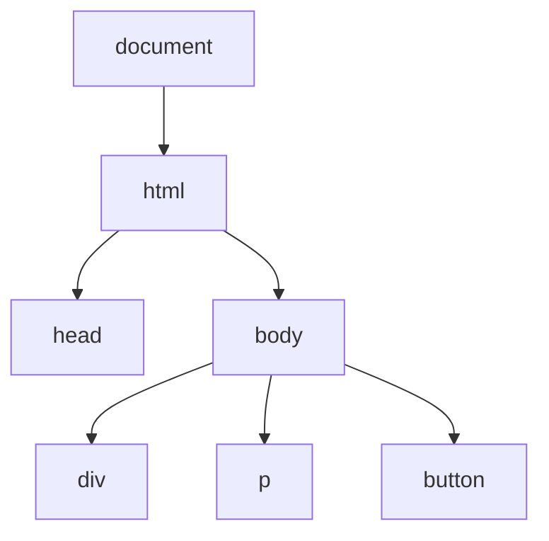

## Lecture Notes: JavaScript Fundamentals and DOM Basics

### Section 1: Mastering the Browser's Playground

By the end of this deep dive, you will:

- Explain how JavaScript interacts with HTML and CSS in the browser environment.
- Implement basic DOM manipulation techniques to dynamically update web pages.
- Debug common JavaScript issues that arise when working with the DOM.
- Architect a modular, event-driven application using JavaScript and the DOM.

### Section 2: The Browser's Sandbox - JavaScript's Unique Habitat

**Analogy Application:** Imagine the browser as a vast, bustling city, with the DOM (Document Object Model) serving as the intricate network of streets, buildings, and infrastructure. JavaScript, in this analogy, is the team of skilled urban planners and construction workers, tasked with shaping and animating this digital metropolis.

**Technical Definition:** JavaScript is a high-level, interpreted programming language that was originally designed for adding interactivity and dynamic behavior to web pages. It operates within the browser's runtime environment, where it can directly interact with the HTML and CSS that define the structure and styling of a web page, through the intermediary of the DOM.

**Why It Matters:** Understanding the relationship between JavaScript, HTML, CSS, and the DOM is crucial for building modern, responsive, and engaging web applications. By mastering this fundamental connection, developers can harness the full power of the browser's capabilities, creating dynamic user experiences that go beyond static content.

### Section 3: The DOM - JavaScript's Architectural Blueprint

**The Blueprint:** The DOM is a programming interface for web documents that represents the structure of the web page. It allows programs and scripts to dynamically access and update the content, structure, and style of a document. The DOM is structured as a tree-like hierarchy, with the `document` object serving as the root, and various HTML elements represented as nodes in the tree.

```javascript
// Example of DOM manipulation using JavaScript
const myDiv = document.getElementById('my-div');
myDiv.textContent = 'Hello, World!';
myDiv.style.backgroundColor = 'blue';
```

**Visual Architecture:**



**Code Implementation:**

```javascript
// Accessing and modifying the DOM
const myDiv = document.getElementById('my-div');
myDiv.textContent = 'Hello, World!';
myDiv.style.backgroundColor = 'blue';

// Creating and appending new elements
const newParagraph = document.createElement('p');
newParagraph.textContent = 'This is a new paragraph.';
myDiv.appendChild(newParagraph);

// Handling events
myDiv.addEventListener('click', () => {
  console.log('Div was clicked!');
});
```

### Section 4: Navigating the DOM's Challenges

**The "Happy Path" vs. Reality:** While the DOM provides a powerful interface for manipulating web pages, it also presents some common challenges that developers must be aware of. These include:

1. **Timing Issues:** Accessing DOM elements before they are fully loaded can lead to errors. Proper event handling and timing are crucial.
2. **Cross-Browser Compatibility:** Different browsers may implement the DOM API slightly differently, requiring careful testing and normalization.
3. **Performance Concerns:** Excessive DOM manipulation can slow down a web page, necessitating optimization techniques like batch updates and efficient event handling.

**Anti-pattern vs. Best Practice:**

```javascript
// Anti-pattern: Repeatedly accessing the DOM
for (let i = 0; i < 1000; i++) {
  document.getElementById('my-div').textContent = `Item ${i}`;
}

// Best practice: Batch updates and fragment manipulation
const fragment = document.createDocumentFragment();
for (let i = 0; i < 1000; i++) {
  const newDiv = document.createElement('div');
  newDiv.textContent = `Item ${i}`;
  fragment.appendChild(newDiv);
}
document.getElementById('my-div').appendChild(fragment);
```

### Section 5: Elevating JavaScript's Role - Building Modular Applications

**Advanced Usage:** While the DOM provides a low-level interface for manipulating web pages, modern JavaScript development often involves building larger, more complex applications. This requires a more modular and event-driven approach, where JavaScript is responsible for orchestrating the application's behavior and state management.

```javascript
// Example of a modular, event-driven application
class TodoApp {
  constructor() {
    this.todoList = [];
    this.todoContainer = document.getElementById('todo-container');
    this.inputField = document.getElementById('todo-input');
    this.addButton = document.getElementById('add-todo');

    this.addButton.addEventListener('click', () => this.addTodo());
  }

  addTodo() {
    const newTodo = this.inputField.value.trim();
    if (newTodo) {
      this.todoList.push(newTodo);
      this.renderTodos();
      this.inputField.value = '';
    }
  }

  renderTodos() {
    this.todoContainer.innerHTML = '';
    this.todoList.forEach((todo) => {
      const todoElement = document.createElement('div');
      todoElement.textContent = todo;
      this.todoContainer.appendChild(todoElement);
    });
  }
}

const app = new TodoApp();
```

### Section 6: Key Takeaways (Cheat Sheet)

1. JavaScript operates within the browser's runtime environment and can directly interact with the HTML and CSS that define a web page through the DOM.
2. The DOM is a tree-like hierarchical representation of the web page structure, allowing programs to dynamically access and update content, structure, and style.
3. Proper timing, cross-browser compatibility, and performance optimization are crucial when working with the DOM to avoid common challenges.
4. Modular, event-driven application architecture leverages JavaScript's capabilities beyond low-level DOM manipulation, enabling more complex and dynamic web experiences.
5. Mastering the interplay between JavaScript, HTML, CSS, and the DOM is a fundamental skill for building modern, responsive, and engaging web applications.