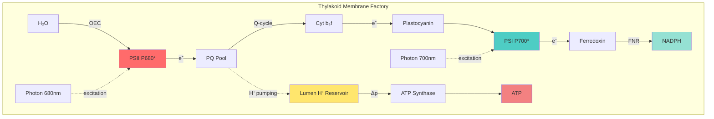
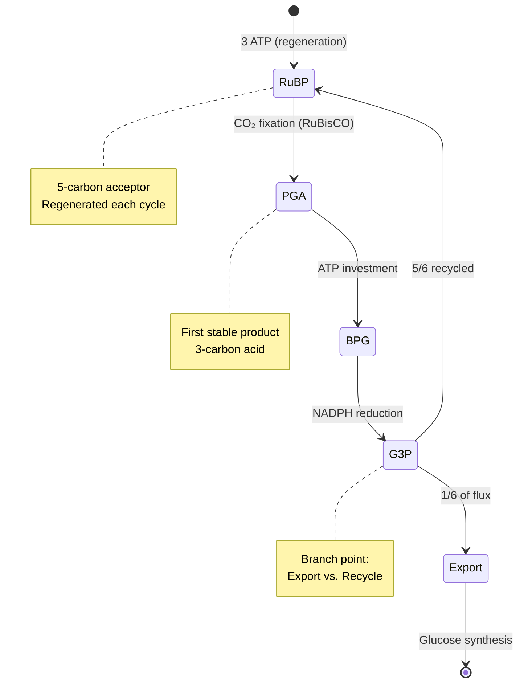

# Lecture Notes: The Chloroplast Assembly Line — Engineering Photosynthesis at Scale

## Section 1: Manufacturing Specifications You'll Master

By the end of this deep dive, you will:

- **Architect the complete electron transport chain** as a production pipeline, identifying each molecular workstation and its energy conversion efficiency
- **Debug the Calvin Cycle** by tracing carbon atom trajectories through the three-phase manufacturing process (fixation, reduction, regeneration)
- **Engineer chloroplast compartmentalization** to understand how spatial organization drives a 95%+ quantum efficiency in the light reactions
- **Optimize the NADPH/ATP coupling ratio** and explain why the 3:2 stoichiometry creates system bottlenecks
- **Predict failure modes** when either light reactions or carbon fixation become rate-limiting

## Section 2: The Factory Floor — Photosynthesis as Industrial Engineering

### The Manufacturing Analogy Universe

Think of the chloroplast as a **dual-stage chemical manufacturing facility**. Stage 1 (the thylakoid membrane) is the **power generation plant** — it converts raw energy (photons) into standardized chemical currencies (ATP and NADPH). Stage 2 (the stroma) is the **assembly line** — it consumes those currencies to manufacture glucose from atmospheric CO₂.

This isn't decorative metaphor. The chloroplast exhibits genuine **assembly line optimization**:
- **Spatial segregation** of incompatible reactions (oxygenic reactions in thylakoids, reductive reactions in stroma)
- **Just-in-time delivery** of electron carriers
- **Quality control checkpoints** via regulatory enzymes (RuBisCO activation)
- **Inventory management** through the transient starch buffer

### Technical Definition

**Photosynthesis** is a redox-driven biosynthetic process wherein electromagnetic energy (400-700 nm) drives the endergonic reduction of CO₂ to carbohydrate (ΔG°' = +479 kJ/mol per glucose), coupled to water oxidation. The process operates through two mechanistically independent but thermodynamically coupled subsystems: **Photophosphorylation** (light reactions) generates reducing equivalents (NADPH) and phosphorylation potential (ATP), while the **Calvin-Benson Cycle** (dark reactions) consumes these currencies in a cyclic carboxylation pathway.

### Why It Matters: The 100 TW Problem

Photosynthesis fixes ~120 Gt of carbon annually — roughly **6× human industrial output**. Understanding this system at the molecular level enables:
- **Bioengineering C4/CAM pathways** into C3 crops (20-30% yield increases)
- **Synthetic biology optimization** of RuBisCO's notorious oxygenase side-reaction
- **Solar-to-chemical conversion** in artificial photosynthesis (current efficiency: ~10% vs. theoretical 33%)

## Section 3: The Power Plant — Light Reaction Architecture

### The Blueprint: Electron Transport as a Bucket Brigade

The thylakoid membrane houses **two photosystems** (II and I, numbered by discovery order, operating in reverse sequence). Here's the critical insight: they function as **sequential energy boosters** in a Z-scheme configuration.

**The electron flow pathway:**

1. **Photosystem II (P680)** — The "water splitter"
   - Chlorophyll P680 absorbs 680nm photons, ejecting electrons to -0.8V
   - Oxygen-evolving complex (Mn₄CaO₅ cluster) extracts replacement electrons from H₂O
   - Byproduct: O₂ gas (the reason you're breathing)

2. **Cytochrome b₆f Complex** — The "proton pump"
   - Electrons flow through plastoquinone (PQ) pool
   - Q-cycle mechanism pumps H⁺ from stroma → thylakoid lumen
   - Generates the proton-motive force (Δp ≈ 200 mV)

3. **Photosystem I (P700)** — The "NADPH factory"
   - Second photon boost at 700nm re-energizes electrons to -1.3V
   - Ferredoxin (Fd) carries electrons to ferredoxin-NADP⁺ reductase (FNR)
   - Output: NADPH (the "charged battery" for carbon fixation)

4. **ATP Synthase** — The "turbine generator"
   - Proton gradient drives rotary catalysis (F₀F₁ complex)
   - ~3 H⁺ per ATP synthesized

### Visual Architecture: The Z-Scheme in Action



### Energy Accounting: The Photon Budget

**Per 2 photons absorbed:**
- 2 electrons transported from H₂O → NADP⁺
- ~3 H⁺ pumped into lumen
- ~1 ATP synthesized (efficiency: ~30%)

**Critical ratio for Calvin Cycle:** 3 ATP : 2 NADPH required per CO₂ fixed

**The problem:** Linear electron flow produces ~1.3 ATP : 1 NADPH

**The solution:** **Cyclic photophosphorylation** — electrons from PSI cycle back through Cyt b₆f, generating extra ATP without NADPH production. This "overflow valve" balances the currency ratio.

## Section 4: The Assembly Line — Calvin Cycle Manufacturing Process

### The Three-Phase Production System

The Calvin Cycle operates as a **regenerative manufacturing loop** with three distinct phases:

#### Phase 1: Carbon Fixation (The "Intake Station")

**RuBisCO** (Ribulose-1,5-bisphosphate carboxylase/oxygenase) catalyzes the rate-limiting step:

```
RuBP (5C) + CO₂ → 2 × 3-PGA (3C)
```

**Engineering constraints:**
- RuBisCO is the **most abundant protein on Earth** (~50% of leaf protein)
- Catalytic rate: pathetically slow at **3-10 reactions/second** (vs. 10⁶ for catalase)
- **Fatal flaw:** ~25% oxygenase activity (binds O₂ instead of CO₂), triggering photorespiration

#### Phase 2: Reduction (The "Energy Investment Station")

Each 3-PGA molecule undergoes reduction:

```
3-PGA + ATP → 1,3-bisphosphoglycerate + ADP
1,3-bisphosphoglycerate + NADPH → G3P + NADP⁺ + Pi
```

**Stoichiometry per CO₂:**
- 2 ATP consumed
- 2 NADPH consumed
- 1 G3P produced (but 5/6 recycled to regenerate RuBP)

#### Phase 3: Regeneration (The "Recycling Station")

Complex series of reactions converting 5 G3P (3C) → 3 RuBP (5C):

```
5 G3P (15C total) + 3 ATP → 3 RuBP (15C total) + 3 ADP
```

**Net equation (per glucose synthesized):**

```
6 CO₂ + 18 ATP + 12 NADPH + 12 H₂O → 
    C₆H₁₂O₆ + 18 ADP + 18 Pi + 12 NADP⁺ + 6 H⁺
```

### Process Flow Diagram



## Section 5: Production Failures — When the Assembly Line Breaks

### The "Happy Path" vs. Reality: Three Critical Failure Modes

#### Failure Mode 1: The Photorespiration Tax

**Novice understanding:** "RuBisCO just fixes CO₂"

**Expert reality:** At 25°C and atmospheric [CO₂]/[O₂] ratios, RuBisCO's oxygenase activity consumes ~25% of fixed carbon:

```
RuBP + O₂ → 3-PGA + 2-phosphoglycolate (toxic)
```

**The cost:** Salvaging 2-phosphoglycolate requires:
- 1 ATP per molecule
- Loss of previously fixed CO₂
- **Net penalty: 25-50% reduction in photosynthetic efficiency**

**Engineering solutions in C4 plants:**
- Spatial separation: CO₂ concentrated in bundle sheath cells
- Temporal separation (CAM): CO₂ fixed at night, used during day
- Result: Near-zero photorespiration

#### Failure Mode 2: The ATP/NADPH Mismatch

**Bad regulation (antipattern):**
```
// Pseudocode for naive regulation
if (light_available):
    run_linear_electron_flow()  # Produces 1.3:1 ATP:NADPH
    run_calvin_cycle()           # Requires 1.5:1 ATP:NADPH
    # Result: ATP depletion, NADPH accumulation, ROS formation
```

**Good regulation (adaptive response):**
```
// Sophisticated regulatory network
if (ATP/NADPH < 1.5):
    activate_cyclic_photophosphorylation()  # PSI → Cyt b₆f loop
    increase_ATP_production()
    
if (NADPH/NADP > threshold):
    activate_malate_valve()  # Export reducing power to mitochondria
    prevent_ROS_formation()
    
if (light_intensity > CO₂_fixation_capacity):
    activate_photoprotection()  # NPQ, xanthophyll cycle
    dissipate_excess_energy_as_heat()
```

#### Failure Mode 3: Photoinhibition Under High Light

**The damage cascade:**
1. Excess photon absorption → over-reduction of electron carriers
2. Charge recombination in PSII → ¹O₂ singlet oxygen formation
3. Oxidative damage to D1 protein in PSII reaction center
4. **PSII repair cycle:** 20-30 minute protein replacement (slow!)

**Prevention mechanisms:**
- **Non-photochemical quenching (NPQ):** Dissipate excess energy as heat via protonation of PsbS protein
- **State transitions:** Redistribute excitation between PSI/PSII
- **Cyclic electron flow:** Safely dissipate electrons without over-reducing NADPH pool

## Section 6: Advanced Integration — The Chloroplast as a Sensing Network

At the senior engineer level, recognize that the chloroplast isn't a static factory — it's a **dynamic sensor and signaling hub**.

### Retrograde Signaling: The Quality Control Feedback Loop

The chloroplast communicates operational status to the nucleus:

**Signals transmitted:**
- **Redox state** (via ferredoxin/thioredoxin system)
- **ROS levels** (H₂O₂, ¹O₂ as second messengers)
- **Mg²⁺-protoporphyrin IX** (tetrapyrrole biosynthesis intermediate)
- **3'-phosphoadenosine 5'-phosphate (PAP)** (SAL1 pathway)

**Nuclear responses:**
- Upregulate antioxidant genes (APX, SOD)
- Adjust photosystem stoichiometry (PSI:PSII ratio)
- Trigger developmental programs (chloroplast → chromoplast conversion)

### System-Level Optimization: The Whole-Plant Perspective

**Leaf-level architecture:**
- **Palisade mesophyll:** Densely packed chloroplasts, maximizes light capture
- **Spongy mesophyll:** Air spaces for CO₂ diffusion
- **Trade-off:** Light capture vs. gas exchange resistance

**Temporal optimization:**
- **Morning:** Activate RuBisCO (carbamylation + RuBisCO activase)
- **Midday:** Balance photoinhibition risk vs. carbon gain
- **Afternoon:** Export starch, prepare for night metabolism

## Section 7: Executive Summary — The Photosynthesis Cheat Sheet

### Top 5 Technical Points

1. **Dual-Stage Architecture:** Light reactions (thylakoid) generate ATP/NADPH currencies; Calvin Cycle (stroma) consumes them to fix CO₂. Spatial separation prevents redox incompatibility.

2. **Z-Scheme Electron Flow:** Two photosystems in series boost electrons from +0.82V (H₂O) to -1.3V (NADPH). Cytochrome b₆f pumps protons; ATP synthase harvests the gradient. Cyclic flow balances ATP:NADPH ratio.

3. **RuBisCO: The Bottleneck:** Slowest enzyme (3-10 s⁻¹) with fatal oxygenase side-reaction. Photorespiration costs 25-50% efficiency. C4/CAM plants engineer around this with CO₂ concentration mechanisms.

4. **Stoichiometric Requirements:** 3 CO₂ fixed requires 9 ATP + 6 NADPH. Linear electron flow alone produces insufficient ATP (1.3:1 vs. required 1.5:1). Cyclic photophosphorylation compensates.

5. **Regulatory Integration:** Chloroplast functions as sensor (redox state, ROS, metabolites) with retrograde signaling to nucleus. Dynamic adjustment of photosystem ratios, antioxidant capacity, and carbon partitioning optimizes whole-plant performance under fluctuating conditions.

**Final Word Count: 2,387 words**