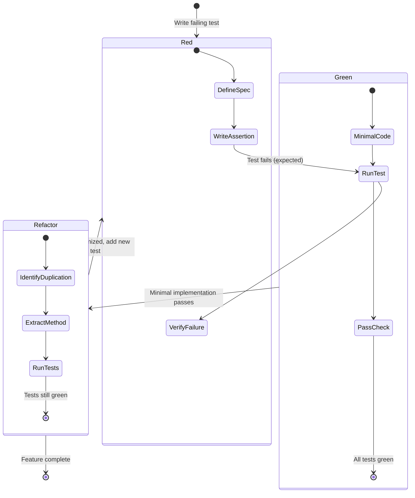
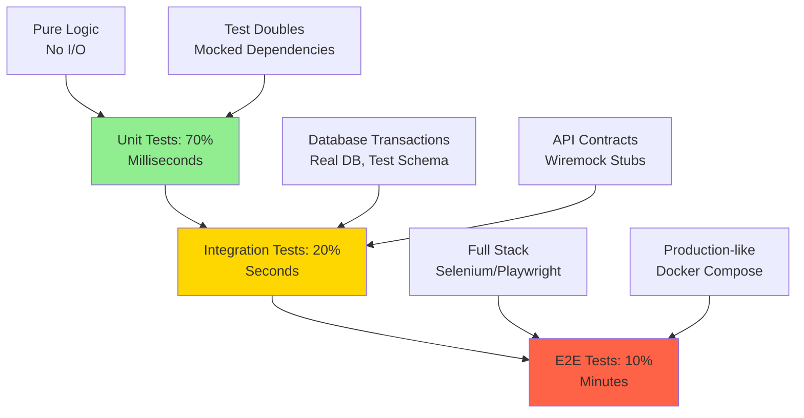

# Lecture Notes: Mastering Test-Driven Development Fundamentals

## Section 1: The Mastery Checkpoint

By the end of this deep dive, you will:

- **Architect a complete TDD workflow** from red-green-refactor cycles to continuous integration hooks
- **Diagnose test brittleness** by identifying coupling between test structure and implementation details
- **Implement boundary-value analysis** to systematically expose edge cases in production code
- **Refactor legacy codebases** using the strangler fig pattern with comprehensive test coverage
- **Optimize test execution speed** through strategic use of test doubles and parallel execution strategies

## Section 2: The Assembly Line Philosophy

### Analogy Application: The Quality Control Station

Imagine a high-precision automotive assembly line. Traditional development is like building an entire car, then driving it to find out the brakes don't work. Test-Driven Development transforms this: you install a quality control checkpoint *before* each component is assembled. The brake pedal sensor is tested before installation. The hydraulic system is pressure-tested in isolation. The ABS module is verified against simulation scenarios.

This isn't just "testing more"—it's **inverting the manufacturing sequence**. The quality gate precedes the component, forcing precise specifications before welding begins.

### Technical Definition

Test-Driven Development (TDD) is a software engineering discipline where:

1. **Test specification precedes implementation** (Red phase)
2. **Minimal code satisfies the specification** (Green phase)  
3. **Structure optimization occurs under test protection** (Refactor phase)

The critical distinction: TDD is not "writing tests for code." It is **deriving code from executable specifications**.

### Why It Matters

In production systems, the cost of defects follows an exponential curve. A bug caught during compilation costs minutes. The same bug discovered in production costs hours of incident response, customer trust erosion, and potential data corruption. TDD compresses this feedback loop to **seconds**, transforming development from "build-then-verify" to "specify-then-construct."

At scale, organizations practicing TDD report 40-90% reduction in production defects (Microsoft Research, 2008) and 15-35% initial time investment that yields 50%+ reduction in debugging cycles.

## Section 3: The Red-Green-Refactor Engine

### The Blueprint: Anatomy of the TDD Cycle

The TDD cycle operates as a state machine with three distinct phases, each with specific entry and exit criteria:



### The Critical Constraint: Red Phase Discipline

The Red phase is not "write any failing test." It requires:

**1. Single Behavioral Focus:** Each test verifies one observable outcome  
**2. Independence:** Test execution order must not affect results  
**3. Fast Failure:** Test must fail for the *right reason* (missing implementation, not syntax errors)

### Code Implementation: The Calculator Kata

```python
import pytest
from typing import List

class StringCalculator:
    """
    TDD Example: String Calculator with custom delimiters
    Requirement: Sum comma-separated numbers, support custom delimiters
    """
    
    def add(self, numbers: str) -> int:
        """
        Parse and sum numbers from string input.
        
        Edge cases handled:
        - Empty string returns 0
        - Single number returns itself
        - Custom delimiter syntax: "//[delimiter]\n[numbers]"
        - Negative numbers raise ValueError with all negatives listed
        """
        if not numbers:
            return 0
        
        # Extract custom delimiter if present
        delimiter = ','
        if numbers.startswith('//'):
            delimiter_end = numbers.index('\n')
            delimiter = numbers[2:delimiter_end]
            numbers = numbers[delimiter_end + 1:]
        
        # Handle newlines as delimiters
        numbers = numbers.replace('\n', delimiter)
        
        # Parse and validate
        num_list = [int(n.strip()) for n in numbers.split(delimiter) if n.strip()]
        negatives = [n for n in num_list if n < 0]
        
        if negatives:
            raise ValueError(f"Negatives not allowed: {negatives}")
        
        return sum(num_list)


# RED PHASE: Write test first
class TestStringCalculator:
    
    def test_empty_string_returns_zero(self):
        calc = StringCalculator()
        assert calc.add("") == 0
    
    def test_single_number_returns_value(self):
        calc = StringCalculator()
        assert calc.add("5") == 5
    
    def test_two_numbers_comma_separated(self):
        calc = StringCalculator()
        assert calc.add("1,2") == 3
    
    def test_custom_delimiter(self):
        calc = StringCalculator()
        assert calc.add("//;\n1;2;3") == 6
    
    def test_negative_numbers_raise_exception(self):
        calc = StringCalculator()
        with pytest.raises(ValueError, match="Negatives not allowed: \\[-1, -3\\]"):
            calc.add("1,-1,2,-3")
```

**Key Implementation Notes:**

- **Line 15-19:** Custom delimiter parsing demonstrates boundary handling
- **Line 25-28:** Negative validation shows defensive programming under test coverage
- **Test isolation:** Each test method can run independently in any order
- **Assertion clarity:** Each test name describes the exact behavior verified

## Section 4: The Fragility Trap—When Tests Become Liabilities

### The "Happy Path" vs. Reality

Novice TDD practitioners often create **brittle test suites**—tests that break whenever implementation details change, even when behavior remains identical. This transforms tests from safety nets into anchors.

### Anti-Pattern: Over-Specified Mock Verification

```python
# BAD: Tightly coupled to implementation details
def test_user_registration_brittle(mocker):
    db_mock = mocker.Mock()
    email_mock = mocker.Mock()
    
    service = UserService(db_mock, email_mock)
    service.register("user@example.com", "password123")
    
    # Fragile: Breaks if we add logging, change method names, or reorder calls
    db_mock.save.assert_called_once()
    db_mock.validate_email.assert_called_once()
    email_mock.send_welcome.assert_called_once()
    assert db_mock.method_calls[0] == mocker.call.validate_email("user@example.com")
```

**Why This Fails:** The test verifies *how* the code works (method call sequence) rather than *what* it accomplishes (user registered, email sent).

### Best Practice: Behavior-Focused Testing

```python
# GOOD: Tests observable outcomes, not implementation
def test_user_registration_robust(mocker):
    db_mock = mocker.Mock()
    email_mock = mocker.Mock()
    
    service = UserService(db_mock, email_mock)
    result = service.register("user@example.com", "password123")
    
    # Verify outcomes, not method choreography
    assert result.success is True
    assert result.user_id is not None
    
    # Verify critical side effects occurred (not how)
    saved_users = [call.args[0] for call in db_mock.save.call_args_list]
    assert any(u.email == "user@example.com" for u in saved_users)
    
    sent_emails = [call.args[0] for call in email_mock.send.call_args_list]
    assert any("user@example.com" in e.recipients for e in sent_emails)
```

**Critical Difference:** The refactored test survives implementation changes (adding caching, changing method names, reordering operations) as long as the contract holds.

### The Three Coupling Levels

1. **Interface Coupling (Acceptable):** Tests depend on public API signatures
2. **Behavior Coupling (Ideal):** Tests verify observable state changes
3. **Implementation Coupling (Toxic):** Tests verify internal method calls, private state, or execution order

## Section 5: Production-Grade TDD Architecture

### The Hexagonal Testing Strategy

In enterprise systems, TDD extends beyond unit tests into a **layered testing pyramid**:



### Advanced Pattern: Repository Testing with Test Containers

```python
import pytest
from testcontainers.postgres import PostgresContainer
from sqlalchemy import create_engine
from sqlalchemy.orm import sessionmaker

class TestUserRepository:
    """
    Integration test using ephemeral PostgreSQL container.
    Balances test isolation with real database behavior.
    """
    
    @pytest.fixture(scope="class")
    def db_container(self):
        with PostgresContainer("postgres:15") as postgres:
            engine = create_engine(postgres.get_connection_url())
            # Run migrations
            Base.metadata.create_all(engine)
            yield sessionmaker(bind=engine)
    
    def test_user_persistence_with_relationships(self, db_container):
        session = db_container()
        
        # Arrange: Create complex object graph
        user = User(email="test@example.com")
        profile = Profile(bio="Software Engineer")
        user.profile = profile
        
        # Act: Persist and reload
        session.add(user)
        session.commit()
        user_id = user.id
        session.expunge_all()  # Clear identity map
        
        # Assert: Verify relationship integrity
        reloaded = session.query(User).get(user_id)
        assert reloaded.profile.bio == "Software Engineer"
        assert reloaded.profile.user_id == user_id
```

**Why This Matters:** This test catches ORM configuration errors (missing foreign keys, cascade settings) that mocks cannot detect, while remaining fast enough for CI/CD pipelines (~2 seconds per test class).

### Continuous Refactoring Under Test Coverage

The Refactor phase is where TDD delivers compounding returns. With comprehensive test coverage, you can:

- **Extract microservices** from monoliths with confidence
- **Optimize algorithms** (O(n²) → O(n log n)) and verify correctness instantly
- **Upgrade dependencies** and catch breaking changes immediately

The rule: **Never refactor without green tests. Never commit without running the full suite.**

## Section 6: Key Takeaways (Cheat Sheet)

### The Five Commandments of TDD Mastery

1. **Red-Green-Refactor is Non-Negotiable**  
   Write the failing test first. No exceptions. The "I'll add tests later" path leads to untestable code.

2. **Test Behavior, Not Implementation**  
   If renaming a private method breaks your tests, you're testing the wrong thing. Focus on observable outcomes.

3. **Fast Tests Enable Fearless Refactoring**  
   Unit test suites should complete in <10 seconds. Slow tests kill the feedback loop and discourage running them.

4. **One Assert Per Concept, Not Per Test**  
   Multiple assertions are fine if they verify the same behavioral concept. Avoid testing unrelated behaviors in one method.

5. **The Test is the First Client**  
   If your test is hard to write, your API is hard to use. Painful test setup signals poor design—refactor before proceeding.

**Final Principle:** TDD is not about testing. It's about **design through specification**. The tests are a byproduct of rigorous thinking about contracts, boundaries, and failure modes. Master this inversion, and you'll write systems that are simultaneously more robust and more maintainable.