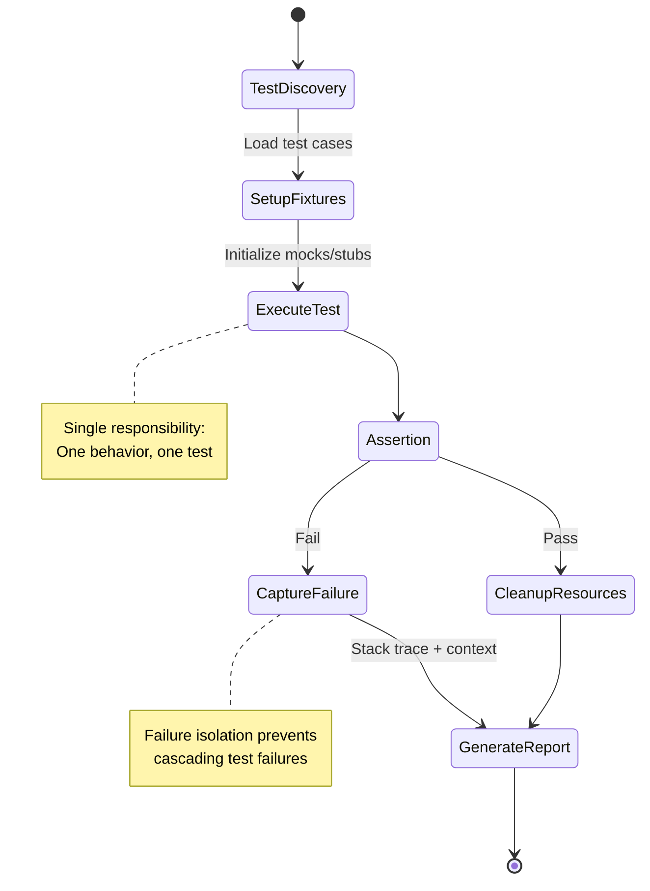

# Lecture Notes: The Art and Science of Software Testing

## Section 1: What You'll Command After This Deep Dive

By the end of this deep dive, you will:

- **Architect test suites** that catch regressions before they reach production, using the test pyramid as your strategic framework
- **Distinguish between unit, integration, and end-to-end tests** with the precision to choose the right tool for each failure mode
- **Implement test doubles** (mocks, stubs, fakes) with full understanding of when each pattern prevents versus creates technical debt
- **Debug flaky tests** by identifying non-determinism sources: timing issues, shared state, and environmental dependencies
- **Design testable systems** by applying dependency injection and interface segregation from the ground up

## Section 2: The Quality Assurance Factory—Your Analogy Universe

Imagine a **high-precision manufacturing facility** producing aircraft components. Each part must pass through multiple inspection stations before assembly. A single defective bolt at 30,000 feet is catastrophic.

**The Inspection Hierarchy:**
- **Station 1 (Raw Material Testing):** Individual metal alloys tested for composition—fast, cheap, catches 80% of defects
- **Station 2 (Component Assembly Verification):** Bolts tested with nuts, gears with shafts—moderate speed, catches integration issues
- **Station 3 (Full System Validation):** Complete wing assembly stress-tested—slow, expensive, but catches emergent failures

This is your **test pyramid**. Most software teams invert this pyramid, running expensive end-to-end tests for problems that unit tests could catch in milliseconds.

**Technical Definition:**  
Software testing is the systematic execution of code under controlled conditions to verify behavioral correctness against specifications, detect regressions, and validate system properties (performance, security, reliability). Tests serve as executable documentation and regression safety nets.

**Why It Matters:**  
Google runs 4+ billion test cases daily. Facebook's CI pipeline executes 30,000+ tests per commit. Without disciplined testing, velocity collapses under the weight of fear—engineers become paralyzed, unable to refactor or ship features confidently. Testing isn't about finding bugs; it's about **enabling velocity at scale**.

## Section 3: The Testing Architecture—From Theory to Implementation

### The Blueprint: Anatomy of a Robust Test

Every well-designed test follows the **Arrange-Act-Assert** (AAA) pattern:

1. **Arrange:** Set up test fixtures, initialize dependencies, prepare system state
2. **Act:** Execute the behavior under test (one logical action)
3. **Assert:** Verify outcomes match expectations

The critical insight: **tests should fail for exactly one reason**. Multi-assertion tests create diagnostic ambiguity.

### Visual Architecture: Test Execution Flow



### Code Implementation: Testing a Payment Processor

Here's a production-grade unit test demonstrating dependency injection and proper mocking:

```python
import pytest
from unittest.mock import Mock, patch
from datetime import datetime, timedelta

class PaymentProcessor:
    def __init__(self, gateway, fraud_detector, logger):
        self.gateway = gateway
        self.fraud_detector = fraud_detector
        self.logger = logger
    
    def process_payment(self, amount, card_token, user_id):
        """Process payment with fraud detection and logging."""
        # Check fraud score
        fraud_score = self.fraud_detector.analyze(user_id, amount)
        if fraud_score > 0.85:
            self.logger.warn(f"High fraud score: {fraud_score}")
            return {"status": "rejected", "reason": "fraud_detected"}
        
        # Attempt charge
        result = self.gateway.charge(amount, card_token)
        
        if result["success"]:
            self.logger.info(f"Payment processed: {amount}")
            return {"status": "success", "transaction_id": result["id"]}
        else:
            return {"status": "failed", "reason": result["error"]}


class TestPaymentProcessor:
    """Test suite for PaymentProcessor using test doubles."""
    
    @pytest.fixture
    def mock_gateway(self):
        """Fixture providing a mock payment gateway."""
        gateway = Mock()
        gateway.charge.return_value = {
            "success": True, 
            "id": "txn_12345"
        }
        return gateway
    
    @pytest.fixture
    def mock_fraud_detector(self):
        """Fixture providing a mock fraud detection service."""
        detector = Mock()
        detector.analyze.return_value = 0.12  # Low fraud score
        return detector
    
    @pytest.fixture
    def mock_logger(self):
        """Fixture providing a mock logger."""
        return Mock()
    
    @pytest.fixture
    def processor(self, mock_gateway, mock_fraud_detector, mock_logger):
        """Fixture providing configured PaymentProcessor."""
        return PaymentProcessor(mock_gateway, mock_fraud_detector, mock_logger)
    
    def test_successful_payment_with_low_fraud_score(self, processor, 
                                                      mock_gateway, 
                                                      mock_fraud_detector):
        # Arrange: Setup is handled by fixtures
        amount = 99.99
        card_token = "tok_visa_4242"
        user_id = "user_789"
        
        # Act: Execute the payment
        result = processor.process_payment(amount, card_token, user_id)
        
        # Assert: Verify behavior
        assert result["status"] == "success"
        assert result["transaction_id"] == "txn_12345"
        mock_fraud_detector.analyze.assert_called_once_with(user_id, amount)
        mock_gateway.charge.assert_called_once_with(amount, card_token)
    
    def test_payment_rejected_for_high_fraud_score(self, processor,
                                                    mock_fraud_detector,
                                                    mock_gateway):
        # Arrange: Configure fraud detector to return high score
        mock_fraud_detector.analyze.return_value = 0.92
        
        # Act
        result = processor.process_payment(50.00, "tok_test", "user_999")
        
        # Assert: Payment should be rejected WITHOUT calling gateway
        assert result["status"] == "rejected"
        assert result["reason"] == "fraud_detected"
        mock_gateway.charge.assert_not_called()  # Critical: no actual charge
```

**Key Engineering Decisions:**

1. **Dependency Injection:** The `PaymentProcessor` receives dependencies through constructor injection, making it trivially testable without touching real services
2. **Pytest Fixtures:** Reusable test setup eliminates duplication and ensures consistent initialization
3. **Mock Verification:** We assert not just return values, but also *interaction patterns* (was the gateway called? with what arguments?)
4. **Isolation:** Each test is hermetic—no shared state, no database, no network calls

## Section 4: Where Tests Break—The Gap Between Theory and Production

### The "Happy Path" vs. Reality

Novice engineers write tests that only verify success cases. Senior engineers **hunt for boundary conditions and race conditions**.

**Common Failure Modes:**

**1. The Flaky Test Epidemic**

Symptoms: Tests pass locally, fail in CI, pass when re-run.

Root causes:
- **Timing dependencies:** `sleep(1)` instead of waiting for actual conditions
- **Shared global state:** Static variables, singletons, database records
- **Non-deterministic ordering:** Iterating over hash maps, parallel test execution

**Anti-pattern (Flaky):**
```python
def test_async_data_fetch():
    fetch_data_async()
    time.sleep(2)  # Hope it's done by now
    assert get_cached_data() is not None
```

**Best Practice (Deterministic):**
```python
def test_async_data_fetch():
    future = fetch_data_async()
    result = future.result(timeout=5)  # Explicit wait with timeout
    assert result is not None
```

**2. The Over-Mocking Trap**

Mocking every dependency creates tests that pass while production burns. You've tested your mocks, not your code.

**Anti-pattern:**
```python
# Mocking the entire database layer
mock_db.query.return_value = [{"id": 1, "name": "Alice"}]
```

**Best Practice:**  
Use **in-memory databases** (SQLite) for integration tests. Mock only external services (payment gateways, third-party APIs) that you don't control.

**3. Test Pollution Through Shared State**

```python
# Anti-pattern: Tests share class-level state
class TestUserService:
    users = []  # DANGER: Shared across tests
    
    def test_add_user(self):
        self.users.append({"id": 1})
        assert len(self.users) == 1
    
    def test_remove_user(self):
        # Fails if test_add_user ran first!
        assert len(self.users) == 0
```

**Best Practice:**  
Use `setUp`/`tearDown` (unittest) or fixtures (pytest) to ensure clean state per test.

## Section 5: Advanced Testing Strategies—The Senior Engineer's Toolkit

### Property-Based Testing: Beyond Example-Based Verification

Instead of testing specific inputs, test **properties that should hold for all inputs**.

```python
from hypothesis import given, strategies as st

@given(st.lists(st.integers()))
def test_sort_is_idempotent(numbers):
    """Sorting twice should equal sorting once."""
    once = sorted(numbers)
    twice = sorted(sorted(numbers))
    assert once == twice

@given(st.lists(st.integers(), min_size=1))
def test_max_element_is_in_list(numbers):
    """The maximum element must exist in the original list."""
    maximum = max(numbers)
    assert maximum in numbers
```

Hypothesis generates hundreds of test cases, including edge cases you'd never think of (empty lists, negative numbers, duplicates).

### Contract Testing for Microservices

In our factory analogy, this is **testing the bolt-to-nut interface specification**, not the entire wing assembly.

When Service A calls Service B, both teams maintain a **contract test**:
- **Provider test (Service B):** "I guarantee this API response structure"
- **Consumer test (Service A):** "I can handle this response structure"

Tools like Pact enable teams to evolve services independently without breaking integrations.

### Mutation Testing: Testing Your Tests

Your test suite has 100% code coverage. Great! But do your tests actually *detect bugs*?

**Mutation testing** injects bugs into your code (change `>` to `>=`, flip boolean conditions) and verifies tests fail. If mutated code still passes tests, your tests are weak.

```bash
# Using mutmut for Python
mutmut run
# Generates report: "42 mutants killed, 3 survived"
```

Survived mutants reveal gaps in your test assertions.

## Section 6: Key Takeaways—Your Testing Cheat Sheet

1. **The Test Pyramid is Non-Negotiable:** 70% unit tests, 20% integration tests, 10% end-to-end tests. Invert this, and your CI pipeline becomes a bottleneck.

2. **Isolation is Everything:** Each test must run independently. Shared state between tests is a cardinal sin. Use fixtures, not class variables.

3. **Mock External Systems, Not Your Own Code:** Over-mocking creates false confidence. Use real objects for code you control; mock third-party APIs and I/O.

4. **Flaky Tests are Worse Than No Tests:** A flaky test trains engineers to ignore failures. Fix immediately or delete. Never merge flaky tests.

5. **Tests are Production Code:** Apply the same standards—code review, refactoring, DRY principles. A 10,000-line test suite with duplication is unmaintainable.

**Final Insight:** The best codebases have a test-to-code ratio of 1:1 or higher. Google's codebase is 60% test code. Tests aren't overhead—they're the foundation that enables aggressive refactoring and continuous deployment. Master testing, and you unlock the ability to move fast without breaking things.