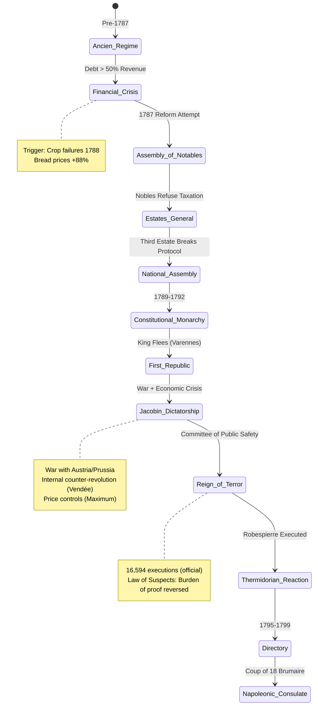

# Lecture Notes: The French Revolution — Anatomy of a System Collapse

## Section 1: Mastering the Mechanics of Revolutionary Transformation

By the end of this deep dive, you will:

- **Diagnose** the three-layer failure cascade (social stratification, fiscal insolvency, ideological fracture) that destabilized the Ancien Régime
- **Trace** the critical path from symbolic revolt (Bastille) to systematic state violence (Terror) through phase transition analysis
- **Architect** a mental model of revolutionary momentum as a feedback loop system with positive reinforcement mechanisms
- **Identify** the inflection points where moderate reform became impossible and radical restructuring became inevitable
- **Evaluate** the Terror not as moral aberration but as emergent behavior from specific institutional design failures

---

## Section 2: The Pressure Cooker Framework — Understanding Pre-Revolutionary France

### Analogy Application: The Industrial Pressure System

Think of pre-1789 France as a **sealed industrial pressure vessel** with three critical subsystems:

1. **The Containment Structure** (Social Estates): Three rigid chambers with non-permeable barriers
2. **The Heat Source** (Economic Crisis): Continuous energy input with no release valve
3. **The Pressure Gauge** (Enlightenment Ideas): Monitoring system that broadcasts dangerous readings to all operators

In a well-designed system, pressure relief valves activate before catastrophic failure. The Ancien Régime had **welded shut every safety mechanism**.

### Technical Definition

A **revolution** (in the structural sense) occurs when:
1. Legitimacy deficit reaches critical threshold (government cannot justify its monopoly on violence)
2. Alternative coordination mechanisms emerge (parallel power structures)
3. Transaction costs of system replacement fall below transaction costs of system maintenance
4. Triggering event provides Schelling point for mass coordination

The French Revolution represents a **complete state transition** — not reform, but architectural replacement of the operating system.

### Why It Matters

Understanding revolutionary mechanics illuminates:
- **Modern state fragility indicators** (Venezuela, Lebanon, Sri Lanka)
- **Institutional path dependency** (why gradual reform often fails)
- **The violence paradox** (why revolutionary regimes become more brutal than their predecessors)

This isn't ancient history — it's the **reference implementation** for state collapse patterns.

---

## Section 3: The Three-Layer Failure Cascade — Deep System Analysis

### The Blueprint: Structural Vulnerabilities

**Layer 1: Social Architecture (The Estate System)**

The Ancien Régime operated on a **three-tier privilege stack**:

- **First Estate** (Clergy): 0.5% of population, 10% of land, tax-exempt
- **Second Estate** (Nobility): 1.5% of population, 25% of land, tax-exempt  
- **Third Estate** (Everyone Else): 98% of population, 65% of land, bore 100% of direct taxation

This wasn't mere inequality — it was **hardcoded privilege** with legal enforcement. The bourgeoisie (wealthy merchants, lawyers) paid higher tax rates than destitute nobles. Meritocracy had a **permission denied** error at the kernel level.

**Layer 2: Fiscal Insolvency (The Debt Crisis)**

By 1788, the French state faced:
- **Debt service consuming 50%** of annual revenue
- **Regressive tax base** (exempting the wealthy)
- **No central bank** or monetary policy tools
- **Repeated failed reform attempts** (Turgot, Necker, Calonne)

The government tried **seven different finance ministers** in 15 years. Each proposed the same fix: tax the nobility. Each was blocked by the parlements (noble-controlled courts). The system had a **deadlock** — those with veto power over taxation were those who needed to be taxed.

**Layer 3: Ideological Operating System (Enlightenment)**

Rousseau, Voltaire, and Montesquieu provided the **new mental models**:
- **Social Contract Theory**: Legitimacy derives from consent, not divine right
- **Separation of Powers**: Checks and balances prevent tyranny
- **Natural Rights**: Inalienable individual freedoms

These ideas spread through **salons, pamphlets, and Masonic lodges** — creating an alternative legitimacy framework. When the king called the Estates-General in 1789, representatives arrived with **incompatible operating systems**.

### Visual Architecture: The Revolutionary Phase Diagram



### The Bastille Event: Symbolic Threshold Crossing

**July 14, 1789** — not strategically important (the fortress held 7 prisoners), but **symbolically irreversible**.

The Bastille represented:
1. **Royal authority** (fortress controlled by the king)
2. **Arbitrary detention** (lettres de cachet — imprisonment without trial)
3. **Military threat** (cannons pointed at Paris)

When 900 Parisians stormed it, they weren't executing a military strategy — they were **performing a legitimacy transfer**. The governor's head on a pike wasn't murder; it was a **state transition signal**. The king asked the Duke of La Rochefoucauld, "Is this a revolt?" Response: "No, Sire, it is a revolution."

The critical insight: **The king's soldiers didn't fire**. The Gardes Françaises defected. When the monopoly on violence fractures, the state has already fallen.

---

## Section 4: The Terror — When Exception Becomes Rule

### The "Happy Path" vs. Reality

**Novice View**: "The Revolution went too far and became violent."  
**Expert View**: "The Terror was the predictable output of specific institutional design choices under wartime conditions."

The National Convention faced:
- **External invasion** (Austria, Prussia, Britain, Spain)
- **Internal revolt** (Vendée uprising, federalist rebellions)
- **Economic collapse** (assignat hyperinflation, food shortages)
- **No established procedures** for emergency governance

### Anti-Pattern: Suspended Due Process

**Bad Implementation (Law of Suspects, September 1793)**:

```
ARTICLE 1: Immediately after publication, all suspects 
within the territory of the Republic shall be placed 
under arrest.

ARTICLE 2: Suspects are defined as:
- Those who by their conduct, relations, remarks, or 
  writings show themselves partisans of tyranny or 
  federalism and enemies of liberty
- Those who cannot justify their means of existence
- Those who have been refused certificates of civisme
- Public functionaries suspended or removed
- Former nobles who have not constantly manifested 
  their attachment to the Revolution
```

**Problems**:
- **Burden of proof reversal**: Accused must prove innocence
- **Vague definitions**: "Show themselves partisans" — no objective standard
- **Retroactive application**: Past associations become criminal
- **No appeals process**: Revolutionary Tribunal verdicts were final

This created a **positive feedback loop**: Each execution created more "suspects" (family, associates), requiring more executions.

**Good Implementation (Modern Emergency Powers)**:

```
CONSTITUTIONAL FRAMEWORK:
- Sunset clauses (automatic expiration)
- Judicial review (independent courts)
- Proportionality tests (means-ends balancing)
- Non-derogable rights (torture prohibition absolute)
- Legislative oversight (cannot be suspended by executive alone)
```

### The Committee of Public Safety: Centralized Exception Handling

The Committee operated as a **12-member executive** with:
- **No separation of powers** (legislative, executive, judicial functions merged)
- **Unlimited delegation** (representatives-on-mission had dictatorial authority)
- **Surveillance apparatus** (Revolutionary Committees in every commune)

Robespierre's logic: "The government of the revolution is the despotism of liberty against tyranny."

Translation: **Temporary dictatorship** to establish permanent democracy. The fatal flaw: No exit condition. How do you know when the emergency is over? Who decides? The Committee's answer: "We do." Classic **halting problem**.

---

## Section 5: Advanced Analysis — The Thermidorian Algorithm

### The Self-Terminating Terror

By July 1794 (Thermidor Year II), the Terror faced a **coordination problem**:

- **External threats neutralized** (French victories at Fleurus)
- **Internal revolts crushed** (Vendée pacified)
- **Robespierre eliminating moderates** (Danton executed March 1794)

The Convention members realized: "If Danton wasn't safe, none of us are safe."

The **Thermidorian Reaction** (July 27-28, 1794) was a **pre-emptive strike** by the Convention against Robespierre. When he tried to speak, they shouted him down. When he tried to shoot himself, he botched it (shattered jaw). He was guillotined the next day with 21 allies.

### The Institutional Lesson

The Directory (1795-1799) tried to prevent both:
1. **Jacobin dictatorship** (single-party rule)
2. **Royalist restoration** (return to monarchy)

Their solution: **Five-member executive** with rotating membership, bicameral legislature, annual partial elections.

Result: **Chronic instability**. In four years:
- **Two coups** (Fructidor 1797, Floréal 1798)
- **Annulled elections** when "wrong" side won
- **Financial chaos** (two-thirds bankruptcy)

The system was designed to **prevent concentration of power** but created a **power vacuum**. Napoleon filled it in 1799.

### The Meta-Pattern

Revolutionary regimes face a **trilemma**:

1. **Legitimacy** (popular support)
2. **Effectiveness** (can govern)
3. **Liberalism** (respect rights)

Pick two. The Terror chose effectiveness + legitimacy (via nationalism), sacrificing liberalism. The Directory chose liberalism + legitimacy, sacrificing effectiveness. Napoleon chose effectiveness + legitimacy (via meritocracy), sacrificing liberalism.

---

## Section 6: Key Takeaways — The Revolution Cheat Sheet

**1. Multi-Layer Failure Cascades**  
Revolutions require simultaneous failure across social (estate privilege), economic (fiscal crisis), and ideological (legitimacy deficit) layers. Single-point failures get patched.

**2. Symbolic Thresholds Over Strategic Assets**  
The Bastille mattered not for its military value but as an **irreversible signal**. Once the king's soldiers defect, the state has already collapsed.

**3. Emergency Powers Without Exit Conditions**  
The Terror demonstrates the danger of **exception becoming rule**. Without sunset clauses and independent oversight, temporary measures become permanent.

**4. The Radicalization Ratchet**  
Each phase eliminated moderates: Monarchists → Girondins → Dantonists → Hébertists → Robespierrists. **Purity spirals** are self-terminating but unpredictable.

**5. Institutional Design Determines Outcomes**  
The Directory's anti-concentration mechanisms created chronic instability, enabling Napoleon's coup. **Preventing tyranny** and **enabling governance** require careful balance, not just constraints.

**Bonus Insight**: The Revolution's ultimate outcome (Napoleonic Empire) resembled the Ancien Régime more than the Declaration of Rights promised. Revolutions are **state reboots**, not **system upgrades** — they clear the cache but often reinstall similar software.