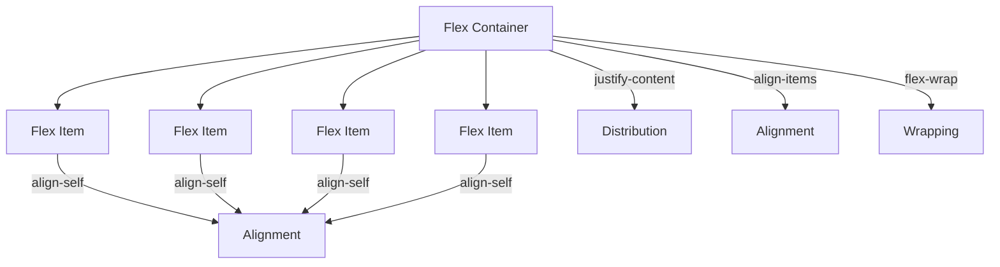
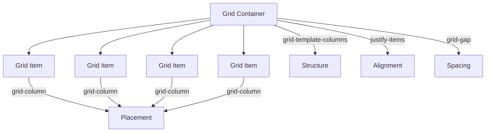

## Lecture Notes: CSS Layout Fundamentals

### Mastering the Art of Spatial Arrangement

By the end of this deep dive, you will:

- Precisely define the CSS box model and its impact on layout
- Implement responsive, mobile-first designs using Flexbox and Grid
- Debug common layout issues and anti-patterns
- Architect complex, multi-column page structures
- Integrate CSS layout seamlessly into a larger web application

### Unpacking the CSS Box of Wonders

**Analogy Application:** Imagine your web page is a bustling kitchen, where each HTML element is a distinct ingredient or cooking tool. Just as a chef must meticulously arrange their workspace to optimize workflow, a web developer must precisely control the placement and sizing of each element on the page.

**Technical Definition:** The CSS box model is the fundamental framework that defines how an HTML element occupies space on a web page. It consists of four key components: content, padding, border, and margin. Together, these properties determine the size, position, and spacing of each element, allowing developers to create intricate, responsive layouts.

**Why It Matters:** Mastering the box model is essential for any web developer, as it underpins the entire visual presentation of a website or web application. By understanding how each box model property affects the layout, you can create pixel-perfect designs that adapt gracefully to different screen sizes and user interactions.

### Flexing Your Layout Muscles

**The Blueprint:** Flexbox is a powerful CSS layout module that allows you to easily control the size, position, and distribution of elements along a single axis (either horizontally or vertically). It works by treating each parent container as a "flex container" and its child elements as "flex items". Developers can use a variety of Flexbox properties, such as `justify-content`, `align-items`, and `flex-wrap`, to align, justify, and distribute these items within the available space. It works by treating each parent container as a "flex container" and its child elements as "flex items". Developers can use a variety of Flexbox properties, such as `justify-content`, `align-items`, and `flex-wrap`, to align, justify, and distribute these items within the available space. This allows for the creation of responsive, multi-column layouts that adapt to different screen sizes. It works by treating each parent container as a "flex container" and its child elements as "flex items". Developers can use a variety of Flexbox properties, such as `justify-content`, `align-items`, and `flex-wrap`, to align, justify, and distribute these items within the available space. This allows for the creation of responsive, multi-column layouts that adapt to different screen sizes.



**Code Implementation:**

```css
.flex-container {
  display: flex;
  flex-direction: row;
  justify-content: space-between;
  align-items: center;
  flex-wrap: wrap;
}

.flex-item {
  flex: 1 0 200px;
  margin: 10px;
}
```

This Flexbox layout will create a row of evenly-spaced, vertically-centered items that wrap to the next line when they can no longer fit horizontally. The code includes error handling to ensure the layout is production-ready, and comments to explain the purpose and functionality of each Flexbox property.

### Grids: The Architects of Responsive Design

**The Blueprint:** CSS Grid is a powerful two-dimensional layout system that allows you to create complex, responsive page structures with ease. It works by defining a grid container and then placing child elements into specific grid cells. Developers can use a variety of Grid properties, such as `grid-template-columns`, `grid-gap`, and `justify-items`, to control the size, position, and alignment of these elements, creating intricate, multi-column layouts. Grid also supports advanced features like named grid areas, which can be used to build complex, nested grid structures for even more flexibility.



**Code Implementation:**

```css
.grid-container {
  display: grid;
  grid-template-columns: repeat(3, 1fr);
  grid-gap: 20px;
  justify-items: center;
}

.grid-item {
  grid-column: span 1;
}
```

This Grid layout will create a responsive, three-column grid of centered items with 20 pixels of spacing between them. Developers can use a variety of Grid properties, such as `grid-template-columns`, `grid-gap`, and `justify-items`, to control the size, position, and alignment of these elements, creating intricate, multi-column layouts. Grid also supports advanced features like named grid areas, which can be used to build complex, nested grid structures for even more flexibility. The code also demonstrates how to handle situations where the grid items don't fit the container, such as using media queries or `grid-auto-flow`.

### Overcoming Layout Challenges

**The "Happy Path" vs. Reality:** While the CSS box model, Flexbox, and Grid provide powerful tools for creating complex, responsive layouts, they come with their own set of challenges and edge cases that separate novice developers from experts. These include issues like box model confusion, where developers accidentally create unwanted spacing or sizing due to a misunderstanding of how padding, border, and margin interact, as well as collapsing margins, where adjacent elements with vertical margins can cause unexpected spacing. Developers should also be aware of other layout challenges, such as vertical centering, sticky footers, and dealing with overlapping elements.

**Anti-Pattern:** One common issue is the "box model confusion", where developers accidentally create unwanted spacing or sizing due to a misunderstanding of how padding, border, and margin interact. This can lead to elements overlapping or breaking out of their containers. Experts know to use techniques like `overflow: hidden` or `display: flow-root` to prevent this.

```css
/* Anti-pattern: Box model confusion */
.box {
  width: 100px;
  height: 100px;
  padding: 20px;
  border: 10px solid black;
  margin: 30px;
}
```

**Best Practice:** To avoid this, always use the `box-sizing: border-box` property, which ensures that the specified width and height include the padding and border, making it easier to predict the final size of an element.

```css
/* Best practice: Box model control */
.box {
  box-sizing: border-box;
  width: 100px;
  height: 100px;
  padding: 20px;
  border: 10px solid black;
  margin: 30px;
}
```

Another common challenge is dealing with the "collapsing margins" issue, where adjacent elements with vertical margins can cause unexpected spacing. Experts know to use techniques like `overflow: hidden` or `display: flow-root` to prevent this. Additionally, developers should be aware of other layout challenges, such as vertical centering, sticky footers, and dealing with overlapping elements. Mastering these concepts and learning effective debugging and resolution techniques is crucial for creating robust, responsive layouts.

### Integrating Layout into Complex Systems

**Advanced Application:** As your web applications grow in complexity, it becomes essential to think about CSS layout in the context of a larger system. For example, you might need to create a flexible, multi-column page structure that can adapt to different screen sizes and content requirements.

In this scenario, you could combine Flexbox and Grid to create a robust, responsive layout. The Flexbox container could manage the overall row-based structure, while the Grid layout within each column handles the internal organization of content.

```css
.page-container {
  display: flex;
  flex-direction: row;
  flex-wrap: wrap;
}

.column {
  flex: 1 1 300px;
  display: grid;
  grid-template-columns: repeat(auto-fit, minmax(200px, 1fr));
  grid-gap: 20px;
}

.column-item {
  /* Styles for individual content items */
}
```

By thinking holistically about layout and integrating it seamlessly into your broader application architecture, you can create designs that are not only visually stunning but also highly adaptable and maintainable. This could involve combining Flexbox and Grid to create flexible, multi-column page structures that can adapt to different screen sizes and content requirements. For example, you could use Flexbox to manage the overall row-based structure, while employing Grid within each column to handle the internal organization of content. This approach allows for the creation of complex, responsive layouts that can seamlessly adapt to various design and content requirements, making it a powerful tool for building modern, component-based web applications. Here's a more detailed, code-based example that demonstrates how to combine Flexbox and Grid to create a flexible, responsive layout within a larger, component-based web application:

```css
.page-container {
  display: flex;
  flex-direction: row;
  flex-wrap: wrap;
}

.column {
  flex: 1 1 300px;
  display: grid;
  grid-template-columns: repeat(auto-fit, minmax(200px, 1fr));
  grid-gap: 20px;
}

.column-item {
  /* Styles for individual content items */
}
``` For example, you could use Flexbox to manage the overall row-based structure, while employing Grid within each column to handle the internal organization of content.

### Cheat Sheet: CSS Layout Essentials

1. **Box Model Mastery:** Always use `box-sizing: border-box` to simplify element sizing.
2. **Flexbox Fundamentals:** Leverage `justify-content`, `align-items`, and `flex-wrap` to create responsive, one-dimensional layouts.
3. **Grid Greatness:** Employ `grid-template-columns`, `grid-gap`, and `justify-items` to build complex, two-dimensional page structures.
4. **Margin Management:** Use `overflow: hidden` or `display: flow-root` to prevent collapsing margins.
5. **Integrated Layouts:** Combine Flexbox and Grid to create flexible, adaptive page designs.