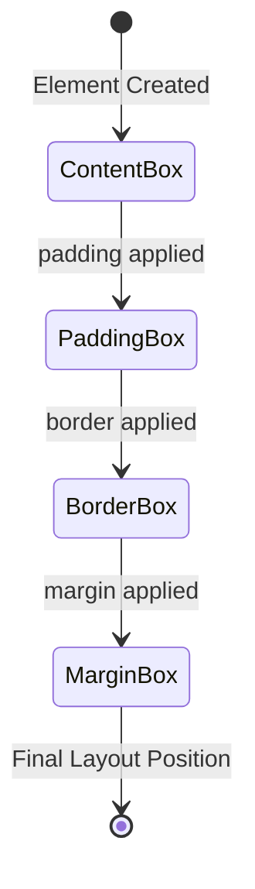

# Lecture Notes: CSS Layout Fundamentals — The Architecture of Digital Real Estate

## Section 1: Your Blueprint for Spatial Mastery

By the end of this deep dive, you will:

- **Engineer precise layouts** using the Box Model's mathematical space allocation system, calculating content flow with padding, borders, and margins
- **Architect one-dimensional layouts** with Flexbox, controlling alignment, distribution, and responsive behavior along a primary axis
- **Design two-dimensional grid systems** that adapt seamlessly across viewport dimensions, implementing named grid areas and fractional units
- **Debug layout anomalies** by understanding stacking contexts, collapsing margins, and the differences between `box-sizing` models
- **Optimize responsive designs** by selecting the appropriate layout system (Box Model, Flexbox, or Grid) based on structural requirements

## Section 2: The Foundation — Understanding Digital Real Estate

**Analogy Application: The Building Architecture Universe**

Think of CSS layout as urban planning and architecture. The Box Model is your **property boundary system** — defining lot lines, setbacks, and building footprints. Flexbox is your **single-street planner** — arranging buildings along a boulevard with precise spacing rules. Grid is your **city master plan** — dividing entire districts into organized blocks with intersecting avenues and streets.

**Technical Definition**

CSS layout is a constraint-based rendering system where the browser's layout engine calculates element dimensions and positions through a cascade of mathematical rules. Each element generates a rectangular box governed by the Box Model specification (content, padding, border, margin), which then participates in one or more formatting contexts (Block, Inline, Flex, or Grid) that determine spatial relationships.

**Why It Matters**

Poor layout architecture creates technical debt: excessive DOM nesting, brittle responsive breakpoints, and JavaScript-dependent positioning. Mastering these three systems enables you to build maintainable, performant interfaces that adapt fluidly across devices. A well-architected layout reduces paint operations, minimizes reflows, and provides predictable behavior — the difference between a 60fps interface and a janky user experience.

## Section 3: The Box Model — Property Boundaries and Space Allocation

**The Blueprint: Four Nested Rectangles**

Every HTML element is a box with four concentric rectangles:

1. **Content Box** — The innermost area where text and children render
2. **Padding Box** — Transparent spacing between content and border (part of the element's background)
3. **Border Box** — The visible perimeter (or invisible if border-width: 0)
4. **Margin Box** — Transparent spacing between elements (collapses vertically in block contexts)

**Understanding Formatting Contexts**

A formatting context is an isolated rendering region where layout rules apply independently. Elements inside a flex formatting context (display: flex) follow flex rules and don't interact with outside block layout. For example, margins don't collapse across formatting context boundaries, which is why flex and grid containers behave differently than normal block flow.

The critical distinction: `box-sizing: content-box` (default) vs `box-sizing: border-box`. With `content-box`, setting `width: 300px` creates a 300px content area, then *adds* padding and border. With `border-box`, `width: 300px` becomes the *total* width including padding and border — the content area shrinks to accommodate them.

**Visual Architecture**



**Box-Sizing Calculation Logic:**

- **content-box (default)**: Final width = declared width + padding + border
- **border-box**: Final width = declared width (padding and border reduce content area)

**Margin Collapse Behavior:**

- **Block context**: Adjacent vertical margins collapse to max(margin1, margin2)
- **Flex/Grid context**: Margins never collapse

**Code Implementation**

```css
/* The Foundation: Reset to border-box for predictable sizing */
*, *::before, *::after {
  box-sizing: border-box;
  margin: 0;
  padding: 0;
}

/* Property Boundary Example: A Card Component */
.card {
  /* Total width = 320px (includes padding + border) */
  width: 320px;
  
  /* Content breathing room (inside the border) */
  padding: 20px;
  
  /* Property perimeter */
  border: 2px solid #e0e0e0;
  
  /* Space between adjacent properties (collapses with siblings) */
  margin: 16px;
  
  /* Visual foundation */
  background-color: #ffffff;
  border-radius: 8px;
}

/* Debugging: Visualize the box model */
.debug * {
  outline: 1px solid rgba(255, 0, 0, 0.3);
  background-color: rgba(0, 255, 0, 0.05);
}

/* Common Pitfall: Percentage padding/margin uses PARENT WIDTH */
.responsive-card {
  width: 100%;
  padding: 5%; /* 5% of PARENT width, not own width */
  /* Creates consistent aspect ratios but can surprise newcomers */
}
```

## Section 4: Flexbox — The Boulevard Layout System

**The Blueprint: One-Dimensional Flow Control**

Flexbox is a **single-axis layout system** that distributes space along either a row (horizontal boulevard) or column (vertical avenue). The flex container establishes a flex formatting context where children become flex items with special properties.

**Key Architectural Decisions:**

- **Main Axis** — The primary direction of flow (`flex-direction: row | column`)
- **Cross Axis** — The perpendicular dimension
- **Flex Container** — The parent that establishes the context
- **Flex Items** — Direct children that participate in flex layout

**Code Implementation: The Navigation Boulevard**

```css
/* Container: The Boulevard */
.navbar {
  display: flex;
  
  /* Main axis direction: left-to-right */
  flex-direction: row;
  
  /* Distribute buildings along the boulevard */
  justify-content: space-between; /* main axis alignment */
  
  /* Align buildings to the ground (cross axis) */
  align-items: center; /* cross axis alignment */
  
  /* Allow wrapping when boulevard gets too narrow */
  flex-wrap: wrap;
  
  /* Space between wrapped rows */
  gap: 16px;
  
  padding: 12px 24px;
  background-color: #2c3e50;
}

/* Items: Individual Buildings */
.navbar__logo {
  /* This building doesn't shrink */
  flex-shrink: 0;
  margin-right: auto; /* Push everything else right */
}

.navbar__links {
  display: flex;
  gap: 24px;
  
  /* These links grow to fill available space equally */
  flex: 1; /* shorthand for flex-grow: 1, flex-shrink: 1, flex-basis: 0% */
}

.navbar__cta {
  /* This building maintains its natural size */
  flex: 0 0 auto; /* no grow, no shrink, auto basis */
  margin-left: auto; /* Push to the far right */
}

/* Responsive: Convert boulevard to avenue on narrow viewports */
@media (max-width: 768px) {
  .navbar {
    flex-direction: column; /* Now a vertical avenue */
    align-items: stretch;   /* Buildings span full width */
  }
  
  .navbar__links {
    flex-direction: column;
    align-items: center;
  }
}
```

**The Flex Algorithm with Concrete Example:**

1. Calculate the **main axis size** of the container
2. Determine each item's **flex-basis** (starting size)
3. Calculate **remaining space** (container size - sum of bases)
4. Distribute space using **flex-grow** ratios (if positive space)
5. Shrink items using **flex-shrink** ratios (if negative space)
6. Align items along the **cross axis** using `align-items`

**Mathematical Example:**

Container: 1000px wide with 3 items, each with `flex-basis: 200px`.

- Total basis: 200px × 3 = 600px
- Remaining space: 1000px - 600px = 400px
- With `flex-grow: 1, 2, 1` (total ratio: 4):
  - Item 1: 200px + (400px × 1/4) = 200px + 100px = **300px**
  - Item 2: 200px + (400px × 2/4) = 200px + 200px = **400px**
  - Item 3: 200px + (400px × 1/4) = 200px + 100px = **300px**

## Section 5: Grid — The Master Plan for Two-Dimensional Districts

**The Blueprint: City Block System**

CSS Grid is a **two-dimensional layout system** that divides space into rows and columns simultaneously. Unlike Flexbox's single-axis flow, Grid creates explicit tracks (streets and avenues) where items can span multiple cells (city blocks).

**Architectural Components:**

- **Grid Container** — The district boundary
- **Grid Tracks** — Rows (horizontal streets) and columns (vertical avenues)
- **Grid Lines** — The numbered intersections (1-indexed)
- **Grid Areas** — Named regions spanning multiple cells
- **fr Unit** — Fractional units that distribute remaining space proportionally

**Code Implementation: The Dashboard District**

```css
/* Container: The Master Plan */
.dashboard {
  display: grid;
  
  /* Define vertical avenues (columns) */
  grid-template-columns: 
    250px           /* Sidebar: fixed width */
    1fr             /* Main: flexible, takes remaining space */
    minmax(200px, 300px); /* Aside: responsive between 200-300px */
  
  /* Define horizontal streets (rows) */
  grid-template-rows: 
    60px            /* Header: fixed height */
    1fr             /* Content: fills remaining vertical space */
    40px;           /* Footer: fixed height */
  
  /* Name the city blocks for semantic placement */
  grid-template-areas:
    "header  header  header"
    "sidebar main    aside"
    "footer  footer  footer";
  
  /* Spacing between blocks (gutters) */
  gap: 20px;
  
  /* District dimensions */
  height: 100vh;
  padding: 20px;
}

/* Buildings: Assign to named blocks */
.dashboard__header {
  grid-area: header;
  background: linear-gradient(135deg, #667eea 0%, #764ba2 100%);
  display: flex;
  align-items: center;
  padding: 0 24px;
}

.dashboard__sidebar {
  grid-area: sidebar;
  background-color: #2c3e50;
  overflow-y: auto; /* Scroll if content exceeds height */
}

.dashboard__main {
  grid-area: main;
  background-color: #ecf0f1;
  overflow-y: auto;
  
  /* Nested grid for content cards */
  display: grid;
  grid-template-columns: repeat(auto-fit, minmax(280px, 1fr));
  gap: 16px;
  padding: 24px;
  align-content: start; /* Align to top, don't stretch */
}

.dashboard__aside {
  grid-area: aside;
  background-color: #34495e;
}

.dashboard__footer {
  grid-area: footer;
  background-color: #2c3e50;
  display: flex;
  justify-content: center;
  align-items: center;
}

/* Implicit Grid Creation: Handling Unexpected Items */
.dashboard-with-extras {
  display: grid;
  grid-template-columns: 250px 1fr 300px;
  grid-template-rows: 60px 1fr 40px; /* Only 3 explicit rows */
  
  /* Control auto-generated rows for items beyond explicit grid */
  grid-auto-rows: minmax(100px, auto);
  
  /* Control auto-generated columns (if items overflow columns) */
  grid-auto-columns: 200px;
  
  /* Direction for auto-placement: row (default) or column */
  grid-auto-flow: row;
}

/* Example: If you place a 4th row item without defining grid-template-rows,
 * the browser creates an implicit row sized by grid-auto-rows.
 * This prevents unexpected 0-height or content-sized rows. */

/* Responsive: Collapse to single column on mobile */
@media (max-width: 768px) {
  .dashboard {
    grid-template-columns: 1fr; /* Single avenue */
    grid-template-rows: 60px auto auto auto 40px;
    grid-template-areas:
      "header"
      "main"
      "aside"
      "sidebar"
      "footer";
  }
  
  .dashboard__sidebar {
    max-height: 300px; /* Prevent excessive scrolling */
  }
}
```

**Advanced Grid Features:**

```css
/* Auto-fit vs Auto-fill: Dynamic column creation */
.gallery {
  display: grid;
  
  /* auto-fit: Collapses empty tracks, stretches items */
  grid-template-columns: repeat(auto-fit, minmax(200px, 1fr));
  
  /* auto-fill: Preserves empty tracks, maintains item size */
  /* grid-template-columns: repeat(auto-fill, minmax(200px, 1fr)); */
  
  gap: 16px;
}

/* Behavioral Example with 3 items in 1000px container:
 * auto-fill: Creates [200px][200px][200px][empty][empty] - 5 tracks preserved
 *            Items stay at 200px each
 * auto-fit:  Creates [200px][200px][200px] then collapses empty tracks
 *            Items stretch to [333px][333px][333px]
 * Use auto-fit for full-width stretching, auto-fill for consistent sizing
 */

/* Named lines for semantic positioning */
.complex-layout {
  display: grid;
  grid-template-columns: 
    [full-start] 1fr 
    [content-start] minmax(0, 1200px) 
    [content-end] 1fr 
    [full-end];
}

.full-width {
  grid-column: full-start / full-end;
}

.contained {
  grid-column: content-start / content-end;
}
```

## Section 6: The "Happy Path" vs. Reality — Expert-Level Debugging

**Common Pitfall #1: Margin Collapse Confusion**

```css
/* ❌ ANTIPATTERN: Expecting 40px total space */
.card-bad {
  margin-bottom: 20px;
}
.card-bad + .card-bad {
  margin-top: 20px; /* Collapses! Only 20px total, not 40px */
}

/* ✅ BEST PRACTICE: Use gap in flex/grid or single-direction margins */
.card-container {
  display: flex;
  flex-direction: column;
  gap: 20px; /* No collapse, predictable spacing */
}

/* OR use consistent margin direction */
.card-good {
  margin-bottom: 20px;
  /* No margin-top: prevents collapse issues */
}
```

**Common Pitfall #2: Flex Item Overflow**

```css
/* ❌ ANTIPATTERN: Text overflows flex container */
.flex-item-bad {
  flex: 1;
  /* Long text with no wrapping breaks layout */
}

/* ✅ BEST PRACTICE: Set min-width to allow shrinking */
.flex-item-good {
  flex: 1;
  min-width: 0; /* Allows item to shrink below content size */
  overflow: hidden;
  text-overflow: ellipsis;
  white-space: nowrap;
}
```

**Why This Works:** Flex items have an implicit `min-width: auto` (not 0), which prevents them from shrinking below their content's minimum size. When content like long unbreakable text exceeds the available space, this causes overflow. Setting `min-width: 0` overrides this default behavior, allowing the flex item to shrink arbitrarily small, which then enables text-overflow and wrapping strategies to work correctly.

**Common Pitfall #3: Grid Item Stretch Distortion**

```css
/* ❌ ANTIPATTERN: Images stretch to fill grid cell */
.grid-image-bad {
  width: 100%;
  height: 100%; /* Distorts aspect ratio */
}

/* ✅ BEST PRACTICE: Use object-fit or align-self */
.grid-image-good {
  width: 100%;
  height: 100%;
  object-fit: cover; /* Maintains aspect ratio, crops excess */
}

/* OR prevent stretching */
.grid-item-natural {
  align-self: start; /* Don't stretch vertically */
  justify-self: start; /* Don't stretch horizontally */
}
```

## Section 7: Advanced Application — The Responsive Architecture Pattern

**The Holy Grail Layout: Modern Implementation**

```css
/* The complete responsive architecture using Grid + Flexbox */
.holy-grail {
  display: grid;
  grid-template-areas:
    "header"
    "nav"
    "main"
    "aside"
    "footer";
  grid-template-rows: auto auto 1fr auto auto;
  min-height: 100vh;
}

/* Tablet: Side-by-side content */
@media (min-width: 768px) {
  .holy-grail {
    grid-template-areas:
      "header header"
      "nav    nav"
      "main   aside"
      "footer footer";
    grid-template-columns: 1fr 300px;
    grid-template-rows: auto auto 1fr auto;
  }
}

/* Desktop: Full three-column layout */
@media (min-width: 1024px) {
  .holy-grail {
    grid-template-areas:
      "header header  header"
      "nav    main    aside"
      "footer footer  footer";
    grid-template-columns: 200px 1fr 300px;
    grid-template-rows: auto 1fr auto;
  }
}

/* Each section uses Flexbox internally for content arrangement */
.holy-grail__header {
  grid-area: header;
  display: flex;
  justify-content: space-between;
  align-items: center;
}

.holy-grail__main {
  grid-area: main;
  display: grid;
  grid-template-columns: repeat(auto-fit, minmax(300px, 1fr));
  gap: 24px;
  padding: 24px;
}
```

## Section 8: Key Takeaways — Your Layout Decision Framework

**Core Principles:**

1. **The Box Model is universal** — Every element uses it, regardless of layout system. Master `box-sizing: border-box` and margin collapse behavior before moving to advanced layouts.

2. **Flexbox excels at one-dimensional distribution** — Use it for navigation bars, button groups, card layouts in a single row/column, and any scenario where items need to share space along one axis with dynamic sizing.

3. **Grid excels at two-dimensional structure** — Use it for page-level layouts, dashboards, image galleries, and any design requiring simultaneous control of rows and columns with explicit placement.

4. **Formatting contexts prevent layout interference** — Flex and Grid containers create isolated rendering regions where margins don't collapse and floats don't intrude. Use this to your advantage when debugging unexpected behavior.

5. **Responsive design requires system selection** — Mobile-first approaches often start with single-column (block flow or flex-column), then introduce Grid at larger breakpoints. The Holy Grail pattern demonstrates this progressive enhancement.

6. **Debug with first principles** — When layouts break, check: (1) box-sizing model, (2) which formatting context applies, (3) whether margins are collapsing, (4) if flex items need `min-width: 0`, (5) if grid items are creating implicit tracks.

**Decision Matrix:**

| Layout Need | Recommended System | Key Properties |
|-------------|-------------------|----------------|
| Single row/column with flexible sizing | Flexbox | `display: flex`, `gap`, `flex: 1` |
| Navigation bar with space distribution | Flexbox | `justify-content: space-between`, `align-items: center` |
| Full page layout (header/sidebar/main/footer) | Grid | `grid-template-areas`, named regions |
| Responsive card gallery | Grid | `repeat(auto-fit, minmax(280px, 1fr))` |
| Centering a single element | Flexbox or Grid | Flex: `justify-content: center, align-items: center` |
| Complex overlapping regions | Grid | `grid-column/row` with spanning |
| Form with label-input pairs | Grid | `grid-template-columns: auto 1fr` |

**Next Steps:**

Practice by rebuilding common UI patterns: recreate a news website header (Flexbox), a dashboard layout (Grid), and a responsive card grid (Grid with auto-fit). Inspect real websites using browser DevTools to see how professional developers combine these systems. The mastery comes from recognizing which tool fits each structural problem.