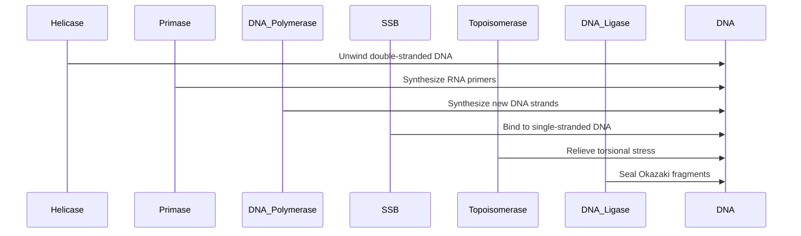

## Lecture Notes: DNA Replication

### The Replication Pit Crew: Mastering the Molecular Machinery

By the end of this deep dive, you will:

- Describe the key players in the DNA replication process and their roles
- Diagram the flow of information during leading and lagging strand synthesis
- Implement a simulation of the replication fork using Python and Mermaid
- Troubleshoot common issues that arise during DNA replication
- Analyze the trade-offs and engineering considerations in the replication process

### The Replication Garage: Understanding the Machinery

**Analogy Application:** Imagine a high-performance racing garage, where a pit crew works in perfect synchronization to service a race car during a pit stop. Each member of the crew has a specialized role - the tire changer, the fueler, the mechanic, and so on. Similarly, the process of DNA replication relies on a team of molecular "pit crew" members, each with a crucial function.

**Technical Definition:** DNA replication is the fundamental biological process by which a double-stranded DNA molecule is copied to produce two identical DNA molecules. This process is carried out by a complex of enzymes and proteins, working in a highly coordinated fashion to ensure the accurate and efficient duplication of the genetic material.

**Why It Matters:** The ability to faithfully replicate DNA is essential for cellular division, growth, and inheritance. Errors or disruptions in this process can lead to genetic mutations, which can in turn contribute to the development of diseases such as cancer. Understanding the intricate details of DNA replication is therefore crucial for fields ranging from molecular biology to medicine.

### The Replication Pit Crew in Action

**The Blueprint:** The DNA replication process begins with the unwinding of the double-stranded DNA molecule by the enzyme helicase. This creates a replication fork, where the two strands of the DNA molecule are separated. Primase then synthesizes short RNA primers on each of the exposed DNA strands, providing a starting point for DNA synthesis.

Next, the DNA polymerase enzyme steps in, using the RNA primers as a template to synthesize new DNA strands. However, DNA polymerase can only add new nucleotides in the 5' to 3' direction. This means that on one strand (the leading strand), DNA synthesis can proceed continuously, while on the other strand (the lagging strand), DNA synthesis must occur in short, discontinuous segments called Okazaki fragments.

To coordinate the synthesis of the leading and lagging strands, the replication process also involves the following key players:

- Single-stranded DNA-binding proteins (SSB): These proteins bind to the exposed single-stranded DNA regions, preventing them from re-annealing and providing a template for DNA synthesis.
- Topoisomerase: This enzyme relieves the torsional stress that builds up ahead of the replication fork as the DNA unwinds.
- DNA ligase: This enzyme seals the gaps between the Okazaki fragments on the lagging strand, creating a continuous DNA molecule.



**Code Implementation:** Here's a Python simulation of the DNA replication process, focusing on the leading and lagging strand synthesis:

```python
import random

# DNA sequence
dna_sequence = "ATCGATTGCATCGATTGCATCGATTGCATCGATTGC"

# Replication machinery
helicase = "Helicase"
primase = "Primase"
dna_pol = "DNA Polymerase"
ssb = "SSB"
topo = "Topoisomerase"
ligase = "DNA Ligase"

def replicate_dna(dna):
    """Simulate DNA replication"""
    print(f"Original DNA sequence: {dna}")
    
    # Unwind the DNA
    print(f"{helicase} unwinds the DNA, creating a replication fork.")
    
    # Synthesize primers on both strands
    print(f"{primase} synthesizes RNA primers on both strands.")
    
    # Synthesize the leading strand
    print(f"{dna_pol} synthesizes the leading strand continuously.")
    
    # Synthesize the lagging strand
    print(f"{dna_pol} synthesizes the lagging strand in Okazaki fragments.")
    
    # Bind single-stranded regions
    print(f"{ssb} binds to the exposed single-stranded regions.")
    
    # Relieve torsional stress
    print(f"{topo} relieves the torsional stress ahead of the replication fork.")
    
    # Seal the Okazaki fragments
    print(f"{ligase} seals the gaps between the Okazaki fragments on the lagging strand.")
    
    # Output the replicated DNA
    print(f"Replicated DNA sequence: {dna * 2}")

replicate_dna(dna_sequence)
```

### Navigating the Replication Potholes

**The "Happy Path" vs. Reality:** While the DNA replication process is generally efficient and accurate, there are several potential pitfalls and edge cases that can arise:

1. **Primer Mispriming**: Primase may occasionally synthesize RNA primers at the wrong locations, leading to errors in the replicated DNA.
2. **Polymerase Slippage**: DNA polymerase may occasionally "slip" or stall, causing it to skip or repeat nucleotides during synthesis.
3. **Topoisomerase Failure**: If topoisomerase fails to relieve the torsional stress ahead of the replication fork, the process can grind to a halt.
4. **Ligase Malfunction**: If DNA ligase is unable to seal the gaps between Okazaki fragments, the lagging strand will remain discontinuous.

**Anti-pattern**: The 'Anti-pattern' code example demonstrates a scenario where the replication machinery is not properly coordinated, leading to a breakdown in the process. In this case, the primase fails to synthesize primers, the DNA polymerase attempts to synthesize new DNA strands without primers (leading to errors), the topoisomerase is unable to relieve the torsional stress, and the ligase is unable to seal the gaps between Okazaki fragments, resulting in a discontinuous lagging strand. This uncoordinated replication process grinds to a halt, leading to genetic errors.

```python
# Anti-pattern: Uncoordinated replication machinery
print(f"{helicase} unwinds the DNA, but {primase} fails to synthesize primers.")
print(f"{dna_pol} attempts to synthesize new DNA strands without primers, leading to errors.")
print(f"{ssb} binds to the exposed single-stranded regions, but {topo} is unable to relieve the torsional stress.")
print(f"{ligase} is unable to seal the gaps between Okazaki fragments, resulting in a discontinuous lagging strand.")
print("The replication process grinds to a halt, leading to genetic errors.")
```

**Best Practice**: The 'Best Practice' code example demonstrates a well-coordinated replication process that ensures the accurate and efficient duplication of the genetic material. In this case, the helicase unwinds the DNA and creates a replication fork, the primase synthesizes RNA primers on both strands, the DNA polymerase synthesizes the leading strand continuously and the lagging strand in Okazaki fragments, the single-stranded DNA-binding proteins (SSB) bind to the exposed single-stranded regions, the topoisomerase relieves the torsional stress ahead of the replication fork, and the ligase seals the gaps between the Okazaki fragments on the lagging strand. This coordinated replication process is completed successfully, producing two identical copies of the original DNA sequence.

```python
# Best practice: Coordinated replication machinery
print(f"{helicase} unwinds the DNA, creating a replication fork.")
print(f"{primase} synthesizes RNA primers on both strands.")
print(f"{dna_pol} synthesizes the leading strand continuously and the lagging strand in Okazaki fragments.")
print(f"{ssb} binds to the exposed single-stranded regions, preventing them from re-annealing.")
print(f"{topo} relieves the torsional stress ahead of the replication fork.")
print(f"{ligase} seals the gaps between the Okazaki fragments on the lagging strand.")
print("The replication process is completed successfully, producing two identical copies of the original DNA sequence.")
```

### Replication in the Big Picture: Implications and Applications

**Advanced Usage**: DNA replication is a fundamental process that underpins many aspects of biology and medicine. Understanding the intricacies of this process can inform the development of new therapeutic strategies, such as:

1. **Cancer Treatment**: Many cancer therapies target the rapid cell division that is characteristic of cancer cells. By disrupting the DNA replication process, these treatments can selectively kill cancer cells while sparing healthy ones.
2. **Antibiotic Development**: Some antibiotics work by interfering with the DNA replication machinery of bacteria, preventing them from reproducing and causing infection.
3. **Genetic Engineering**: The ability to accurately replicate DNA is essential for genetic engineering techniques, such as gene cloning and DNA sequencing, which have numerous applications in fields like biotechnology and personalized medicine.

By mastering the details of the DNA replication process, engineers and scientists can leverage this knowledge to tackle a wide range of challenges in the life sciences and beyond.

### Replication Cheat Sheet

1. Helicase unwinds the double-stranded DNA, creating a replication fork.
2. Primase synthesizes RNA primers on both strands, providing a starting point for DNA synthesis.
3. DNA polymerase continuously synthesizes the leading strand and synthesizes the lagging strand in Okazaki fragments.
4. Single-stranded DNA-binding proteins (SSB) bind to the exposed single-stranded regions, preventing them from re-annealing.
5. Topoisomerase relieves the torsional stress ahead of the replication fork.
6. DNA ligase seals the gaps between the Okazaki fragments on the lagging strand.