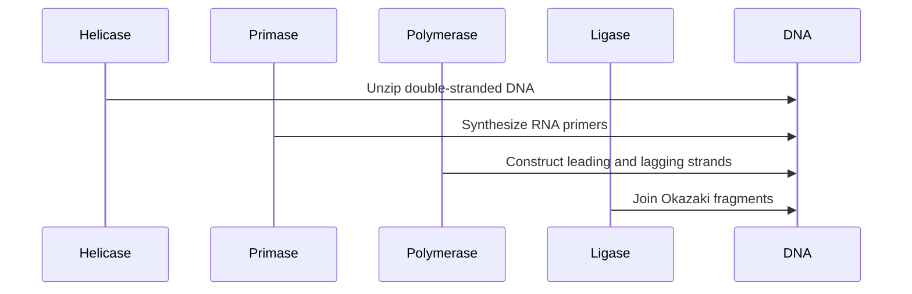

## Lecture Notes: DNA Replication

### Mastering the Replication Blueprint

By the end of this deep dive, you will:

- Explain the core purpose and mechanics of DNA replication
- Differentiate the roles of Helicase, Polymerase, and Primase in the replication process
- Implement a simplified DNA replication simulation in code
- Diagnose and resolve common replication errors and inefficiencies
- Apply advanced replication strategies to optimize for speed and fidelity

### The Replication Bakery: Understanding the Framework

**Analogy Application:** Let's imagine a bustling bakery where the goal is to efficiently produce high-quality loaves of bread. In this analogy, the DNA double helix is our "dough" that needs to be replicated, the Helicase is the "oven" that separates the dough, the Polymerase is the "baker" that constructs the new strands, and the Primase is the "assistant" that lays down the initial "starter" for the bakers.

**Technical Definition:** DNA replication is the biological process of creating two identical replicas of a DNA molecule from a single original. This is a crucial step in cell division, as each new cell must contain a complete copy of the organism's genetic material.

**Why It Matters:** Accurate DNA replication is essential for the proper functioning and survival of all living organisms. Errors or inefficiencies in this process can lead to genetic mutations, developmental disorders, and even cancer. Understanding the mechanics of replication is a fundamental building block for fields like molecular biology, genetics, and biotechnology.

### The Replication Workflow: A Deep Dive

**The Blueprint:** The DNA replication process can be summarized as follows:

1. **Helicase Unzips the Dough:** The Helicase enzyme travels along the DNA, separating the double-stranded helix into two single strands. This creates the "replication forks" where new DNA will be synthesized.

2. **Primase Lays the Starter:** The Primase enzyme binds to the exposed single-stranded DNA and synthesizes short RNA primers, which act as starting points for the Polymerase.

3. **Polymerase Bakes the Bread:** The DNA Polymerase enzyme then binds to the RNA primers and begins constructing the new complementary DNA strands, using the original strands as templates. One strand (the "leading" strand) is synthesized continuously, while the other ("lagging" strand) is synthesized in short, discontinuous Okazaki fragments.

4. **Ligase Seals the Loaf:** Finally, the Ligase enzyme joins the Okazaki fragments together, completing the synthesis of the lagging strand.



**Code Implementation:**

```python
def dna_replicate(dna_sequence):
    """
    Simulates the DNA replication process.
    
    Args:
        dna_sequence (str): The original DNA sequence to be replicated.
    
    Returns:
        Tuple[str, str]: The replicated leading and lagging strands.
    """
    # Helicase unzips the DNA
    leading_template, lagging_template = split_dna(dna_sequence)
    
    # Primase lays the RNA primers
    leading_primers = synthesize_primers(leading_template)
    lagging_primers = synthesize_primers(lagging_template)
    
    # Polymerase constructs the new strands
    leading_strand = construct_strand(leading_template, leading_primers)
    lagging_strand = construct_okazaki_fragments(lagging_template, lagging_primers)
    
    # Ligase seals the lagging strand
    lagging_strand = join_okazaki_fragments(lagging_strand)
    
    return leading_strand, lagging_strand
```

### Replication Challenges: Handling Edge Cases

**The "Happy Path" vs. Reality:** While the replication process may seem straightforward, there are several common issues that can arise, which need to be addressed for a robust simulation. These issues include replication fork stalls and Polymerase errors, which can lead to incomplete or inaccurate replication.

1. **Replication Forks Getting Stuck:** If the Helicase encounters a tightly bound protein or a DNA lesion, the replication fork can become stalled, leading to incomplete or inaccurate replication. This issue needs to be handled in the code implementation by incorporating mechanisms to recover from stalled replication forks, such as recruiting repair enzymes to resolve the stall and allow replication to continue.

**Bad Code:**
```python
def dna_replicate(dna_sequence):
    leading_template, lagging_template = split_dna(dna_sequence)
    leading_strand = construct_strand(leading_template, synthesize_primers(leading_template))
    lagging_strand = construct_okazaki_fragments(lagging_template, synthesize_primers(lagging_template))
    return leading_strand, lagging_strand
```

**Good Code:**
```python
def dna_replicate(dna_sequence):
    leading_template, lagging_template = split_dna(dna_sequence)
    leading_strand, lagging_strand = [], []
    
    while leading_template and lagging_template:
        try:
            leading_strand.append(construct_strand(leading_template, synthesize_primers(leading_template)))
            lagging_strand.append(construct_okazaki_fragments(lagging_template, synthesize_primers(lagging_template)))
        except ReplicationForkStallError:
            # Handle stalled forks, e.g., by recruiting repair enzymes
            leading_template, lagging_template = recover_from_stall(leading_template, lagging_template)
    
    return ''.join(leading_strand), ''.join(lagging_strand)
```

2. **Polymerase Errors:** DNA Polymerase can occasionally make mistakes during strand synthesis, leading to mutations in the final DNA sequence. The code implementation should incorporate proofreading and error correction mechanisms, such as the built-in proofreading capabilities of DNA Polymerase enzymes and specialized repair enzymes, to ensure high fidelity of the replicated DNA.

**Bad Code:**
```python
def construct_strand(template, primers):
    new_strand = ''
    for primer in primers:
        new_strand += polymerize(template, primer)
    return new_strand
```

**Good Code:**
```python
def construct_strand(template, primers):
    new_strand = ''
    for primer in primers:
        new_strand += polymerize_with_proofreading(template, primer)
    return new_strand
```

### Advanced Replication Strategies: Optimizing for Speed and Fidelity

**Parallel Replication:** In eukaryotic cells, multiple replication forks can operate simultaneously on the same DNA molecule, dramatically increasing the speed of replication.

**Proofreading and Repair:** DNA Polymerase enzymes have built-in proofreading capabilities that can identify and correct errors during strand synthesis. Additionally, specialized repair enzymes can fix mistakes that slip through.

**Redundancy and Backup Systems:** Many organisms have multiple copies of their genetic material, and some even have redundant replication systems to ensure that critical information is not lost.

By understanding and applying advanced replication strategies such as parallel replication, proofreading, and redundancy, engineers can design highly efficient and reliable DNA replication systems for a wide range of applications, from genetic engineering to synthetic biology. Parallel replication allows multiple replication forks to operate simultaneously, dramatically increasing the speed of replication. Proofreading mechanisms, including the built-in capabilities of DNA Polymerase and specialized repair enzymes, can identify and correct errors during strand synthesis. Redundancy, such as having multiple copies of genetic material or redundant replication systems, can ensure critical information is not lost. These advanced strategies should be implemented in the code to optimize for both speed and fidelity of the DNA replication process.

### Key Takeaways: DNA Replication Cheat Sheet

1. Helicase unzips the DNA double helix, creating replication forks.
2. Primase synthesizes RNA primers to serve as starting points for Polymerase.
3. DNA Polymerase constructs the new leading and lagging strands using the original strands as templates.
4. Ligase seals the gaps in the lagging strand by joining the Okazaki fragments.
5. Common challenges include replication fork stalls and Polymerase errors, which can be mitigated through repair mechanisms and redundancy.