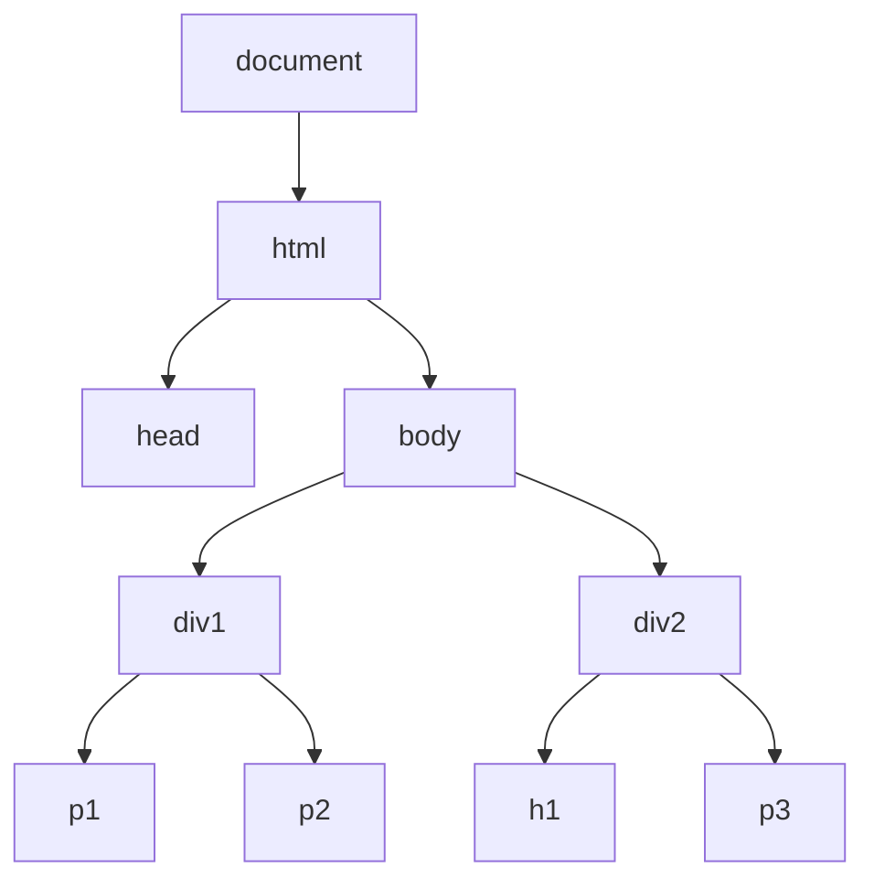
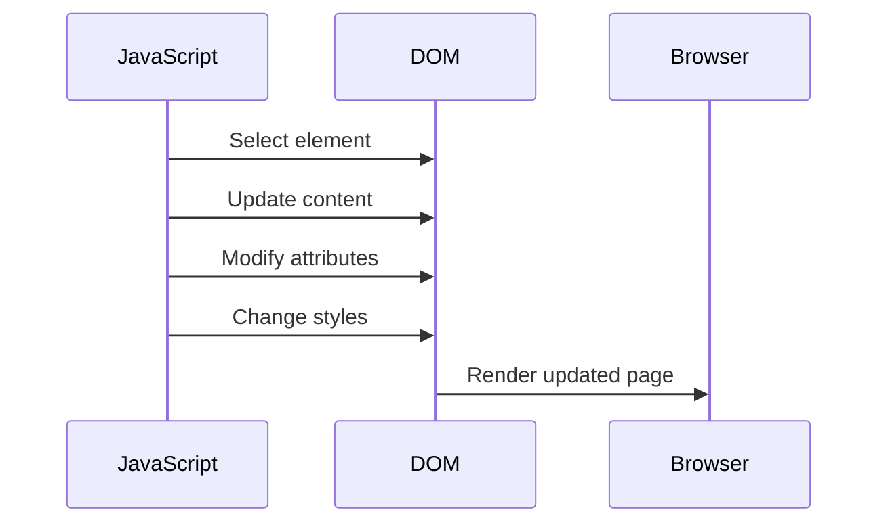

## Lecture Notes: Introduction to DOM

### Mastering the Document Object Model (DOM)

By the end of this deep dive, you will:

- Confidently select and traverse DOM elements using JavaScript
- Manipulate the content, attributes, and styles of DOM elements
- Dynamically create, update, and remove DOM elements as needed
- Understand the DOM tree structure and how it relates to web page rendering
- Debug common DOM-related issues and apply best practices

### The DOM: Your Window to the Web Page

**Analogy Application:** Imagine the web page as a bustling city, with the DOM as your interactive map. Just as a city map allows you to locate specific buildings, streets, and landmarks, the DOM provides a structured representation of the elements that make up a web page.

**Technical Definition:** The Document Object Model (DOM) is a programming interface for web documents that represents the structure of an HTML or XML document. It allows programs and scripts to dynamically access and update the content, structure, and style of a document.

**Why It Matters:** The DOM is the fundamental bridge between your JavaScript code and the visual elements on a web page. By mastering DOM manipulation, you gain the power to create dynamic, responsive, and interactive user experiences that go far beyond static HTML.

### Navigating the DOM: Selecting and Traversing Elements

**The Blueprint:** The DOM represents the web page as a tree-like hierarchy, with the `document` object at the root and various elements, attributes, and text nodes as the branches and leaves. To access specific elements, you can use a variety of DOM selection methods, such as `getElementById()`, `getElementsByTagName()`, `querySelector()`, and `querySelectorAll()`.



**Code Implementation:**

```javascript
// Select an element by its ID
const mainDiv = document.getElementById('main-div');

// Select all elements with a specific tag name
const paragraphs = document.getElementsByTagName('p');

// Select an element using a CSS selector
const specialParagraph = document.querySelector('.special-p');

// Select all elements matching a CSS selector
const allSpecialParagraphs = document.querySelectorAll('.special-p');
```

Once you have a reference to a DOM element, you can traverse the DOM tree using properties like `parentNode`, `children`, `firstElementChild`, `lastElementChild`, `nextElementSibling`, and `previousElementSibling`.

### Manipulating the DOM: Content, Attributes, and Styles

**The Blueprint:** With your DOM element references in hand, you can now modify the content, attributes, and styles of those elements. Common operations include:

- Updating the text content using `textContent` or `innerHTML`
- Modifying element attributes with `getAttribute()`, `setAttribute()`, and `removeAttribute()`
- Accessing and changing the inline styles with the `style` property

```javascript
// Update the text content of an element
mainDiv.textContent = 'This is the main div';

// Modify an element's attribute
mainDiv.setAttribute('data-custom', 'my-value');

// Access and change the inline styles
mainDiv.style.backgroundColor = 'blue';
mainDiv.style.fontSize = '24px';
```

**Visual Architecture:**



### Handling Edge Cases: Avoiding Common Pitfalls

**The "Happy Path" vs. Reality:** While the DOM provides a powerful set of tools, there are some common gotchas and edge cases that separate novice developers from experts.

**Antipattern:** Modifying the DOM during a loop iteration can lead to unexpected behavior, as the DOM structure changes while you're trying to access it.

**Best Practice:** Use techniques like creating a copy of the collection or working backwards through the collection to avoid issues.

```javascript
// Antipattern: Modifying the DOM during iteration
const divs = document.getElementsByTagName('div');
for (let i = 0; i < divs.length; i++) {
  divs[i].remove(); // This will not work as expected
}

// Best Practice: Iterate in reverse order
for (let i = divs.length - 1; i >= 0; i--) {
  divs[i].remove();
}
```

Another common issue is the race condition between JavaScript execution and the DOM being fully loaded. Trying to access DOM elements before the page has finished rendering can lead to errors.

**Best Practice:** Use the `DOMContentLoaded` event to ensure the DOM is ready before interacting with it.

```javascript
document.addEventListener('DOMContentLoaded', () => {
  // DOM is now ready, safely access and manipulate elements
  const mainDiv = document.getElementById('main-div');
  mainDiv.textContent = 'Hello, DOM!';
});
```

### Advanced DOM Manipulation: Dynamic Element Creation and Removal

**The Blueprint:** Beyond simply modifying existing elements, the DOM API also allows you to create, append, and remove elements dynamically. This is particularly useful for building complex, interactive user interfaces.

```javascript
// Create a new element
const newDiv = document.createElement('div');

// Set attributes and content
newDiv.classList.add('new-div');
newDiv.textContent = 'This is a new div';

// Append the new element to the DOM
mainDiv.appendChild(newDiv);

// Remove an element from the DOM
mainDiv.removeChild(newDiv);
```

**Why It Matters:** Dynamic DOM manipulation is a cornerstone of modern web development, enabling techniques like content loading, infinite scrolling, and complex user interactions without full page refreshes.

### Key Takeaways (Cheat Sheet)

1. The DOM provides a structured representation of the web page, allowing you to select and traverse elements using a variety of methods.
2. You can manipulate the content, attributes, and styles of DOM elements to create dynamic, interactive experiences.
3. Be aware of common DOM-related issues, such as modifying the DOM during a loop or trying to access elements before the page is fully loaded.
4. Leverage dynamic element creation and removal to build complex, responsive user interfaces.
5. Mastering the DOM is a fundamental skill for any web developer, as it underpins the majority of interactive web applications.