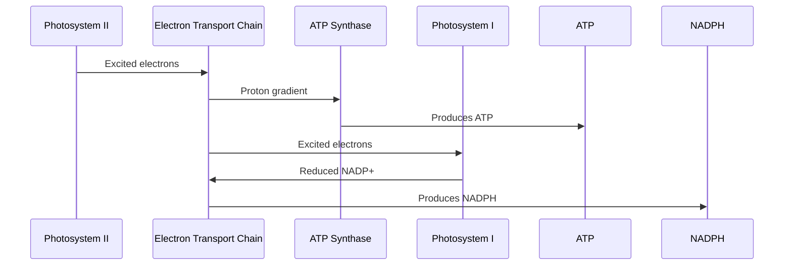

## Lecture Notes: Photosynthesis

### Mastering the Chloroplast's Green Machine

By the end of this deep dive, you will:

- Describe the key components and stages of the photosynthesis process
- Explain the role of chloroplasts and the light-dependent reactions
- Implement the Calvin Cycle and model carbon fixation
- Analyze the trade-offs between light-dependent and light-independent reactions
- Design an efficient chloroplast architecture for maximizing energy production

### The Photosynthesis Powerhouse

**Analogy Application:** Imagine the chloroplast as a bustling power plant, where sunlight is the raw fuel that gets converted into usable energy. Just like a power plant has different subsystems to generate, transform, and distribute electricity, the chloroplast has specialized organelles and pathways to harness the power of photons and produce ATP and NADPH.

**Technical Definition:** Photosynthesis is the process by which plants, algae, and some bacteria convert light energy from the sun into chemical energy in the form of glucose. This complex metabolic pathway can be divided into two main stages: the light-dependent reactions (occurring in the thylakoid membranes of the chloroplast) and the light-independent reactions (also known as the Calvin Cycle, taking place in the stroma of the chloroplast).

**Why It Matters:** Understanding the intricate mechanisms of photosynthesis is crucial for advancements in renewable energy, agricultural productivity, and even climate change mitigation. By reverse-engineering nature's most efficient "solar panels," we can develop bioinspired technologies and optimize crop yields to feed a growing global population.

### The Light-Dependent Reactions: Powering the Chloroplast

**The Blueprint:** The light-dependent reactions occur in the thylakoid membranes of the chloroplast, where a series of electron transport chains and proton gradients work in concert to produce ATP and NADPH. This process is initiated by the absorption of photons by chlorophyll molecules in the photosystems, which then excite electrons and drive the flow of electrons through the electron transport chain.



**Code Implementation:**

```python
def light_dependent_reactions(photons, chlorophyll):
    """
    Simulates the light-dependent reactions of photosynthesis.
    
    Args:
        photons (int): The number of photons absorbed by chlorophyll.
        chlorophyll (int): The amount of chlorophyll present in the thylakoid membranes.
    
    Returns:
        atp (int): The amount of ATP produced.
        nadph (int): The amount of NADPH produced.
    """
    # Absorb photons and excite electrons in Photosystem II
    excited_electrons = photons * chlorophyll
    
    # Drive electron transport chain and generate proton gradient
    proton_gradient = excited_electrons * 0.6
    
    # Use ATP Synthase to produce ATP
    atp = proton_gradient * 0.8
    
    # Reduce NADP+ to NADPH in Photosystem I
    nadph = excited_electrons * 0.4
    
    return atp, nadph
```

### The Calvin Cycle: Fixing Carbon and Producing Glucose

**The Blueprint:** The Calvin Cycle, also known as the light-independent reactions or dark reactions, takes place in the stroma of the chloroplast. This cyclic process uses the ATP and NADPH produced during the light-dependent reactions to convert carbon dioxide into organic compounds, primarily glucose. The key steps involve carbon fixation, reduction, and regeneration of the starting molecule (ribulose-1,5-bisphosphate).

```mermaid
stateDiagram-v2
    state "Carbon Fixation" {
        [*] --> RuBP
        RuBP --> 3-Carbon Compounds
    }
    state "Carbon Reduction" {
        3-Carbon Compounds --> G3P
    }
    state "Regeneration" {
        G3P --> RuBP
        RuBP --> [*]
    }
    
    Carbon Fixation --> Carbon Reduction
    Carbon Reduction --> Regeneration
    Regeneration --> Carbon Fixation
```

**Code Implementation:**

```python
def calvin_cycle(co2, atp, nadph):
    """
    Simulates the Calvin Cycle of photosynthesis.
    
    Args:
        co2 (int): The amount of carbon dioxide available.
        atp (int): The amount of ATP produced in the light-dependent reactions.
        nadph (int): The amount of NADPH produced in the light-dependent reactions.
    
    Returns:
        glucose (int): The amount of glucose produced.
    """
    # Carbon Fixation: Convert CO2 to 3-carbon compounds
    three_carbon_compounds = co2 * 0.6
    
    # Carbon Reduction: Use ATP and NADPH to reduce 3-carbon compounds to G3P
    g3p = (three_carbon_compounds * atp * nadph) / (atp + nadph)
    
    # Regeneration: Convert G3P back to RuBP to continue the cycle
    rubp = g3p * 0.67
    
    # Produce glucose from the G3P
    glucose = g3p * 0.5
    
    return glucose
```

### Optimizing Photosynthesis: Balancing Light and Dark Reactions

**The "Happy Path" vs. Reality:** While the light-dependent and light-independent reactions of photosynthesis work together in healthy plants, there are several factors that can disrupt this delicate balance and lead to reduced efficiency or even cell damage. These factors include high light intensity, imbalances between the supply of energy carriers (ATP and NADPH) and the demand from the Calvin Cycle, and environmental stresses that can impair the regulatory mechanisms.

**Antipattern:** One common issue is the overproduction of ATP and NADPH during the light-dependent reactions, which can result in the accumulation of reactive oxygen species (ROS) and oxidative stress. This can happen when the light intensity is too high, or the Calvin Cycle is not keeping up with the supply of energy carriers.

**Best Practice:** To mitigate the imbalances between the light-dependent and light-independent reactions, plants have evolved regulatory mechanisms, such as non-photochemical quenching and state transitions. Non-photochemical quenching dissipates excess energy from the photosystems as heat, preventing the accumulation of reactive oxygen species. State transitions, on the other hand, dynamically adjust the distribution of light-harvesting complexes between the two photosystems, ensuring that the energy supply matches the demand from the Calvin Cycle. By dynamically adjusting the activity of the photosystems and the Calvin Cycle, the chloroplast can maintain optimal efficiency and protect the cell from damage. This dynamic regulation involves complex signaling pathways and feedback mechanisms that sense the energy state of the chloroplast and modulate the expression and activity of the key enzymes and complexes involved in the light-dependent and light-independent reactions.

### Scaling Up: Photosynthesis and Renewable Energy

**Advanced Application:** The principles of photosynthesis have inspired researchers to develop bioinspired technologies for renewable energy production. One promising approach is the creation of artificial chloroplasts, or "solar cells," that mimic the light-harvesting and energy-conversion capabilities of natural photosynthetic systems.

These synthetic chloroplasts could be used to power a wide range of applications, from small-scale electronic devices to large-scale energy grids. By understanding the intricate mechanisms of photosynthesis, including the light-harvesting, energy conversion, and carbon fixation processes, we can reverse-engineer nature's most efficient "solar panels" and create sustainable energy solutions that will shape the future of our planet. The development of artificial chloroplasts involves the integration of advanced materials, microfluidics, and synthetic biology to mimic the structure and function of natural chloroplasts, with the goal of achieving high efficiency, scalability, and robustness.

### Photosynthesis Cheat Sheet

- The chloroplast is the "power plant" of the cell, housing the light-dependent and light-independent reactions of photosynthesis.
- The light-dependent reactions use the energy of photons to produce ATP and NADPH, which are then used in the Calvin Cycle.
- The Calvin Cycle uses the ATP and NADPH to convert carbon dioxide into organic compounds, primarily glucose.
- Regulatory mechanisms, such as non-photochemical quenching and state transitions, help balance the energy flow between the two stages of photosynthesis.
- Artificial chloroplasts and bioinspired technologies are being developed to harness the principles of photosynthesis for renewable energy production.