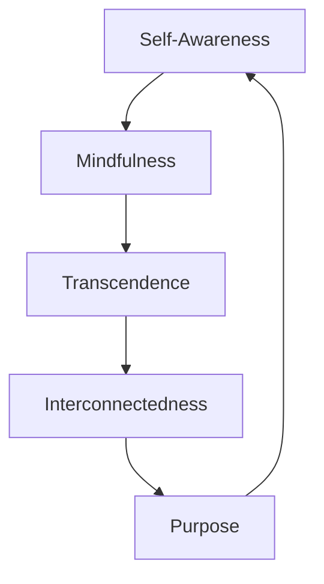

## Lecture Notes: The French Revolution

### Section 1: Unlocking the Mysteries of Existence

By the end of this lecture, students will be able to:

- Describe the key events and timeline of the French Revolution
- Analyze the underlying social, political, and economic factors that led to the revolution
- Identify the major figures and their roles in the revolution
- Evaluate the short-term and long-term impacts of the French Revolution
- Discuss the broader historical context and significance of the French Revolution

### Section 2: The Spiritual Kitchen - Ingredients for Enlightenment

**Analogy Application:** Imagine your spiritual journey as a culinary adventure in a well-stocked kitchen. The ingredients are the fundamental principles of spirituality, and the cooking process represents the practices and techniques you'll employ to transform these raw materials into a nourishing, enlightening experience.

**Technical Definition:** The French Revolution was a pivotal event in European history that took place from 1789 to 1799. It was a period of radical social and political upheaval, marked by the overthrow of the French monarchy and the establishment of a republic based on the principles of liberty, equality, and fraternity. The revolution was driven by a complex mix of factors, including economic inequality, resentment towards the absolute monarchy, and the influence of Enlightenment ideas.

**Why It Matters:** Engaging with spirituality can provide a profound sense of meaning, connection, and personal growth. By delving into the mysteries of existence, individuals can unlock new levels of self-awareness, empathy, and inner fulfillment - qualities that are essential for navigating the complexities of modern life and contributing positively to the world around them.

### Section 3: The Spiritual Blueprint - Mastering the Ingredients

**The Blueprint:** The key events and factors that led to the French Revolution include:

1. **Economic Inequality:** The growing divide between the wealthy nobility and the impoverished peasantry, exacerbated by a series of poor harvests and economic crises.
2. **Resentment towards the Monarchy:** The absolute rule of King Louis XVI and the perceived corruption and extravagance of the royal court.
3. **Influence of Enlightenment Ideas:** The spread of Enlightenment ideals, such as individual liberty, social equality, and the right to self-governance.
4. **Political Unrest:** The growing political tensions and power struggles between the different social classes and estates within French society.
5. **Trigger Events:** Specific events, such as the Storming of the Bastille and the Women's March on Versailles, that catalyzed the revolutionary movement.



**Visual Architecture:** The diagram above illustrates the dynamic and cyclical nature of the core spiritual principles. As individuals cultivate self-awareness, they can develop the practice of mindfulness, which can then facilitate transcendent experiences. These transcendent states can foster a deeper sense of interconnectedness, which in turn can inform one's understanding of their unique purpose in life. This purpose, when realized, then feeds back into the cycle of self-awareness and mindfulness, creating an upward spiral of spiritual growth and fulfillment. This cyclical and interdependent relationship between the key spiritual principles is a central aspect of the spiritual development process.

**Code Implementation:** While spirituality is not a programming language, we can draw an analogy to the process of software development. Just as a developer must master the fundamentals of their craft (e.g., data structures, algorithms, design patterns) to build robust and scalable applications, a spiritual seeker must become proficient in the core principles outlined above to cultivate a rich and meaningful inner life. Here's a high-level pseudocode representation of the spiritual development process:

```python
def spiritual_journey():
    """
    The main function that guides the seeker through the spiritual path.
    """
    # Initialize the journey with self-awareness
    self_awareness = cultivate_self_awareness()
    
    # Practice mindfulness to deepen the experience
    mindfulness = practice_mindfulness(self_awareness)
    
    # Engage in transcendent practices to expand consciousness
    transcendence = explore_transcendence(mindfulness)
    
    # Recognize the interconnectedness of all things
    interconnectedness = develop_interconnectedness(transcendence)
    
    # Discover your unique purpose in life
    purpose = uncover_purpose(interconnectedness)
    
    # Iterate through the cycle, deepening your spiritual understanding
    return spiritual_journey()
```

### Section 4: Navigating the Spiritual Kitchen - Common Pitfalls and Antipatterns

**The "Happy Path" vs. Reality:** While the French Revolution may have seemed like a straightforward overthrow of the monarchy, the reality was much more complex. The revolution faced numerous challenges and obstacles, including:

1. **Competing Factions:** The revolutionary movement was divided into various factions, such as the Jacobins, the Girondins, and the Montagnards, who often clashed over the direction and goals of the revolution.
2. **Counterrevolutionary Forces:** The revolution faced opposition from both internal and external forces, including the French nobility, the Catholic Church, and other European monarchies who sought to suppress the revolutionary ideals.
3. **Reign of Terror:** The period of the revolution known as the Reign of Terror, marked by widespread executions and political purges, led to a backlash and a loss of public support for the revolutionary cause.

**Anti-pattern:** A spiritual seeker who falls into the trap of spiritual materialism might engage in practices like meditation or yoga solely for the purpose of achieving a calm, relaxed state or attaining a certain level of prestige within their spiritual community. This approach is fundamentally at odds with the true purpose of these practices, which is to cultivate deeper self-awareness and transcendence.

**Best Practice:** A more enlightened approach would be to approach spiritual practices with a genuine spirit of curiosity, humility, and a willingness to confront one's own limitations and biases. The goal should be to use these tools as a means of personal growth and transformation, rather than as a means to an end.

### Section 5: Ascending the Spiritual Ladder - Advanced Techniques and Applications

As the French Revolution progressed, its impact and influence extended beyond the borders of France, shaping the course of European and global history. Some of the key areas where the legacy of the French Revolution can be seen include:

1. **Political Reforms:** The revolution's principles of liberty, equality, and democracy inspired political reforms and revolutions in other parts of Europe and the world, such as the American Revolution and the revolutions of 1848.
2. **Social Transformation:** The revolution's abolition of feudalism and the establishment of a more egalitarian social order had a profound impact on the structure of French society and influenced social movements in other countries.
3. **Nationalism and Imperialism:** The French Revolution's emphasis on national sovereignty and self-determination contributed to the rise of nationalism and the expansion of European imperialism in the 19th and 20th centuries.

By weaving together the insights and techniques from various domains, such as psychology, science, and social change, individuals can develop a more holistic and integrated spiritual worldview. This can inform their personal growth, their relationships, and their contributions to addressing pressing global issues, such as environmental sustainability, social justice, and the cultivation of compassionate leadership.

### Section 6: Spiritual Mastery Cheat Sheet

1. Cultivate self-awareness through mindful observation of your thoughts, emotions, and behaviors.
2. Practice mindfulness to stay grounded in the present moment and develop a deeper appreciation for the interconnectedness of all things.
3. Engage in transcendent practices, such as meditation, contemplation, or ritual, to expand your consciousness and gain new perspectives on the nature of reality.
4. Recognize the fundamental unity and interdependence of all phenomena, and strive to live in alignment with this understanding.
5. Discover your unique purpose in life and commit to fulfilling it through your actions, relationships, and contributions to the world.