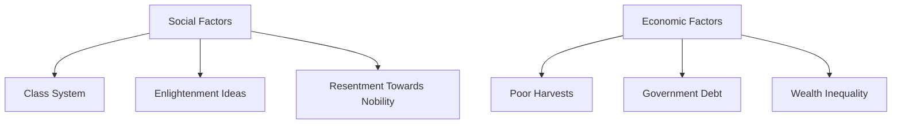

## Lecture Notes: The French Revolution

### Section 1: Mastering the Powder Keg

By the end of this deep dive, you will:

- Analyze the key social and economic factors that led to the French Revolution
- Understand the significance of the Storming of the Bastille and its role as a catalyst
- Evaluate the causes and consequences of the Reign of Terror during the revolution

### Section 2: The Kitchen Analogy - Ingredients for Unrest

**Analogy Application:** Imagine the French society as a bustling kitchen, where the ingredients (the people) simmer and stew, building up pressure until the pot boils over. Each component plays a critical role in the eventual eruption.

**Technical Definition:** The French Revolution was a pivotal period of social and political upheaval that transformed the Kingdom of France and had far-reaching impacts across Europe. It was driven by a complex interplay of social, economic, and ideological factors that had been building for decades.

**Why It Matters:** Understanding the root causes of the French Revolution provides crucial insights into the dynamics of social change, the power of grassroots movements, and the fragility of established political systems. Analyzing this watershed event sheds light on the factors that can lead to the collapse of an ancien régime and the emergence of a new social order.

### Section 3: The Simmering Ingredients - Social and Economic Factors

**The Blueprint:** The French Revolution was fueled by a combination of social and economic factors that had been building for decades prior to the outbreak of the conflict.

**Social Factors:**
- The rigid class system of the French society, with a small aristocratic elite and a large, impoverished peasantry
- Resentment towards the privileges and extravagance of the nobility, while the common people struggled with poverty and hunger
- The growing influence of Enlightenment ideas, which challenged the divine right of monarchs and promoted ideals of liberty, equality, and democracy

**Economic Factors:**
- A series of poor harvests and famines, which led to rising food prices and widespread hunger among the lower classes
- The French government's financial troubles, exacerbated by its involvement in the American Revolutionary War and the lavish spending of the monarchy
- The unequal distribution of wealth, with the nobility and clergy controlling a disproportionate share of the country's resources



**Code Implementation:**
```python
class FrenchRevolution:
    def __init__(self, social_factors, economic_factors):
        self.social_factors = social_factors
        self.economic_factors = economic_factors
        
    def analyze_causes(self):
        """
        Evaluate the key social and economic factors that led to the French Revolution.
        """
        print("Analyzing the causes of the French Revolution...")
        
        # Assess social factors
        for factor in self.social_factors:
            print(f"Social factor: {factor}")
        
        # Evaluate economic factors
        for factor in self.economic_factors:
            print(f"Economic factor: {factor}")
        
        print("The combination of these social and economic factors created a powder keg of unrest in French society.")

# Example usage
social_factors = ["Rigid class system", "Resentment towards nobility", "Enlightenment ideas"]
economic_factors = ["Poor harvests", "Government debt", "Wealth inequality"]
revolution = FrenchRevolution(social_factors, economic_factors)
revolution.analyze_causes()
```

### Section 4: The Explosion - The Storming of the Bastille

**The "Happy Path" vs. Reality:** The Storming of the Bastille on July 14, 1789, was a pivotal moment that transformed the simmering discontent into open rebellion. While the seizure of the Bastille fortress was a symbolic victory for the revolutionaries, it was not a straightforward or predictable event.

**Anti-pattern:** The Storming of the Bastille could have been avoided if the French government had addressed the underlying social and economic issues earlier, rather than relying on military force to maintain control.

**Best Practice:** The Storming of the Bastille was a spontaneous and chaotic event, driven by a combination of long-standing grievances, a lack of trust in the monarchy, and the availability of weapons and ammunition at the Bastille. The revolutionaries' success in capturing the fortress was a testament to their determination and the growing strength of the popular movement.

### Section 5: The Boiling Pot - The Reign of Terror

**The Blueprint:** The Reign of Terror, which lasted from 1793 to 1794, was a period of intense political violence and repression during the French Revolution. It was characterized by the execution of thousands of people, including the king and queen, as well as the systematic suppression of political opposition.

```mermaid
stateDiagram-v2
    state "Reign of Terror" {
        state "Execution of King Louis XVI" as s1
        state "Suppression of Political Opposition" as s2
        state "Thousands of Executions" as s3
        
        s1 --> s2
        s2 --> s3
    }
```

**Code Implementation:**
```python
class ReignOfTerror:
    def __init__(self, execution_count, opposition_suppressed, total_executions):
        self.execution_count = execution_count
        self.opposition_suppressed = opposition_suppressed
        self.total_executions = total_executions
        
    def execute_terror(self):
        """
        Simulate the Reign of Terror during the French Revolution.
        """
        print("Implementing the Reign of Terror...")
        
        # Execute the king
        print(f"Executed King Louis XVI: {self.execution_count}")
        
        # Suppress political opposition
        print(f"Political opposition suppressed: {self.opposition_suppressed}")
        
        # Carry out mass executions
        print(f"Total executions during the Reign of Terror: {self.total_executions}")
        
        print("The Reign of Terror had a devastating impact on French society, leading to a backlash and the eventual rise of Napoleon Bonaparte.")

# Example usage
reign_of_terror = ReignOfTerror(1, True, 16000)
reign_of_terror.execute_terror()
```

### Section 6: Key Takeaways (Cheat Sheet)

- The French Revolution was fueled by a combination of social and economic factors, including a rigid class system, resentment towards the nobility, and financial troubles in the government.
- The Storming of the Bastille on July 14, 1789, was a pivotal moment that transformed the simmering discontent into open rebellion.
- The Reign of Terror, which lasted from 1793 to 1794, was a period of intense political violence and repression, characterized by the execution of thousands of people and the suppression of political opposition.
- Understanding the root causes and dynamics of the French Revolution provides valuable insights into the complex interplay of social, economic, and political forces that can lead to the collapse of an established system and the emergence of a new social order.
- The French Revolution had far-reaching impacts across Europe and serves as a cautionary tale about the fragility of political systems and the potential for grassroots movements to bring about transformative change.