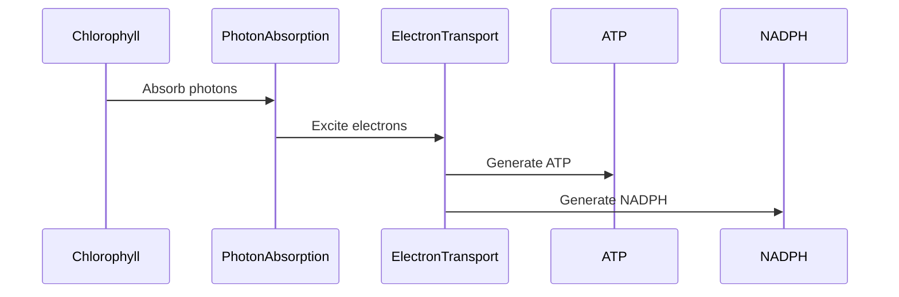

## Lecture Notes: Photosynthesis

### The Photosynthesis Factory: Powering Life on Earth

By the end of this deep dive, you will:

- Explain the core purpose and high-level mechanics of the photosynthesis process
- Diagram the two key stages of photosynthesis: the light-dependent reactions and the Calvin cycle
- Implement a simplified Python simulation of the light-dependent reactions
- Analyze common inefficiencies and optimization strategies in photosynthetic systems
- Connect the principles of photosynthesis to larger-scale renewable energy systems

### The Photosynthetic Powerhouse: Harnessing Light to Fuel Life

**Analogy Application:** Imagine a bustling factory, where the sun's rays pour in through the windows, providing the energy to fuel a complex series of chemical reactions. This is the world of photosynthesis, where plants and certain microorganisms transform light, carbon dioxide, and water into the glucose that powers life on Earth.

**Technical Definition:** Photosynthesis is the process by which organisms, such as plants, algae, and some bacteria, convert light energy from the sun into chemical energy in the form of glucose. This process occurs in two main stages: the light-dependent reactions and the Calvin cycle (also known as the light-independent reactions).

**Why It Matters:** Understanding the intricate mechanisms of photosynthesis is not just an academic exercise - it has profound real-world implications. Photosynthesis is the foundation of nearly all food webs, providing the energy that sustains ecosystems and supports the vast diversity of life on our planet. Moreover, the principles of photosynthesis are being applied to the development of advanced renewable energy technologies, such as solar fuels and artificial photosynthesis, which hold the promise of a more sustainable future.

### The Light-Dependent Reactions: Powering the Photosynthetic Assembly Line

**The Blueprint:** The light-dependent reactions take place in the thylakoid membranes of the chloroplasts within plant cells and certain photosynthetic microorganisms. This is where the initial conversion of light energy into chemical energy occurs. 

The process begins when chlorophyll molecules in the thylakoid membranes absorb photons of light. This excites the electrons in the chlorophyll, causing them to jump to a higher energy level. These high-energy electrons are then passed through a series of electron transport chains, which harness their energy to generate ATP (the universal energy currency of cells) and NADPH (a reducing agent used in the Calvin cycle).



**Code Implementation:** Here's a simplified Python simulation of the light-dependent reactions, which demonstrates the key steps and factors affecting efficiency:

```python
import random

# Constants
CHLOROPHYLL_EFFICIENCY = 0.8
ELECTRON_TRANSPORT_EFFICIENCY = 0.9
ATP_PRODUCTION_RATE = 3
NADPH_PRODUCTION_RATE = 2

def simulate_light_reactions(photon_intensity):
    """
    Simulates the light-dependent reactions of photosynthesis.
    
    Args:
        photon_intensity (float): The intensity of the incident light.
    
    Returns:
        tuple: The amounts of ATP and NADPH produced.
    """
    # Absorb photons
    photons_absorbed = photon_intensity * CHLOROPHYLL_EFFICIENCY
    
    # Transport electrons
    electrons_transported = photons_absorbed * ELECTRON_TRANSPORT_EFFICIENCY
    
    # Generate ATP and NADPH
    atp_produced = electrons_transported * ATP_PRODUCTION_RATE
    nadph_produced = electrons_transported * NADPH_PRODUCTION_RATE
    
    return atp_produced, nadph_produced

# Example usage
light_intensity = random.uniform(500, 2000)  # Photon intensity in μmol/m²/s
atp, nadph = simulate_light_reactions(light_intensity)
print(f"ATP produced: {atp:.2f} μmol")
print(f"NADPH produced: {nadph:.2f} μmol")
```

### Optimizing Photosynthetic Efficiency: Overcoming the Limitations

**The "Happy Path" vs. Reality:** While the light-dependent reactions are the foundation of photosynthesis, they are not without their limitations. Several factors can impact the efficiency of this stage, including:

1. **Photoinhibition:** Excessive light intensity can damage the photosynthetic machinery, leading to a decrease in overall efficiency.
2. **Photorespiration:** In some cases, the enzyme RuBisCO (which plays a key role in the Calvin cycle) can react with oxygen instead of carbon dioxide, leading to a wasteful process called photorespiration.
3. **Photosaturation:** At very high light intensities, the photosynthetic system becomes saturated, and additional light energy cannot be effectively utilized.

**Anti-pattern:** A simplistic approach to addressing these limitations might be to simply increase the amount of chlorophyll or other photosynthetic pigments. However, this "brute force" method is often ineffective and can even be counterproductive, as it can lead to increased shading and reduced light penetration within the plant or algal cells.

**Best Practice:** Experts in photosynthetic optimization have developed more nuanced strategies to improve efficiency, such as:

1. **Dynamic Light Regulation:** Implementing mechanisms to adjust the absorption and utilization of light energy based on environmental conditions, preventing photoinhibition and photosaturation.
2. **Metabolic Engineering:** Modifying the expression and activity of key enzymes, like RuBisCO, to minimize photorespiration and maximize carbon fixation.
3. **Architectural Design:** Optimizing the physical structure and arrangement of photosynthetic organisms to enhance light harvesting and distribution.

### Scaling Up: Photosynthesis and Renewable Energy Systems

**Advanced Application:** The principles of photosynthesis are not limited to the microscopic world of plant cells. Scientists and engineers are actively applying these concepts to the development of large-scale renewable energy systems, such as artificial photosynthesis and solar fuels.

In these systems, the light-dependent reactions are mimicked using specialized materials and devices, which capture solar energy and use it to drive the production of energy-rich compounds, like hydrogen or hydrocarbon fuels. By harnessing the same fundamental mechanisms that power natural photosynthesis, these technologies hold the potential to revolutionize the way we generate and store renewable energy.

### Photosynthesis: A Cheat Sheet

1. Photosynthesis is the process by which organisms convert light energy into chemical energy in the form of glucose.
2. The light-dependent reactions occur in the thylakoid membranes of chloroplasts, where chlorophyll absorbs photons and uses their energy to generate ATP and NADPH.
3. The Calvin cycle (also known as the light-independent reactions) uses the ATP and NADPH produced in the light-dependent stage to fix carbon dioxide and synthesize glucose. This stage includes three main phases: carbon fixation, reduction, and regeneration of RuBP.
4. Factors like photoinhibition, photorespiration, and photosaturation can limit the efficiency of the light-dependent reactions, requiring advanced optimization strategies.
5. The principles of photosynthesis are being applied to the development of renewable energy technologies, such as artificial photosynthesis and solar fuels, with the goal of creating a more sustainable future.