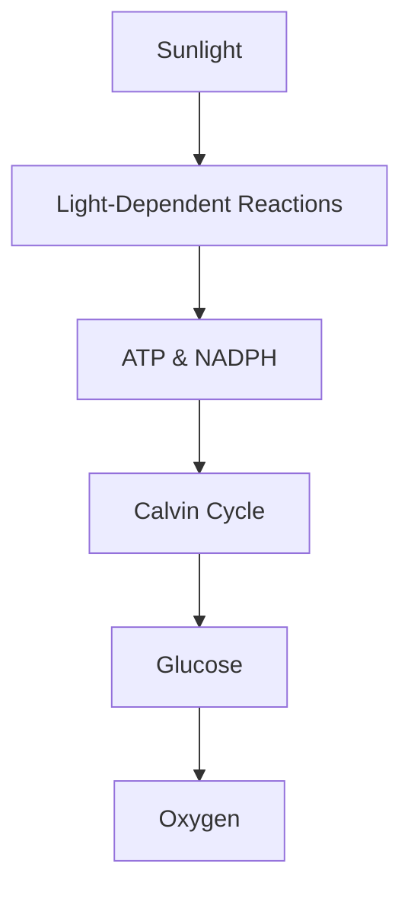

# 🚀 Pre-read: Photosynthesis

## 1. The Big Idea (In Plain English)

Photosynthesis is the remarkable process by which plants and some other organisms use sunlight, water, and carbon dioxide to create oxygen and energy-rich organic compounds like glucose. It's the foundation of the food chain and the primary driver of the Earth's carbon cycle. 

Imagine a solar-powered factory, where sunlight is the energy source, water and carbon dioxide are the raw materials, and the factory produces oxygen and glucose as the outputs. That's photosynthesis in a nutshell - a biological process that converts light energy into chemical energy that powers the plant.

## 2. Key Vocabulary

**Photosynthesis**: The process by which plants and other organisms use sunlight, water, and carbon dioxide to create oxygen and energy-rich organic compounds like glucose. Like a solar-powered factory.

**Chloroplast**: The organelle inside plant cells where photosynthesis takes place. Like a specialized manufacturing plant within the cell.

**Light-Dependent Reactions**: The first stage of photosynthesis where chloroplasts use sunlight to produce ATP and NADPH. Like the power plant that generates electricity.

**Calvin Cycle**: The second stage of photosynthesis where the cell uses the ATP and NADPH from the light reactions to produce glucose. Like the assembly line that builds the final products.

**Thylakoid**: Stacked membrane structures inside chloroplasts where the light-dependent reactions occur. Like the assembly lines within the manufacturing plant.

**Stroma**: The fluid-filled space surrounding the thylakoids in a chloroplast, where the Calvin Cycle takes place. Like the management offices outside the assembly line.

## 3. Mental Model / Diagram

Photosynthesis can be visualized as a two-stage process:

In the first stage, the light-dependent reactions use sunlight to produce ATP and NADPH, the energy carriers needed for the second stage. 

In the second stage, the Calvin Cycle uses those energy carriers to convert carbon dioxide into glucose, the primary energy source for the plant. Oxygen is a byproduct released back into the atmosphere.

## 4. Preparation Checklist

Before the session, make sure you:

1. Understand the difference between the light-dependent reactions and the Calvin Cycle.
2. Can explain the role of chloroplasts, thylakoids, and stroma in the photosynthesis process.
3. Have a basic grasp of how plants use the glucose produced during photosynthesis.

## 5. Reflection Questions

1. How do plants use the glucose produced during photosynthesis?
2. What would happen if a plant was unable to perform the light-dependent reactions?
3. Imagine a world where photosynthesis did not exist. How would that impact the global ecosystem?